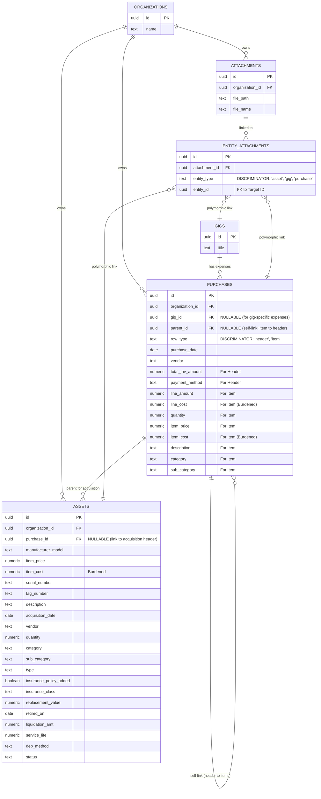

# Technical Specification: Asset & Purchase Import

## 1. Overview
This specification covers the implementation of the `purchases` table to handle acquisition headers and expense items, extensions to the `assets` table, and a centralized polymorphic attachment system.

## 2. Technical Context
- **Frontend**: React (Vite), TypeScript, Tailwind CSS, Shadcn/UI.
- **Backend**: Supabase (Auth, Postgres, Storage, Edge Functions).
- **AI**: LLM (Claude-haiku) for PDF/Image extraction.
- **Legacy Mapping**: Map Columns A-Z to relational tables.

## 3. Data Model Changes

### 3.0 ER Diagram

### 3.1 `public.purchases` Table (New)
Handles all acquisition headers (Source 0) and expense items (Source 2).
| Column | Type | Notes |
|---|---|---|
| `id` | `uuid` | PK |
| `organization_id` | `uuid` | FK -> organizations |
| `gig_id` | `uuid` | FK -> gigs (Nullable) |
| `parent_id` | `uuid` | Self-reference (Item -> Header) |
| `row_type` | `text` | 'header' or 'item' |
| `purchase_date` | `date` | (Col A) |
| `vendor` | `text` | (Col C) |
| `total_inv_amount` | `numeric` | (Col D) Header Only |
| `payment_method` | `text` | (Col E) Header Only |
| `line_amount` | `numeric` | (Col F) Item Only |
| `line_cost` | `numeric` | (Col G) Item Only (Burdened) |
| `quantity` | `numeric` | (Col H) Item Only |
| `item_price` | `numeric` | (Col I) Item Only |
| `item_cost` | `numeric` | (Col J) Item Only (Burdened) |
| `description` | `text` | (Col K) Item Only |
| `category` | `text` | (Col L) Item Only |
| `sub_category` | `text` | (Col M) Item Only |

### 3.2 `public.assets` Table Updates
| Column | Type | Notes |
|---|---|---|
| `item_price` | `numeric` | (Col I) New |
| `item_cost` | `numeric` | Rename from `cost` (Col J) |
| `retired_on` | `date` | (Col V) New |
| `purchase_id` | `uuid` | FK -> purchases (Header) |
| `tag_number` | `text` | (Col Q) |
| `acquisition_date` | `date` | (Col A) |
| `vendor` | `text` | (Col C) |
| `quantity` | `numeric` | (Col H) |
| `manufacturer_model` | `text` | (Col K) |
| `category` | `text` | (Col L) |
| `sub_category` | `text` | (Col M) |
| `type` | `text` | (Col N) |
| `serial_number` | `text` | (Col P) |
| `description` | `text` | (Col R) |
| `insurance_policy_added`| `boolean`| (Col S) |
| `insurance_class` | `text` | (Col T) |
| `replacement_value` | `numeric` | (Col U) |
| `liquidation_amt` | `numeric` | (Col W) |
| `service_life` | `numeric` | (Col X) |
| `dep_method` | `text` | (Col Y) |
| `status` | `text` | (Col Z) |

### 3.3 Centralized Attachments
- `public.attachments`: Metadata for files in Supabase Storage.
- `public.entity_attachments`: Polymorphic junction linking `attachment_id` to any `entity_id` with `entity_type` discriminator ('asset', 'purchase', 'gig').

## 4. Implementation Approach

### 4.1 AI Extraction (Gig & Asset Screens)
- **Prompt**: Focus on Date, Vendor, Payment, and Line Items.
- **Classification**: LLM suggests `Asset` vs `Expense` based on legacy rules.
- **Preview Dialog**: 
    - Render extracted data in an editable grid.
    - Implement cost allocation factor logic.
    - Allow manual linking to Gigs for expenses.

### 4.2 Spreadsheet Mapping (A-Z)
- Map `Source 0` -> `purchases` (header).
- Map `Source 1` -> `assets`.
- Map `Source 2` -> `purchases` (item).
- Implement transactional commit for grouped rows.

### 4.3 Unified UI Components
- **`AttachmentManager`**: A reusable component for managing multiple attachments. 
    - Supports upload, list, preview, and delete.
    - Uses `ENTITY_ATTACHMENTS` for polymorphic linking.
- **`PurchaseTransactionView`**: A unified view for complete purchase transactions.
    - Displays Header metadata (Vendor, Total, Date).
    - Lists associated `purchases` items (expenses) and `assets` acquired in that transaction.
    - Integrated edit/correction mode for modifying existing purchase data.
- **`GigPurchaseExpenses`**: A new section in the Gig detail view.
    - Queries `purchases` where `gig_id` matches.
    - Displays alongside existing `gig_financials`.
- **`CSVTemplateGenerator`**: Update `generateAssetTemplate` logic to output 26 columns (A-Z) in the specified order.

## 5. Verification
- **Test**: Verify `Item Cost` calculation accurately reflects pro-rata tax/shipping.
- **Test**: Ensure `ENTITY_ATTACHMENTS` correctly links one file to multiple records.
