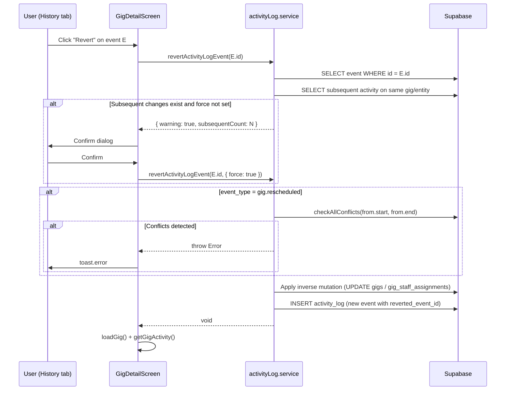

# Technical Specification: Change History / Activity Log

**Feature**: Change History / Recent Activity  
**Status**: Draft  
**Last Updated**: 2026-06-15  
**Based on**: `requirements.md` (same artifacts directory)

---

## 1. Technical Context

| Dimension | Details |
|---|---|
| Language | TypeScript 5 |
| Runtime | Browser (Vite/React 18) + Supabase Edge Functions (Deno) |
| Database | PostgreSQL 17 via Supabase (direct client + RLS) |
| Client | `@supabase/supabase-js` v2 |
| State | React `useState`/`useEffect` — no global store |
| Service layer | `src/services/*.service.ts` — async functions wrapping Supabase queries |
| Auth | `requireAuth()` from `src/utils/supabase/auth-utils.ts` |
| Types | Generated `database.types.ts` + hand-authored `types.tsx` |
| Testing | Vitest, `npm run test:run` |
| Build check | `npm run build && npm run test:run` |

---

## 2. Database Layer

### 2.1 New Table: `activity_log`

```sql
CREATE TABLE public.activity_log (
  id              UUID        PRIMARY KEY DEFAULT gen_random_uuid(),
  organization_id UUID        REFERENCES public.organizations(id) ON DELETE SET NULL,
  actor_id        UUID        NOT NULL REFERENCES public.users(id) ON DELETE SET NULL,
  event_type      TEXT        NOT NULL,
  entity_type     TEXT        NOT NULL,
  entity_id       UUID        NOT NULL,
  gig_id          UUID        REFERENCES public.gigs(id) ON DELETE CASCADE,
  context         JSONB       NOT NULL DEFAULT '{}',
  occurred_at     TIMESTAMPTZ NOT NULL DEFAULT NOW()
);
```

**Constraints / checks**:
- `event_type` must match the dot-notation codes defined in the PRD (enforced by the service layer; not a DB enum, to avoid costly enum migrations on new event types).
- `gig_id` uses `ON DELETE CASCADE` so that deleting a gig also removes all its activity log entries.
- `actor_id` uses `ON DELETE SET NULL` (not cascade) so history survives account deletion; display name is snapshotted in `context`.

**Indexes**:

```sql
CREATE INDEX idx_activity_log_gig_id   ON public.activity_log (gig_id, occurred_at DESC);
CREATE INDEX idx_activity_log_entity   ON public.activity_log (entity_type, entity_id, occurred_at DESC);
CREATE INDEX idx_activity_log_org_id   ON public.activity_log (organization_id, occurred_at DESC);
CREATE INDEX idx_activity_log_actor_id ON public.activity_log (actor_id, occurred_at DESC);
```

### 2.2 RLS on `activity_log`

RLS is **ENABLED**. Three policies:

**SELECT — gig-scoped rows** (any user with gig access):
```sql
CREATE POLICY "activity_log_select_gig_scoped"
  ON public.activity_log FOR SELECT
  USING (
    gig_id IS NOT NULL
    AND public.user_has_access_to_gig(gig_id, auth.uid())
  );
```

**SELECT — non-gig-scoped rows** (standalone asset/kit; org members only):
```sql
CREATE POLICY "activity_log_select_org_scoped"
  ON public.activity_log FOR SELECT
  USING (
    gig_id IS NULL
    AND organization_id IN (
      SELECT organization_id FROM public.organization_members
      WHERE user_id = auth.uid()
    )
  );
```

**INSERT** — authenticated users; service layer enforces correctness:
```sql
CREATE POLICY "activity_log_insert_authenticated"
  ON public.activity_log FOR INSERT
  WITH CHECK (auth.uid() IS NOT NULL AND actor_id = auth.uid());
```

No UPDATE or DELETE policies — the log is append-only. Revert actions create new entries; they never modify existing ones.

### 2.3 Migration: Replace `gig_status_history` and `asset_status_history`

A new migration file `20260615000000_activity_log.sql` performs in order:

1. Create `activity_log` table + indexes + RLS (§2.1/§2.2).
2. Migrate `gig_status_history` rows into `activity_log` as `gig.status_changed` events.
   - Resolve `organization_id`: find the single org where the actor is a member AND the org participates in the gig; NULL if ambiguous or actor no longer exists.
   - Snapshot `actor_display_name` from `users.first_name || ' ' || users.last_name`; fall back to `'[Historical Record]'` if actor missing.
   - Set `actor_org_name` to `'[Historical Record]'` for all migrated rows (org name unavailable at migration time).
3. Drop trigger `record_gig_status_change` on `gigs`.
4. Drop table `gig_status_history`.
5. Migrate `asset_status_history` rows into `activity_log` as `asset.status_changed` events (analogous pattern; `gig_id = NULL` for all asset rows).
6. Drop trigger `record_asset_status_change` on `assets`.
7. Drop table `asset_status_history`.

After migration: regenerate `database.types.ts` via `supabase gen types typescript --linked`.

### 2.4 `database.types.ts` Changes

After type regeneration:
- `activity_log` Row/Insert/Update types are added.
- `gig_status_history` and `asset_status_history` table types are removed.

---

## 3. TypeScript Types

### 3.1 Additions to `src/utils/supabase/types.tsx`

```typescript
export type DbActivityLog = Tables['activity_log']['Row'];

export interface ActivityLogContext {
  actor_display_name: string;
  actor_org_name: string;
  gig_title?: string;
  from_status?: string;
  to_status?: string;
  from?: { start?: string; end?: string };
  to?: { start?: string; end?: string };
  from_title?: string;
  to_title?: string;
  organization_name?: string;
  role?: string;
  user_name?: string;
  initial_status?: string;
  kit_name?: string;
  asset_model?: string;
  category?: string;
  quantity?: number;
  reverted_event_id?: string;
}

export interface ActivityLogEntry extends Omit<DbActivityLog, 'context'> {
  context: ActivityLogContext;
}
```

### 3.2 Removals from `src/utils/supabase/types.tsx`

- `DbAssetStatusHistory` (table dropped)
- `DbGigStatusHistory` (table dropped)

### 3.3 New: `src/utils/activityLog.events.ts` — Event Registry

This is the **single source of truth** for all captured event types. Adding a new event type means adding one entry here; removing means deleting one entry. TypeScript's `keyof typeof ACTIVITY_EVENTS` ensures that any use of an event type string is checked at compile time against this registry.

```typescript
import type { ActivityLogContext } from '../supabase/types';

interface EventTypeConfig {
  label: string;             // human-readable name for UI display
  entityType: string;        // top-level entity: 'gig' | 'asset' | 'kit' | 'staffing' | 'participant' | 'kit_assignment'
  revertible: boolean;       // whether a "Revert" action is offered in the UI
  calendarIndicator: boolean; // whether this event triggers the calendar change dot
  contextKeys: (keyof ActivityLogContext)[];  // required context fields (for documentation + dev tooling)
  format: (ctx: ActivityLogContext) => string; // pure function → human-readable sentence
}

export const ACTIVITY_EVENTS = {
  'gig.status_changed': {
    label: 'Status Changed',
    entityType: 'gig',
    revertible: true,
    calendarIndicator: true,
    contextKeys: ['gig_title', 'from_status', 'to_status'],
    format: (ctx) => `Status changed from ${ctx.from_status} to ${ctx.to_status}`,
  },
  'gig.rescheduled': {
    label: 'Rescheduled',
    entityType: 'gig',
    revertible: true,
    calendarIndicator: true,
    contextKeys: ['gig_title', 'from', 'to'],
    format: (ctx) => `Rescheduled from ${formatDate(ctx.from?.start)} to ${formatDate(ctx.to?.start)}`,
  },
  'gig.renamed': {
    label: 'Renamed',
    entityType: 'gig',
    revertible: true,
    calendarIndicator: false,
    contextKeys: ['from_title', 'to_title'],
    format: (ctx) => `Renamed from '${ctx.from_title}' to '${ctx.to_title}'`,
  },
  'participant.added': {
    label: 'Participant Added',
    entityType: 'participant',
    revertible: false,
    calendarIndicator: false,
    contextKeys: ['gig_title', 'organization_name', 'role'],
    format: (ctx) => `${ctx.organization_name} added as ${ctx.role} participant`,
  },
  'participant.removed': {
    label: 'Participant Removed',
    entityType: 'participant',
    revertible: false,
    calendarIndicator: false,
    contextKeys: ['gig_title', 'organization_name', 'role'],
    format: (ctx) => `${ctx.organization_name} removed as ${ctx.role} participant`,
  },
  'staffing.slot_added': {
    label: 'Staff Slot Added',
    entityType: 'staffing',
    revertible: false,
    calendarIndicator: false,
    contextKeys: ['gig_title', 'role'],
    format: (ctx) => `${ctx.role} slot added`,
  },
  'staffing.slot_removed': {
    label: 'Staff Slot Removed',
    entityType: 'staffing',
    revertible: false,
    calendarIndicator: false,
    contextKeys: ['gig_title', 'role'],
    format: (ctx) => `${ctx.role} slot removed`,
  },
  'staffing.assigned': {
    label: 'Staff Assigned',
    entityType: 'staffing',
    revertible: false,
    calendarIndicator: false,
    contextKeys: ['gig_title', 'user_name', 'role', 'initial_status'],
    format: (ctx) => `${ctx.user_name} assigned as ${ctx.role} (${ctx.initial_status})`,
  },
  'staffing.status_changed': {
    label: 'Staffing Status Changed',
    entityType: 'staffing',
    revertible: true,
    calendarIndicator: false,
    contextKeys: ['gig_title', 'user_name', 'role', 'from_status', 'to_status'],
    format: (ctx) => `${ctx.user_name}'s ${ctx.role} status changed from ${ctx.from_status} to ${ctx.to_status}`,
  },
  'staffing.unassigned': {
    label: 'Staff Unassigned',
    entityType: 'staffing',
    revertible: false,
    calendarIndicator: false,
    contextKeys: ['gig_title', 'user_name', 'role'],
    format: (ctx) => `${ctx.user_name} unassigned from ${ctx.role}`,
  },
  'kit_assignment.added': {
    label: 'Kit Assigned',
    entityType: 'kit_assignment',
    revertible: false,
    calendarIndicator: false,
    contextKeys: ['gig_title', 'kit_name'],
    format: (ctx) => `${ctx.kit_name} kit assigned`,
  },
  'kit_assignment.removed': {
    label: 'Kit Removed',
    entityType: 'kit_assignment',
    revertible: false,
    calendarIndicator: false,
    contextKeys: ['gig_title', 'kit_name'],
    format: (ctx) => `${ctx.kit_name} kit removed`,
  },
  'asset.status_changed': {
    label: 'Asset Status Changed',
    entityType: 'asset',
    revertible: false,
    calendarIndicator: false,
    contextKeys: ['asset_model', 'category', 'from_status', 'to_status'],
    format: (ctx) => `Status changed from ${ctx.from_status} to ${ctx.to_status}`,
  },
  'kit.asset_added': {
    label: 'Asset Added to Kit',
    entityType: 'kit',
    revertible: false,
    calendarIndicator: false,
    contextKeys: ['kit_name', 'asset_model', 'quantity'],
    format: (ctx) => `${ctx.quantity}× ${ctx.asset_model} added to kit`,
  },
  'kit.asset_removed': {
    label: 'Asset Removed from Kit',
    entityType: 'kit',
    revertible: false,
    calendarIndicator: false,
    contextKeys: ['kit_name', 'asset_model'],
    format: (ctx) => `${ctx.asset_model} removed from kit`,
  },
} as const satisfies Record<string, EventTypeConfig>;

export type ActivityEventType = keyof typeof ACTIVITY_EVENTS;
```

**Derived helpers** (also exported from this file):

```typescript
export const REVERTIBLE_EVENT_TYPES = Object.entries(ACTIVITY_EVENTS)
  .filter(([, cfg]) => cfg.revertible)
  .map(([type]) => type as ActivityEventType);

export const CALENDAR_INDICATOR_EVENT_TYPES = Object.entries(ACTIVITY_EVENTS)
  .filter(([, cfg]) => cfg.calendarIndicator)
  .map(([type]) => type as ActivityEventType);
```

**To add a new event type**: add one entry to `ACTIVITY_EVENTS`. TypeScript's exhaustiveness checking in the service layer (via `ActivityEventType`) will surface any missing cases at compile time.

**To remove an event type**: delete its entry from `ACTIVITY_EVENTS`. The TypeScript compiler will flag any remaining usages of the deleted key.

---

## 4. Service Layer

### 4.1 New: `src/services/activityLog.service.ts`

Public API:

```typescript
export async function logActivity(entry: {
  organization_id: string | null;
  event_type: ActivityEventType;
  entity_type: string;
  entity_id: string;
  gig_id?: string | null;
  context: ActivityLogContext;
}): Promise<void>

export async function getRecentActivity(options?: {
  limit?: number;    // default 50
  daysCutoff?: number; // default 30
}): Promise<ActivityLogEntry[]>

export async function getEntityActivity(
  entityType: string,
  entityId: string
): Promise<ActivityLogEntry[]>

export async function getGigActivity(gigId: string): Promise<ActivityLogEntry[]>

export async function revertActivityLogEvent(
  eventId: string,
  options?: { force?: boolean }
): Promise<{ warning?: true; subsequentCount?: number } | void>
```

**`logActivity` implementation notes**:
- Uses `requireAuth()` to obtain the supabase client; `actor_id` is always `auth.user.id`.
- Caller resolves `actor_display_name` and `actor_org_name` from data already in scope before calling this function (no extra DB round-trip inside `logActivity`).
- All call sites wrap this in `.catch(console.error)` — logging failures must never break the triggering mutation.

**`getRecentActivity` implementation notes**:
- Single query: `activity_log` ordered by `occurred_at DESC`, limited to 50, filtered `>= NOW() - INTERVAL '30 days'`. RLS handles visibility automatically via the two SELECT policies.

**`revertActivityLogEvent` implementation notes**:
1. Fetch the target event. Validate `event_type` via `ACTIVITY_EVENTS[event_type]?.revertible === true` (derived from the registry — no hardcoded list).
2. Check for subsequent changes: query `activity_log` for entries on the same `gig_id`/`entity_id` with `occurred_at > event.occurred_at`. If any and `options.force` is not set, return `{ warning: true, subsequentCount: N }`.
3. For `gig.rescheduled`: call `checkAllConflicts` from `conflictDetection.service.ts` with the `context.from` dates. Throw if conflicts found.
4. Apply inverse mutation via existing service functions (`updateGig`, `updateStaffAssignmentStatus`). Pass `reverted_event_id: event.id` in the context of the resulting log entry.

### 4.2 Modified: `src/services/gig.service.ts`

**`updateGig`**: Fetch `{ status, start, end, title }` before the `.update()` call (minimal select). After the update succeeds, fire-and-forget `logActivity` for each field that changed:
- `status` changed → `gig.status_changed`
- `start` or `end` changed → `gig.rescheduled`
- `title` changed → `gig.renamed`

Context always includes `actor_display_name`, `actor_org_name`, `gig_title` (new title), plus event-specific fields (`from_status`/`to_status`, `from`/`to` dates, `from_title`/`to_title`). The `primary_organization_id` and user profile are already in scope from the existing auth/permission checks.

**`updateGigParticipants`**: After computing `idsToDelete` and iterating new participants:
- Each deleted participant ID → `participant.removed` (fetch org name from the participant being deleted before deleting).
- Each inserted participant → `participant.added`.

**`updateGigStaffSlots`**: After processing deletions and inserts:
- Deleted slot IDs → `staffing.slot_removed` (include role name in context).
- Inserted slots → `staffing.slot_added`.
- For assignments within each slot:
  - Fetch existing assignment statuses before the delete/insert loop.
  - Deleted assignment IDs → `staffing.unassigned`.
  - Inserted assignments → `staffing.assigned`.
  - Status changes on existing assignments → `staffing.status_changed`.

**`updateStaffAssignmentStatus`** (line 1380): After the update, fetch old status first (currently the function only has the new status), then log `staffing.status_changed`.

**`updateGigKitAssignments`**:
- Deleted assignment IDs → `kit_assignment.removed` (fetch kit name before deleting).
- Inserted assignments → `kit_assignment.added` (kit name from the incoming `assignment` object).

### 4.3 Modified: `src/services/asset.service.ts`

**`updateAsset`**: Fetch `{ status }` before mutation. After update, if status changed → `asset.status_changed`.

**Remove**: `getAssetStatusHistory` function (table dropped). Update call site in `AssetDetailScreen.tsx`.

### 4.4 Modified: `src/services/kit.service.ts`

**`updateKit`**: Within the asset reconciliation loop, before deleting kit_assets fetch their `asset_id` (to resolve model name for context). After updates:
- Deleted `kit_assets` IDs → `kit.asset_removed`.
- Inserted `kit_assets` → `kit.asset_added`.

---

## 5. UI Components

### 5.1 New: `src/components/ActivityFeed.tsx`

Props:
```typescript
interface ActivityFeedProps {
  entries: ActivityLogEntry[];
  isLoading: boolean;
  onRevert?: (eventId: string) => void;
}
```

Renders:
- Loading state: skeleton rows (3 rows, matching existing skeleton patterns in the codebase).
- Empty state: muted text "No recent activity."
- Entry rows: **who** (`actor_display_name · actor_org_name`), **what** (`formatActivityEvent(entry)`), **when** (relative time via `date-fns` `formatDistanceToNow`).
- Revert button: ghost `Button` (size `sm`) visible on row hover, only rendered when `onRevert` is provided AND `isRevertible(entry.event_type)` returns true.

Uses existing UI primitives: `Card`, `Button`, `Badge`, `Loader2` from `./ui/*`.

### 5.2 New: `src/utils/activityLog.utils.ts`

Thin wrappers that delegate entirely to `ACTIVITY_EVENTS` — no separate lists or switch statements to maintain:

```typescript
import { ACTIVITY_EVENTS, type ActivityEventType } from './activityLog.events';
import type { ActivityLogEntry } from '../supabase/types';

export function formatActivityEvent(entry: ActivityLogEntry): string {
  const cfg = ACTIVITY_EVENTS[entry.event_type as ActivityEventType];
  return cfg ? cfg.format(entry.context) : entry.event_type;
}

export function isRevertible(eventType: string): boolean {
  return ACTIVITY_EVENTS[eventType as ActivityEventType]?.revertible ?? false;
}
```

Both functions are pure (no DB calls, no React) and fully unit-testable. Because `format` is defined on each registry entry, **adding a new event type automatically adds its formatting** — there is no secondary switch statement to update.

### 5.3 Modified: `src/components/Dashboard.tsx`

- Add `recentActivity: ActivityLogEntry[]` and `activityLoading: boolean` state.
- After stats load, trigger a non-blocking `getRecentActivity()` call (independent `useEffect` or chained).
- Add a "Recent Activity" `Card` section below the existing stats and upcoming-gigs area.
- Render `<ActivityFeed entries={recentActivity} isLoading={activityLoading} />` (no `onRevert` prop — Dashboard feed is read-only).

### 5.4 Modified: `src/components/CalendarScreen.tsx`

- Add `changedGigIds: Set<string>` state.
- After gigs load, query `activity_log` for `gig_id` values with `event_type IN (CALENDAR_INDICATOR_EVENT_TYPES)` and `occurred_at >= NOW() - INTERVAL '7 days'`. Store as a `Set<string>`. The event type list is derived from the registry (`calendarIndicator: true` entries) — no hardcoded strings in the component.
- Extend the calendar event renderer: if the event's `id` is in `changedGigIds`, append a small amber dot (e.g., `<span className="inline-block w-2 h-2 rounded-full bg-amber-400 ml-1" />`) after the event title.

### 5.5 Modified: `src/components/GigDetailScreen.tsx`

- Add `gigActivity: ActivityLogEntry[]` and `activityLoading: boolean` state.
- Load `getGigActivity(gigId)` in parallel with the existing conflict check.
- Introduce a `Tabs` layout wrapping the gig detail body (using `Tabs`, `TabsList`, `TabsTrigger`, `TabsContent` from `./ui/tabs`). Tabs: **Overview** (existing content) and **History**.
- History tab renders:
  - A synthetic "Created" entry at top derived from `gig.created_at` / `gig.created_by` (display as a styled header row, not an `ActivityLogEntry`).
  - `<ActivityFeed entries={gigActivity} isLoading={activityLoading} onRevert={handleRevert} />`
- `handleRevert(eventId)`:
  1. Calls `revertActivityLogEvent(eventId)`.
  2. If result has `warning: true`: shows a confirm dialog (`"This event has N subsequent changes. Revert anyway?"`). On confirm, calls `revertActivityLogEvent(eventId, { force: true })`.
  3. On success: reloads gig + activity (calls `loadGig()` and `getGigActivity(gigId)`).
  4. On error: `toast.error(message)`.

### 5.6 Modified: `src/components/AssetDetailScreen.tsx`

- Replace `getAssetStatusHistory(assetId)` call with `getEntityActivity('asset', assetId)`.
- Remove `statusHistory: DbAssetStatusHistory[]` state; add `assetActivity: ActivityLogEntry[]`.
- Replace the existing status-history table rendering with `<ActivityFeed entries={assetActivity} isLoading={isLoadingHistory} />`.
- Remove imports of `getAssetStatusHistory` and `DbAssetStatusHistory`.

### 5.7 Modified: `src/components/KitDetailScreen.tsx`

- Add `kitActivity: ActivityLogEntry[]` and `activityLoading: boolean` state.
- Load `getEntityActivity('kit', kitId)` after kit loads.
- Add a "History" section at the bottom of the kit detail card: `<ActivityFeed entries={kitActivity} isLoading={activityLoading} />`.

---

## 6. Revert Flow Sequence



---

## 7. Source Code Structure Changes

### New files
- `supabase/migrations/20260615000000_activity_log.sql`
- `src/utils/activityLog.events.ts` — event type registry (add/remove event types here)
- `src/services/activityLog.service.ts`
- `src/utils/activityLog.utils.ts`
- `src/components/ActivityFeed.tsx`

### Modified files
- `src/utils/supabase/database.types.ts` — regenerated
- `src/utils/supabase/types.tsx` — add/remove types
- `src/services/gig.service.ts`
- `src/services/asset.service.ts`
- `src/services/kit.service.ts`
- `src/components/Dashboard.tsx`
- `src/components/CalendarScreen.tsx`
- `src/components/GigDetailScreen.tsx`
- `src/components/AssetDetailScreen.tsx`
- `src/components/KitDetailScreen.tsx`

---

## 8. Verification Approach

```bash
npm run build && npm run test:run
```

**Unit tests alongside each implementation task**:

| Module | Tests |
|---|---|
| `activityLog.events.ts` | Registry is complete (all 15 event types present); each entry has all required fields; `REVERTIBLE_EVENT_TYPES` and `CALENDAR_INDICATOR_EVENT_TYPES` contain the correct members |
| `activityLog.utils.ts` | `formatActivityEvent` delegates to registry for all event types; returns raw `event_type` for unknown types; `isRevertible` matches registry `revertible` flag |
| `activityLog.service.ts` | `logActivity` inserts correct shape; `revertActivityLogEvent` applies inverse + logs new entry; subsequent-changes warning path; conflict rejection for `gig.rescheduled` |
| `gig.service.ts` | `updateGig` calls `logActivity` when status/dates/title change; does NOT call it when only notes/tags change |
| `ActivityFeed.tsx` | Renders entries with correct text; shows revert button only for revertible types when `onRevert` provided; shows empty and loading states |

All existing tests in `gig.service.test.ts`, `asset.service.test.ts`, and `kit.service.test.ts` must continue to pass (logging calls are fire-and-forget and will be mocked with `vi.mock`).
