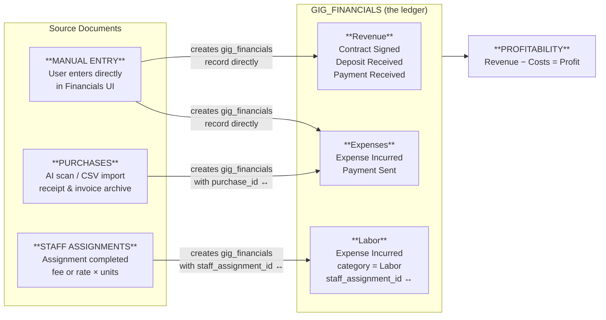
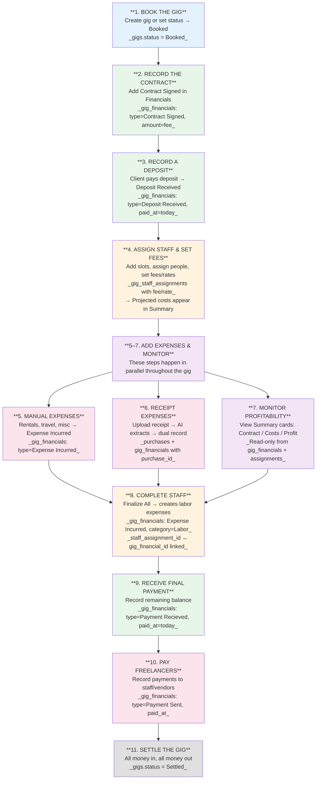
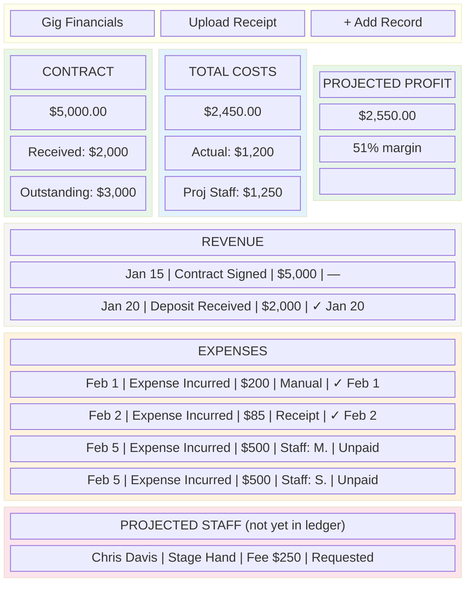
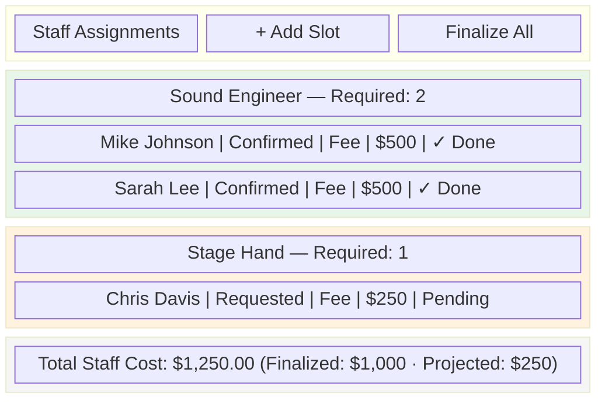

# Gig Financials Workflow — Design & Implementation Plan

## Codebase Summary

After reading all specified files, here is what exists:

### Schema
- **`gig_financials`**: Tracks financial events per gig. Fields: `gig_id`, `organization_id`, `amount`, `date`, `type` (fin_type enum — 24 values), `category` (fin_category enum — 8 values), `counterparty_id`, `external_entity_name`, `currency`, `description`, `due_date`, `paid_at`, `reference_number`, `notes`.
- **`purchases`**: Header/item tree structure for invoices/receipts. Fields: `organization_id`, `gig_id` (nullable), `parent_id`, `row_type` (header/item/asset), `vendor`, `total_inv_amount`, `line_amount`, `line_cost`, `description`, `category`. Created via CSV import or AI receipt scanning.
- **`gig_staff_assignments`**: Has `rate` (numeric) and `fee` (numeric) columns. Status: Open/Requested/Confirmed/Declined.
- **`gig_staff_slots`**: Has `gig_id`, `staff_role_id`, `organization_id`, `required_count`.
- **`gigs`**: Status enum: DateHold, Proposed, Booked, Completed, Cancelled, Settled.

### UI Components

(This is the end state, not the current state.)

- **`GigFinancialsSection`**: Admin and managers only. Shows profitability summary cards, revenue/expense records grouped by type, projected staff costs, and an "Upload Receipt" button for AI receipt scanning. Add/Edit via modal with all fields. Auto-saves.
- **`GigStaffSlotsSection`**: Shows role slots with assignments. Each assignment has user selector, status dropdown, compensation_type (rate/fee), and dollar amount. **Rate/fee are captured in UI** — they feed projected costs in the profitability summary, and become actual costs when assignments are completed into the ledger.

### Constants
- **`FIN_TYPE_CONFIG`**: All 24 `fin_type` enum values with display labels. Labels match the enum value (except "Payment Recieved" → "Payment Received" for display). No grouping, icons, or color — grouping is added via `FIN_TYPE_GROUPS` (see Phase 2).
- **`FIN_CATEGORY_CONFIG`**: 8 `fin_category` enum values with display labels: Labor, Equipment, Transportation, Venue, Production, Insurance, Rebillable, Other. Each `gig_financials` record has both a `type` (what happened — Contract Signed, Expense Incurred, etc.) and a `category` (what it's for — Labor, Equipment, etc.).

### Attachments
- `gig_financials` supports file attachments via the existing `entity_attachments` system (polymorphic attachment table). Receipts, invoices, and supporting documents can be attached directly to financial records.

---

## Core Architecture: The Single-Ledger Model

### Principle

**`gig_financials` is the single source of truth for all gig financial data.** Every financial event that impacts a gig — revenue, expense, staff labor cost — is recorded as a row in `gig_financials`. Profitability is calculated by querying this one table.

Other tables serve as **source documents** that feed into the ledger, with **two-way linking**:
- **`purchases`** is the receipt/invoice archive. When a scanned receipt is a gig expense, a `gig_financials` expense record is created with `purchase_id` → purchases.id. The purchase also retains `gig_id` for tracking. The receipt stays in `purchases` for traceability; the financial effect lives in `gig_financials`.
- **`gig_staff_assignments`** tracks who is assigned to work a gig and their agreed compensation. When an assignment is marked complete, a `gig_financials` record is created with `staff_assignment_id` → gig_staff_assignments.id, and the assignment gets `gig_financial_id` → gig_financials.id back. Before completion, assignment fees serve as **projected** costs only.

This mirrors how assets already work: a purchase creates an asset record (the effect), and the asset links back to the purchase (the source document). The pattern is consistent and uses two-way linking throughout: purchases ↔ assets, purchases ↔ gig_financials, gig_staff_assignments ↔ gig_financials.

### Data Flow Diagram



---

## Design Questions — Answers

### Q1: `gig_financials` vs. `purchases` — What's the right boundary?

**`purchases` is the receipt box. `gig_financials` is the ledger. The financial effect of a purchase flows into the ledger; the receipt stays in the archive.**

When a user scans a receipt on the gig detail page, the system creates:
1. A `purchases` record (header + items, `gig_id` set) — the receipt archive, with attachments
2. A `gig_financials` record (type = `Expense Incurred`, `purchase_id` → purchases.id) — the financial effect

The `gig_id` column is **kept on `purchases`** for tracking purposes — analogous to how `asset_id` exists on purchase items to link back to assets. The authoritative gig expense data still comes from `gig_financials`; `purchases.gig_id` is a convenience for finding which receipts belong to a gig without joining through the ledger.

**Edit propagation**: If a purchase record is edited after the linked `gig_financials` record was created, the amounts may diverge. The `gig_financials` record is the financial truth; the purchase is the receipt archive. A future enhancement could flag discrepancies for reconciliation, but for now, edits to either record are independent.

**Concrete scenarios:**
- "Rented a subwoofer for $200" → User adds an `Expense Incurred` record in Financials. No purchase record needed (no receipt to archive).
- "Scanned a receipt from Bob's Audio" → System creates a `purchases` record AND a linked `gig_financials` record. The expense appears in the ledger; the receipt is viewable via the link.
- "Bought a new mic ($150) — it's a capital asset" → System creates a `purchases` record and an `assets` record. No `gig_financials` record. Capital purchases don't hit the gig ledger.

### Q2: Should staff costs live in `gig_staff_assignments` or `gig_financials`?

**Both — at different lifecycle stages.**

- **Before the gig**: Staff assignments hold projected costs (fee or rate). These show as "Projected Staff Costs" in the profitability view but are NOT in the ledger.
- **After the gig**: When an assignment is marked complete, a `gig_financials` record is created (type = `Expense Incurred`, category = `Labor`) with `staff_assignment_id` linking back. For rate-based staff, the user enters actual units worked. The cost is now in the ledger.
- **Payment tracking**: Later, the user can add a `Payment Sent` record when they actually pay the freelancer — giving clear visibility into "expense incurred but not yet paid."

**New fields on `gig_staff_assignments`:**
- `completed_at` (nullable timestamp) — when the work was marked done
- `units_completed` (nullable numeric) — for rate-based, actual hours/days worked
- `gig_financial_id` (nullable UUID FK → gig_financials.id) — back-link to the ledger entry created on completion

**Completion UX**: When gig status changes to Completed, offer a "Finalize Staff Costs" action that completes all confirmed assignments at their stated fees in one click. Rate-based assignments prompt for units individually.

### Q3: What's the right simplification of `fin_type` for a single-org sound company?

**Keep the existing enum values, add a display-layer grouping.**

For a sound company managing their own books, the practical types are:

**Revenue types (money coming IN):**
- `Contract Signed` — the agreed fee (formal contract)
- `Bid Accepted` — verbal or informal agreement (use when no formal contract exists)
- `Deposit Received` — client deposit
- `Payment Recieved` — client payment (enum typo is permanent)

**Cost types (money going OUT):**
- `Expense Incurred` — spending on this gig (equipment rental, travel, misc, AND staff labor on completion)
- `Payment Sent` — payment to a freelancer or vendor

**Tracking types (informational):**
- `Invoice Issued` — sent invoice to client
- `Invoice Settled` — invoice was paid

The Add Financial modal shows these common types prominently; advanced/bid/sub-contract types accessible via "All Types" expander.

### Q4: What should the "gig profitability" calculation include?

With the single-ledger model, profitability is straightforward:

```
REVENUE     = SUM(gig_financials.amount) WHERE type IN (Contract Signed, Bid Accepted)
RECEIVED    = SUM(gig_financials.amount) WHERE type IN (Deposit Received, Payment Recieved)
OUTSTANDING = REVENUE - RECEIVED

ACTUAL COSTS = SUM(gig_financials.amount) WHERE type IN (Expense Incurred, Payment Sent, Deposit Sent)
PROJECTED STAFF = SUM(gig_staff_assignments.fee) WHERE completed_at IS NULL
                  AND status IN (Confirmed, Requested)
TOTAL COSTS  = ACTUAL COSTS + PROJECTED STAFF

PROFIT       = REVENUE - TOTAL COSTS
MARGIN       = PROFIT / REVENUE × 100
```

One table for all settled financials. Staff assignments contribute projected costs only until they're completed and move into the ledger.

---

## Schema Changes

### `gig_financials` — add two FK columns

```sql
ALTER TABLE gig_financials ADD COLUMN purchase_id UUID REFERENCES purchases(id) ON DELETE SET NULL;
ALTER TABLE gig_financials ADD COLUMN staff_assignment_id UUID REFERENCES gig_staff_assignments(id) ON DELETE SET NULL;
```

### `gig_staff_assignments` — add completion tracking + back-link

```sql
ALTER TABLE gig_staff_assignments ADD COLUMN completed_at TIMESTAMPTZ;
ALTER TABLE gig_staff_assignments ADD COLUMN units_completed NUMERIC(10,2);
ALTER TABLE gig_staff_assignments ADD COLUMN gig_financial_id UUID REFERENCES gig_financials(id) ON DELETE SET NULL;
```

### `purchases` — keep gig_id (no changes needed)

`purchases.gig_id` is retained for tracking purposes (analogous to `purchases.asset_id`). No schema change required.

(Since we're on test data, no migration needed — just reset the schema.)

---

## Workflow Design

### The Sound Company's Gig Financial Lifecycle



**Workflow step details:**

| Step | UI Location | Data Recorded |
|------|------------|---------------|
| 1. Book the Gig | Gig creation form or status dropdown | `gigs.status = Booked` |
| 2. Record Contract | Financials → Add modal | `gig_financials`: Contract Signed (or Bid Accepted for informal) |
| 3. Record Deposit | Financials → Add modal | `gig_financials`: Deposit Received, paid_at |
| 4. Assign Staff | Staff Assignments section | `gig_staff_slots` + `gig_staff_assignments` with fee/rate |
| 5. Manual Expenses | Financials → Add modal | `gig_financials`: Expense Incurred |
| 6. Receipt Scan | Financials → Upload Receipt | `purchases` (with gig_id) + `gig_financials` with purchase_id |
| 7. Monitor Profit | Financials → Summary cards | Read-only calculation |
| 5–7 run in parallel | — | Expenses and monitoring happen throughout the gig lifecycle |
| 8. Complete Staff | Staff Assignments → Finalize All | `gig_staff_assignments.completed_at` + `gig_financials` Labor (two-way link) |
| 9. Final Payment | Financials → Add modal | `gig_financials`: Payment Recieved |
| 10. Pay Freelancers | Financials → Add modal | `gig_financials`: Payment Sent |
| 11. Settle | Status dropdown | `gigs.status = Settled` |

---

## Transaction Types


---

## UI Designs

### Gig Financials Section (Redesigned)



**Key design decisions:**
- Three summary cards answer "am I making money?"
- Revenue and Expenses are both from `gig_financials` — one table, grouped by type
- Completed staff show as Expense Incurred rows with a "Staff: Name" source indicator
- Uncompleted staff show in a separate "Projected Staff" section (sourced from assignments)
- Receipt-sourced expenses show a "Receipt" source indicator and can link to the original document
- Paid/Unpaid column gives clear visibility into cash flow
- "Upload Receipt" button is in this section — no separate Purchase Receipts section. Receipt upload creates both a `purchases` record and a linked `gig_financials` record.

### Staff Assignments Section (Enhanced)



- "Finalize All" button completes all confirmed fee-based assignments in one click
- Individual assignments show completion status (Done / Pending)
- Rate-based assignments show a "Complete" button that prompts for units

### Profitability Summary Cards

**Contract Card:**
- Contract Amount: Sum of `Contract Signed` + `Bid Accepted` from `gig_financials`
- Received: Sum of `Deposit Received` + `Payment Recieved`
- Outstanding: Contract - Received
- Color: Green when fully paid, amber partial, gray nothing

**Total Costs Card:**
- Actual: Sum of cost-type records in `gig_financials`
- Projected Staff: Sum of fees from uncompleted assignments
- Color: Neutral blue/gray

**Profit Card:**
- Amount: Contract - (Actual Costs + Projected Staff)
- Margin: Profit / Contract × 100
- Color: Green positive, red negative

---

## Implementation Plan

### Phase 1: Schema Changes + Profitability Summary

**Database changes:**
- Add `purchase_id` (nullable UUID FK → purchases.id) to `gig_financials`
- Add `staff_assignment_id` (nullable UUID FK → gig_staff_assignments.id) to `gig_financials`
- Add `completed_at` (nullable timestamptz) to `gig_staff_assignments`
- Add `units_completed` (nullable numeric) to `gig_staff_assignments`
- Add `gig_financial_id` (nullable UUID FK → gig_financials.id) to `gig_staff_assignments`
- Keep `gig_id` on `purchases` (no change needed)

**Service layer:**
- New `getGigProfitabilitySummary(gigId, organizationId)` — queries `gig_financials` grouped by type, plus uncompleted staff assignments for projected costs
- Update receipt scanning flow to create both a purchase AND a gig_financials record

**Components:**
- New `GigProfitabilitySummary.tsx` — three-card layout
- Integrate into `GigFinancialsSection.tsx`

### Phase 2: Grouped Records + Simplified Type Picker

**Constants:**
- Add `FIN_TYPE_GROUPS` to `constants.ts` (revenue/cost/tracking/advanced groupings)

**Components:**
- Update `GigFinancialsSection.tsx`: group records by revenue/expense, show paid/unpaid status, show source indicators (Manual, Receipt, Staff)
- Simplify Add/Edit modal: common types prominent, all types via expander
- Default to `Contract Signed` instead of `Bid Submitted`

### Phase 3: Staff Completion Flow

**Service layer:**
- New `completeStaffAssignment(assignmentId, unitsCompleted?)` — sets `completed_at`, creates linked `gig_financials` record, sets `gig_financial_id` back-link on the assignment
- New `completeAllStaffAssignments(gigId)` — bulk completion for fee-based confirmed assignments (sets two-way links for each)

**Components:**
- Update `GigStaffSlotsSection.tsx`: add completion status per assignment, "Finalize All" button, total footer with finalized/projected breakdown
- Add projected-staff sub-section to `GigFinancialsSection.tsx`

### Phase 4: Receipt Upload Integration + Cleanup

**Service layer:**
- Update receipt scanning flow: when scanning from gig page, auto-create both `purchases` record (with `gig_id`) and `gig_financials` record (with `purchase_id`)
- When scanning from global purchases page, create only the `purchases` record (no gig_financials)

**Components:**
- Remove `GigPurchaseExpenses.tsx` entirely — receipt expenses now show in `GigFinancialsSection` as rows with "Receipt" source indicator
- Add "Upload Receipt" button to `GigFinancialsSection` header (triggers the existing AI receipt scan flow)
- Receipt-linked expense rows in the Financials section should link to the original purchase record for viewing line items and attachments

---

## Future Extensions (Not in Scope)

- **Hierarchical gig rollups**: Sum gig_financials across parent/child gigs (Sprint 4+)
- **Multi-tenant bid workflow**: Vendor submits bid → producer accepts
- **Hours tracking**: Rate × hours with clock-in/clock-out
- **Financial reports page**: Cross-gig profitability, outstanding payments, staff earnings
- **Recurring expense templates**: Common gig cost presets
- **Purchase/ledger reconciliation**: Flag discrepancies when a linked purchase is edited after the gig_financials record was created

---

## Verification Checklist

- [ ] Profitability summary correct for: empty gig, contract only, contract + costs, negative profit
- [ ] Staff completion creates gig_financials record with correct amount, staff_assignment_id link, and gig_financial_id back-link
- [ ] Rate-based completion: amount = rate × units_completed
- [ ] "Finalize All" completes only confirmed fee-based assignments
- [ ] Receipt scan from gig page creates both purchase (with gig_id) and gig_financials records (with purchase_id)
- [ ] Receipt scan from global page creates only purchase (no gig_financials)
- [ ] Receipt-sourced expenses display in Financials section with "Receipt" source indicator
- [ ] No double-counting: each cost appears in gig_financials exactly once
- [ ] Projected staff costs disappear from projection as assignments are completed
- [ ] Paid/unpaid status visible on all expense and revenue records
- [ ] All 24 fin_type values still accessible via "All Types" expander
- [ ] Bid Accepted available as revenue type for informal agreements
- [ ] Admin and manager-only visibility preserved on Financials section
- [ ] Upload Receipt button works from Financials section (no separate Purchase Receipts section)
- [ ] Two-way links: purchases ↔ gig_financials, gig_staff_assignments ↔ gig_financials

---

## Related Documentation

- [Technical Reference: Gig Financials](../../technical/gig-financials.md) — Architecture, data boundaries, ER diagram, schema DDL
- [Coding Prompt](./financials-coding-prompt.md) — AI coding agent prompt for implementation
- [Requirements](../requirements.md) — Section 7 (Expense Management & Gig Profitability)
