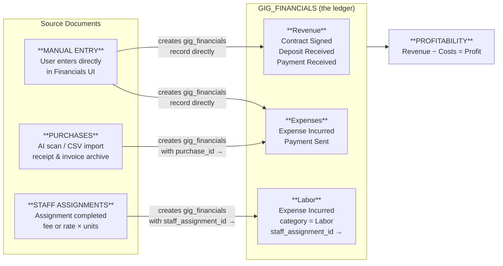
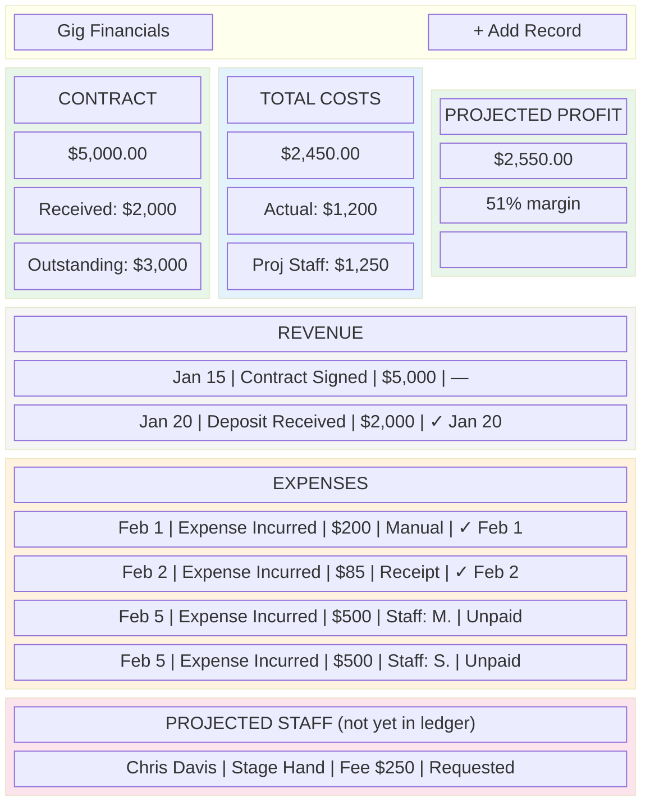
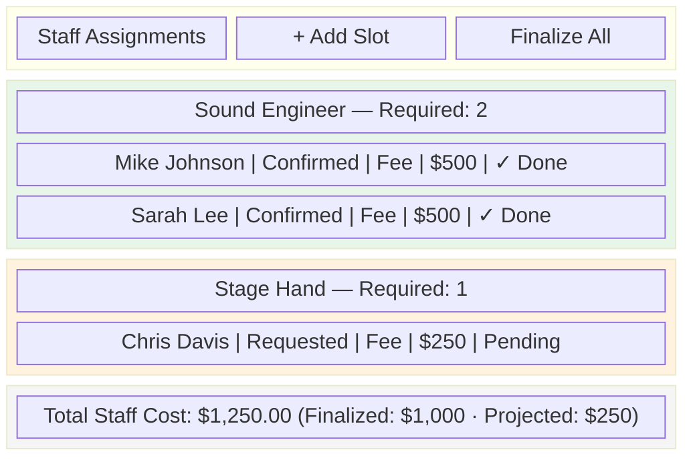
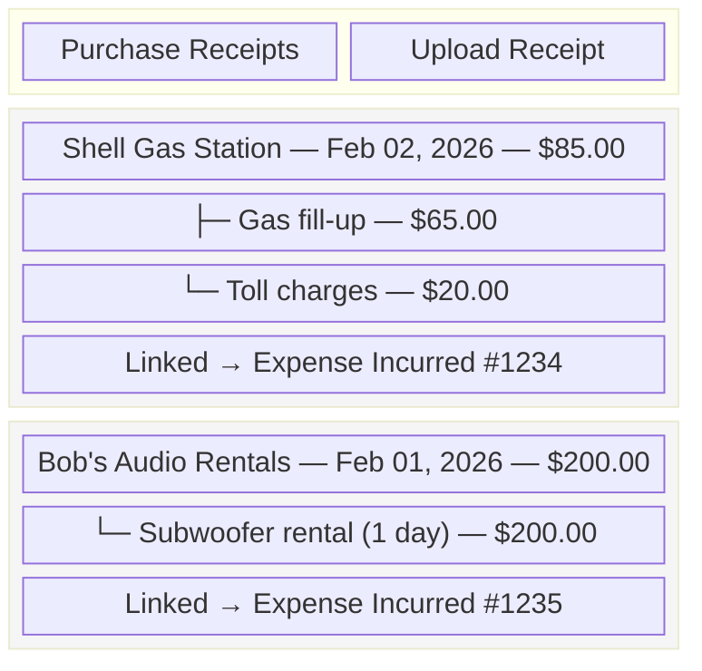

# Gig Financials Workflow — Design & Implementation Plan

## Codebase Summary

After reading all specified files, here is what exists:

### Schema
- **`gig_financials`**: Tracks financial events per gig. Fields: `gig_id`, `organization_id`, `amount`, `date`, `type` (fin_type enum — 24 values), `category` (fin_category enum — 8 values), `counterparty_id`, `external_entity_name`, `currency`, `description`, `due_date`, `paid_at`, `reference_number`, `notes`.
- **`purchases`**: Header/item tree structure for invoices/receipts. Fields: `organization_id`, `gig_id` (nullable), `parent_id`, `row_type` (header/item/asset), `vendor`, `total_inv_amount`, `line_amount`, `line_cost`, `description`, `category`. Created via CSV import or AI receipt scanning.
- **`gig_staff_assignments`**: Has `rate` (numeric) and `fee` (numeric) columns. Status: Open/Requested/Confirmed/Declined.
- **`gig_staff_slots`**: Has `gig_id`, `staff_role_id`, `organization_id`, `required_count`.
- **`gigs`**: Status enum: DateHold, Proposed, Booked, Completed, Cancelled, Settled.

### UI Components

(This is the end state, not the current state.)

- **`GigFinancialsSection`**: Admin and managers only. Shows a flat table of financial records with Date, Type, Amount, Description. Add/Edit via modal with all fields. Auto-saves. Shows current gig income, outgo and profit totals.
- **`GigPurchaseExpenses`**: Admin and managers only. Queries `purchases` where `gig_id` matches AND `row_type = 'item'`. Shows columns (Date, Vendor, Description, item_price, line_cost (as total cost)) with link to full purchase record. Allows AI receipt upload. Shows attachments.
- **`GigStaffSlotsSection`**: Shows role slots with assignments. Each assignment has user selector, status dropdown, compensation_type (rate/fee), and dollar amount. **Rate/fee IS captured in UI** but **never surfaces in any financial summary**.

### Constants
- `FIN_TYPE_CONFIG`: All 24 fin_type values with labels. Labels are just the enum value itself (no grouping, no icons, no color).
- `FIN_CATEGORY_CONFIG`: 8 categories: Labor, Equipment, Transportation, Venue, Production, Insurance, Rebillable, Other.

---

## Core Architecture: The Single-Ledger Model

### Principle

**`gig_financials` is the single source of truth for all gig financial data.** Every financial event that impacts a gig — revenue, expense, staff labor cost — is recorded as a row in `gig_financials`. Profitability is calculated by querying this one table.

Other tables serve as **source documents** that feed into the ledger:
- **`purchases`** is the receipt/invoice archive. When a scanned receipt is a gig expense, a `gig_financials` expense record is created and linked back to the purchase via `purchase_id`. The receipt stays in `purchases` for traceability; the financial effect lives in `gig_financials`.
- **`gig_staff_assignments`** tracks who is assigned to work a gig and their agreed compensation. When an assignment is marked complete, a `gig_financials` record is created and linked back via `staff_assignment_id`. Before completion, assignment fees serve as **projected** costs only.

This mirrors how assets already work: a purchase creates an asset record (the effect), and the asset links back to the purchase (the source document). The pattern is consistent: source document → ledger entry → financial reporting.

### Data Flow Diagram



---

## Design Questions — Answers

### Q1: `gig_financials` vs. `purchases` — What's the right boundary?

**`purchases` is the receipt box. `gig_financials` is the ledger. The financial effect of a purchase flows into the ledger; the receipt stays in the archive.**

When a user scans a receipt on the gig detail page, the system creates:
1. A `purchases` record (header + items) — the receipt archive, with attachments
2. A `gig_financials` record (type = `Expense Incurred`) — the financial effect, with `purchase_id` pointing back to the purchase

The `gig_id` column is **removed from `purchases`**. The gig linkage lives on `gig_financials.purchase_id` — you find a gig's receipts by joining through the ledger. This eliminates the ambiguity of "is this purchase a gig expense?" — if there's a `gig_financials` record pointing to it, yes; if not, no.

**Concrete scenarios:**
- "Rented a subwoofer for $200" → User adds an `Expense Incurred` record in Financials. No purchase record needed (no receipt to archive).
- "Scanned a receipt from Bob's Audio" → System creates a `purchases` record AND a linked `gig_financials` record. The expense appears in the ledger; the receipt is viewable via the link.
- "Bought a new mic ($150) — it's a capital asset" → System creates a `purchases` record and an `assets` record. No `gig_financials` record. Capital purchases don't hit the gig ledger.

### Q2: Should staff costs live in `gig_staff_assignments` or `gig_financials`?

**Both — at different lifecycle stages.**

- **Before the gig**: Staff assignments hold projected costs (fee or rate). These show as "Projected Staff Costs" in the profitability view but are NOT in the ledger.
- **After the gig**: When an assignment is marked complete, a `gig_financials` record is created (type = `Expense Incurred`, category = `Labor`) with `staff_assignment_id` linking back. For rate-based staff, the user enters actual units worked. The cost is now in the ledger.
- **Payment tracking**: Later, the user can add a `Payment Sent` record when they actually pay the freelancer — giving clear visibility into "expense incurred but not yet paid."

**New fields on `gig_staff_assignments`:**
- `completed_at` (nullable timestamp) — when the work was marked done
- `units_completed` (nullable numeric) — for rate-based, actual hours/days worked

**Completion UX**: When gig status changes to Completed, offer a "Finalize Staff Costs" action that completes all confirmed assignments at their stated fees in one click. Rate-based assignments prompt for units individually.

### Q3: What's the right simplification of `fin_type` for a single-org sound company?

**Keep the existing enum values, add a display-layer grouping.**

For a sound company managing their own books, the practical types are:

**Revenue types (money coming IN):**
- `Contract Signed` — the agreed fee
- `Deposit Received` — client deposit
- `Payment Recieved` — client payment (enum typo is permanent)

**Cost types (money going OUT):**
- `Expense Incurred` — spending on this gig (equipment rental, travel, misc, AND staff labor on completion)
- `Payment Sent` — payment to a freelancer or vendor

**Tracking types (informational):**
- `Invoice Issued` — sent invoice to client
- `Invoice Settled` — invoice was paid

The Add Financial modal shows these common types prominently; advanced/bid/sub-contract types accessible via "All Types" expander.

### Q4: What should the "gig profitability" calculation include?

With the single-ledger model, profitability is straightforward:

```
REVENUE     = SUM(gig_financials.amount) WHERE type IN (Contract Signed)
RECEIVED    = SUM(gig_financials.amount) WHERE type IN (Deposit Received, Payment Recieved)
OUTSTANDING = REVENUE - RECEIVED

ACTUAL COSTS = SUM(gig_financials.amount) WHERE type IN (Expense Incurred, Payment Sent, Deposit Sent)
PROJECTED STAFF = SUM(gig_staff_assignments.fee) WHERE completed_at IS NULL
                  AND status IN (Confirmed, Requested)
TOTAL COSTS  = ACTUAL COSTS + PROJECTED STAFF

PROFIT       = REVENUE - TOTAL COSTS
MARGIN       = PROFIT / REVENUE × 100
```

One table for all settled financials. Staff assignments contribute projected costs only until they're completed and move into the ledger.

---

## Schema Changes

### `gig_financials` — add two FK columns

```sql
ALTER TABLE gig_financials ADD COLUMN purchase_id UUID REFERENCES purchases(id) ON DELETE SET NULL;
ALTER TABLE gig_financials ADD COLUMN staff_assignment_id UUID REFERENCES gig_staff_assignments(id) ON DELETE SET NULL;
```

### `gig_staff_assignments` — add completion tracking

```sql
ALTER TABLE gig_staff_assignments ADD COLUMN completed_at TIMESTAMPTZ;
ALTER TABLE gig_staff_assignments ADD COLUMN units_completed NUMERIC(10,2);
```

### `purchases` — remove gig_id

```sql
ALTER TABLE purchases DROP COLUMN gig_id;
```

(Since we're on test data, no migration needed — just reset the schema.)

---

## Workflow Design

### The Sound Company's Gig Financial Lifecycle

```mermaid
flowchart TD
    A["**1. BOOK THE GIG**\nCreate gig or set status → Booked\n_gigs.status = Booked_"] --> B

    B["**2. RECORD THE CONTRACT**\nAdd 'Contract Signed' in Financials\n_gig_financials: type=Contract Signed, amount=fee_"] --> C

    C["**3. RECORD A DEPOSIT**\nClient pays deposit → 'Deposit Received'\n_gig_financials: type=Deposit Received, paid_at=today_"] --> D

    D["**4. ASSIGN STAFF & SET FEES**\nAdd slots, assign people, set fees/rates\n_gig_staff_assignments with fee/rate_\n→ Projected costs appear in Summary"] --> E

    E["**5. ADD EXPENSES (MANUAL)**\nRentals, travel, misc → 'Expense Incurred'\n_gig_financials: type=Expense Incurred_"] --> F

    F["**6. ADD EXPENSES (RECEIPT)**\nUpload receipt → AI extracts → dual record\n_purchases + gig_financials with purchase_id_"] --> G

    G["**7. MONITOR PROFITABILITY**\nView Summary cards: Contract / Costs / Profit\n_Read-only from gig_financials + assignments_"]

    G --> H["**8. COMPLETE STAFF**\nFinalize All → creates labor expenses\n_gig_financials: Expense Incurred, category=Labor_\n_staff_assignment_id linked_"]

    H --> I["**9. RECEIVE FINAL PAYMENT**\nRecord remaining balance\n_gig_financials: type=Payment Recieved, paid_at=today_"]

    I --> J["**10. PAY FREELANCERS**\nRecord payments to staff/vendors\n_gig_financials: type=Payment Sent, paid_at_"]

    J --> K["**11. SETTLE THE GIG**\nAll money in, all money out\n_gigs.status = Settled_"]

    style A fill:#e3f2fd
    style B fill:#e8f5e9
    style C fill:#e8f5e9
    style D fill:#fff3e0
    style E fill:#fce4ec
    style F fill:#fce4ec
    style G fill:#f3e5f5
    style H fill:#fff3e0
    style I fill:#e8f5e9
    style J fill:#fce4ec
    style K fill:#e0e0e0
```



**Workflow step details:**

| Step | UI Location | Data Recorded |
|------|------------|---------------|
| 1. Book the Gig | Gig creation form or status dropdown | `gigs.status = Booked` |
| 2. Record Contract | Financials → Add modal | `gig_financials`: Contract Signed |
| 3. Record Deposit | Financials → Add modal | `gig_financials`: Deposit Received, paid_at |
| 4. Assign Staff | Staff Assignments section | `gig_staff_slots` + `gig_staff_assignments` with fee/rate |
| 5. Manual Expenses | Financials → Add modal | `gig_financials`: Expense Incurred |
| 6. Receipt Scan | Purchase Receipts → Upload | `purchases` + `gig_financials` with purchase_id |
| 7. Monitor Profit | Financials → Summary cards | Read-only calculation |
| 8. Complete Staff | Staff Assignments → Finalize All | `gig_staff_assignments.completed_at` + `gig_financials` Labor |
| 9. Final Payment | Financials → Add modal | `gig_financials`: Payment Recieved |
| 10. Pay Freelancers | Financials → Add modal | `gig_financials`: Payment Sent |
| 11. Settle | Status dropdown | `gigs.status = Settled` |

---

## UI Designs

### Gig Financials Section (Redesigned)



**Key design decisions:**
- Three summary cards answer "am I making money?"
- Revenue and Expenses are both from `gig_financials` — one table, grouped by type
- Completed staff show as Expense Incurred rows with a "Staff: Name" source indicator
- Uncompleted staff show in a separate "Projected Staff" section (sourced from assignments)
- Receipt-sourced expenses show a "Receipt" source indicator and can link to the original document
- Paid/Unpaid column gives clear visibility into cash flow

### Staff Assignments Section (Enhanced)



- "Finalize All" button completes all confirmed fee-based assignments in one click
- Individual assignments show completion status (Done / Pending)
- Rate-based assignments show a "Complete" button that prompts for units

### Purchase Receipts Section (Fixed)



- Renamed to "Purchase Receipts" to clarify its role as an archive
- Shows headers with nested items (not just headers)
- Each entry shows which `gig_financials` record it's linked to
- No separate total needed — the financial totals are in the Financials section

### Profitability Summary Cards

**Contract Card:**
- Contract Amount: Sum of `Contract Signed` from `gig_financials`
- Received: Sum of `Deposit Received` + `Payment Recieved`
- Outstanding: Contract - Received
- Color: Green when fully paid, amber partial, gray nothing

**Total Costs Card:**
- Actual: Sum of cost-type records in `gig_financials`
- Projected Staff: Sum of fees from uncompleted assignments
- Color: Neutral blue/gray

**Profit Card:**
- Amount: Contract - (Actual Costs + Projected Staff)
- Margin: Profit / Contract × 100
- Color: Green positive, red negative

---

## Implementation Plan

### Phase 1: Schema Changes + Profitability Summary

**Database changes:**
- Add `purchase_id` (nullable UUID FK) to `gig_financials`
- Add `staff_assignment_id` (nullable UUID FK) to `gig_financials`
- Add `completed_at` (nullable timestamptz) to `gig_staff_assignments`
- Add `units_completed` (nullable numeric) to `gig_staff_assignments`
- Drop `gig_id` from `purchases`

**Service layer:**
- New `getGigProfitabilitySummary(gigId, organizationId)` — queries `gig_financials` grouped by type, plus uncompleted staff assignments for projected costs
- Update receipt scanning flow to create both a purchase AND a gig_financials record

**Components:**
- New `GigProfitabilitySummary.tsx` — three-card layout
- Integrate into `GigFinancialsSection.tsx`

### Phase 2: Grouped Records + Simplified Type Picker

**Constants:**
- Add `FIN_TYPE_GROUPS` to `constants.ts` (revenue/cost/tracking/advanced groupings)

**Components:**
- Update `GigFinancialsSection.tsx`: group records by revenue/expense, show paid/unpaid status, show source indicators (Manual, Receipt, Staff)
- Simplify Add/Edit modal: common types prominent, all types via expander
- Default to `Contract Signed` instead of `Bid Submitted`

### Phase 3: Staff Completion Flow

**Service layer:**
- New `completeStaffAssignment(assignmentId, unitsCompleted?)` — sets `completed_at`, creates linked `gig_financials` record
- New `completeAllStaffAssignments(gigId)` — bulk completion for fee-based confirmed assignments

**Components:**
- Update `GigStaffSlotsSection.tsx`: add completion status per assignment, "Finalize All" button, total footer with finalized/projected breakdown
- Add projected-staff sub-section to `GigFinancialsSection.tsx`

### Phase 4: Fix Purchase Receipts Display

**Service layer:**
- New `getGigPurchaseReceipts(gigId, organizationId)` — joins `gig_financials` (where `purchase_id` IS NOT NULL) to `purchases` to get headers + items
- Update receipt scanning: when scanning from gig page, auto-create both purchase and gig_financials records

**Components:**
- Rewrite `GigPurchaseExpenses.tsx` → rename to `GigPurchaseReceipts.tsx`
- Show header/item tree with link to corresponding gig_financials record
- Remove standalone totaling (financials section handles that)

---

## Future Extensions (Not in Scope)

- **Hierarchical gig rollups**: Sum gig_financials across parent/child gigs (Sprint 4+)
- **Multi-tenant bid workflow**: Vendor submits bid → producer accepts
- **Hours tracking**: Rate × hours with clock-in/clock-out
- **Financial reports page**: Cross-gig profitability, outstanding payments, staff earnings
- **Recurring expense templates**: Common gig cost presets
