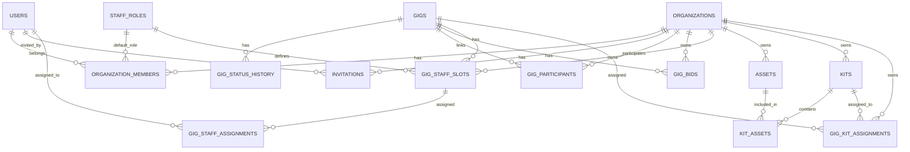

# Database Specification

**Purpose**: This document provides the complete database schema, Supabase integration details, and data access patterns for the GigManager application.

**Last Updated**: 2026-01-28

---

## Table of Contents

1. [Overview](#overview)
2. [Supabase Integration](#supabase-integration)
3. [High-Level Entity Diagram](#high-level-entity-diagram)
4. [Enum Types](#enum-types)
5. [Core Tables](#core-tables)
6. [Gig Management Tables](#gig-management-tables)
7. [Bid Management](#bid-management)
8. [Staff Management Tables](#staff-management-tables)
9. [Equipment Tables](#equipment-tables)
10. [Row-Level Security (RLS)](#row-level-security-rls)
11. [Authentication](#authentication)
12. [Real-Time Features](#real-time-features)
13. [Testing & Troubleshooting](#testing--troubleshooting)

---

## Overview

The database uses **PostgreSQL 15+** hosted on **Supabase** with Row-Level Security (RLS) for multi-tenant data isolation. All enum types are defined in the Prisma schema as the single source of truth.

**Technology Stack:**
- PostgreSQL 15+ database
- Supabase backend (auth, realtime, storage)
- Direct Supabase client integration (no Prisma ORM in production)
- TypeScript types generated from schema

**Key Features:**
- Multi-tenant architecture with RLS
- Real-time subscriptions via Postgres CDC
- Automatic audit trails (status history, timestamps)
- Hierarchical data structures (nested gigs)
- Flexible participant/role management

---

## Supabase Integration

### What's Implemented

**Database:**
- Complete schema with 16 tables
- Row-Level Security (RLS) policies for data isolation
- Automatic triggers for timestamp updates and status logging
- Seed data for common staff roles

**Authentication:**
- Email/Password authentication (ready to use)
- Google OAuth integration via Supabase Auth
- Multiple providers supported (GitHub, Microsoft, etc.)
- Session management with automatic token refresh
- User profile creation on first login

**Real-Time:**
- Live updates when data changes
- Multi-user sync via Postgres CDC
- Automatic subscriptions for gigs, assets, kits

**API Layer:**
- Direct Supabase client calls from frontend
- Authentication middleware via RLS
- Permission checks (Admin/Manager/Staff/Viewer roles)

### File Structure

```
/
├── src/
│   └── utils/
│       ├── api.tsx                      # API client functions
│       └── supabase/
│           ├── client.tsx               # Supabase client singleton
│           └── types.tsx                # TypeScript types matching schema
└── supabase/
    └── migrations/
        └── *.sql                        # Database migrations
    └── schema.sql                       # Current database schema (after migrations)
```

---

## High-Level Entity Diagram



---

## Enum Types

The following custom enumeration types are defined in the database:

### organization_type
Used for categorization of organizations and their roles in gigs.
- `Production`
- `Sound`
- `Lighting`
- `Staging`
- `Rentals`
- `Venue`
- `Act`
- `Agency`

### user_role
Defines access levels within an organization.
- `Admin`
- `Manager`
- `Staff`
- `Viewer`

### gig_status
Tracks the lifecycle of a gig.
- `DateHold`
- `Proposed`
- `Booked`
- `Completed`
- `Cancelled`
- `Settled`

---

## Core Tables

### users

User profiles (extends Supabase auth.users)

| Field | Type | Description |
|-------|------|-------------|
| id | UUID | Primary key, references auth.users(id) |
| email | TEXT | User's email address (unique, NOT NULL) |
| first_name | TEXT | User's first name (NOT NULL) |
| last_name | TEXT | User's last name (NOT NULL) |
| phone | TEXT | User's phone number (nullable) |
| avatar_url | TEXT | URL to user's avatar image (nullable) |
| address_line1 | TEXT | Street address (nullable) |
| address_line2 | TEXT | Apartment, suite, etc. (nullable) |
| city | TEXT | City (nullable) |
| state | TEXT | State or province (nullable) |
| postal_code | TEXT | ZIP/postal code (nullable) |
| country | TEXT | Country (nullable) |
| role_hint | TEXT | Default staffing role hint (e.g., "FOH", "Lighting") (nullable) |
| user_status | TEXT | User account status: `active`, `pending`, `inactive` (default 'active') |
| created_at | TIMESTAMPTZ | Record creation timestamp (NOT NULL) |
| updated_at | TIMESTAMPTZ | Record last update timestamp (NOT NULL) |

**Notes:**
- Address fields structured to support both US and international addresses
- `created_by` and `updated_by` fields in other models reference User.id but don't maintain reverse relations

---

### organizations

Companies, venues, acts, and other entities

| Field | Type | Description |
|-------|------|-------------|
| id | UUID | Primary key |
| name | TEXT | Organization name (NOT NULL) |
| type | OrganizationType | Organization type enum (NOT NULL) |
| url | TEXT | Organization website URL (nullable) |
| phone_number | TEXT | Organization phone number (nullable) |
| address_line1 | TEXT | Street address (nullable) |
| address_line2 | TEXT | Apartment, suite, etc. (nullable) |
| city | TEXT | City (nullable) |
| state | TEXT | State or province (nullable) |
| postal_code | TEXT | ZIP/postal code (nullable) |
| country | TEXT | Country (nullable) |
| description | TEXT | Organization description (nullable), long text, markdown |
| allowed_domains | TEXT | Comma separated list of automatically allowable user email domains. |
| created_at | TIMESTAMPTZ | Record creation timestamp (NOT NULL) |
| updated_at | TIMESTAMPTZ | Record last update timestamp (NOT NULL) |

**Notes:**

- Organizations are editable only by their Admin members (via `OrganizationMember` with `Admin` role)
- Ownership/editing permissions controlled via `OrganizationMember` with Admin role
- All authenticated users may read organizations, but only Admin members can modify
- The `description` field is a long text in markdown format.

---

### organization_members

User memberships in organizations with roles

| Field | Type | Description |
|-------|------|-------------|
| id | UUID | Primary key |
| organization_id | UUID | Reference to organizations.id (NOT NULL) |
| user_id | UUID | Reference to users.id (NOT NULL) |
| role | UserRole | RBAC role within organization: Admin, Manager, Staff, Viewer (NOT NULL) |
| default_staff_role_id | UUID | Reference to staff_roles.id for default gig assignments (nullable) |
| created_at | TIMESTAMPTZ | Record creation timestamp (NOT NULL) |

**Notes:**
- Only Admin members can modify organization records
- Unique constraint on (organization_id, user_id) ensures a user can only be a member of an organization once
- `default_staff_role_id` allows pre-filling staff assignments for this member
- RLS is **DISABLED** on this table to prevent circular dependencies in policies; access is controlled at the application layer.

---

## Gig Management Tables

### gigs

Main gig records with status, dates, and details

| Field | Type | Description |
|-------|------|-------------|
| id | UUID | Primary key |
| parent_gig_id | UUID | Reference to gigs.id for hierarchical relationships (nullable) |
| hierarchy_depth | INTEGER | Depth level in gig hierarchy (default 0, NOT NULL) |
| title | TEXT | Gig title/name (NOT NULL) |
| start | TIMESTAMPTZ | Start date and time of the gig (NOT NULL) |
| end | TIMESTAMPTZ | End date and time of the gig (NOT NULL) |
| timezone | TEXT | IANA timezone identifier (e.g., "America/New_York") (NOT NULL) |
| status | GigStatus | Gig status enum: DateHold, Proposed, Booked, Completed, Cancelled, Settled (NOT NULL) |
| tags | TEXT[] | Array of tags for categorization (default '{}') |
| notes | TEXT | Long text field for freeform notes (Markdown-formatted, nullable) |
| amount_paid | DECIMAL(10,2) | Total revenue collected for this gig (nullable) |
| created_by | UUID | Reference to users.id (informational, NOT NULL) |
| updated_by | UUID | Reference to users.id (informational, NOT NULL) |
| created_at | TIMESTAMPTZ | Record creation timestamp (NOT NULL) |
| updated_at | TIMESTAMPTZ | Record last update timestamp (NOT NULL) |

**Notes:**
- Gigs are shared (participated in) by multiple organizations so there is no 'owning' organization.
- Gigs link to organizations via `gig_participants` with a `role` using OrganizationType enum values
- Gig status transitions are recorded in `gig_status_history` for auditability
- Any status can transition to any other status (no restrictions)
- Gigs can span midnight, so we use full DateTime for both start and end
- The "gig date" shown in UI is derived from the start DateTime
- `parent_gig_id` enables hierarchical relationships between gigs (e.g., main event with sub-events)
- `hierarchy_depth` tracks the depth level in the hierarchy for performance and validation
- `created_by` and `updated_by` are stored as User.id values but don't maintain reverse relations
- RLS is **DISABLED** on this table; access is controlled via `gig_participants` at the application layer.

---

### gig_status_history

Automatic audit log of status changes. Shared across all tenants.

| Field | Type | Description |
|-------|------|-------------|
| id | UUID | Primary key |
| gig_id | UUID | Reference to gigs.id (NOT NULL) |
| from_status | GigStatus | Previous status (nullable if initial status) |
| to_status | GigStatus | New status (NOT NULL) |
| changed_by | UUID | Reference to users.id (informational, NOT NULL) |
| changed_at | TIMESTAMPTZ | Status change timestamp (NOT NULL) |

**Notes:**
- `changed_by` is stored as User.id but doesn't maintain a reverse relation
- All status transitions are recorded for auditability
- RLS is **ENABLED** on this table. Users can view status history for gigs their organization participates in.

---

### gig_participants

Organizations participating in a gig (venue, act, production, etc.) Note that this information is shared across all tenants.

| Field | Type | Description |
|-------|------|-------------|
| id | UUID | Primary key |
| organization_id | UUID | Reference to organizations.id (the participating organization) (NOT NULL) |
| gig_id | UUID | Reference to gigs.id (NOT NULL) |
| role | OrganizationType | Participant role using OrganizationType enum values (NOT NULL) |
| notes | TEXT | Long text field for freeform notes (Markdown-formatted, nullable) |

**Notes:**
- `role` uses the same OrganizationType enum values: Production, Sound, Lighting, Staging, Rentals, Venue, Act, Agency
- Both `gig_id` and `organization_id` are foreign keys
- Composite unique constraint on (gig_id, organization_id, role)
- RLS is **DISABLED** on this table to prevent circular dependencies; access is controlled at the application layer.

---

## Bid Management

### gig_bids

Bid tracking for gigs

| Field | Type | Description |
|-------|------|-------------|
| id | UUID | Primary key |
| organization_id | UUID | Reference to organizations.id (the owning organization) (nullable) |
| gig_id | UUID | Reference to gigs.id (NOT NULL) |
| amount | DECIMAL(10,2) | Bid/proposal amount (NOT NULL) |
| date_given | DATE | Date the bid was given (NOT NULL) |
| result | TEXT | Bid result: Pending, Accepted, Rejected, Withdrawn (nullable) |
| notes | TEXT | Notes about the bid (nullable, Markdown-formatted) |
| created_by | UUID | Reference to users.id (informational, NOT NULL) |
| created_at | TIMESTAMPTZ | Record creation timestamp (NOT NULL) |

**Notes:**
- `created_by` is stored as User.id but doesn't maintain a reverse relation
- RLS is **DISABLED** on this table; access is controlled at the application layer.

---

## Staff Management Tables

### staff_roles

Global staff role choices (FOH, Lighting, etc.)

| Field | Type | Description |
|-------|------|-------------|
| id | UUID | Primary key |
| name | TEXT | Staff role name (e.g., "FOH", "Lighting", "Stage", "CameraOp") (unique, NOT NULL) |
| description | TEXT | Description of the staff role and responsibilities (nullable) |
| created_at | TIMESTAMPTZ | Record creation timestamp (NOT NULL) |
| updated_at | TIMESTAMPTZ | Record last update timestamp (NOT NULL) |

**Notes:**
- Staff roles are enumerated in this table to support future staffing template functionality
- Templates can be created for different gig types based on gig tags
- RLS is **ENABLED** on this table. Anyone can view staff roles.

---

### gig_staff_slots

Staff positions needed for a gig

| Field | Type | Description |
|-------|------|-------------|
| id | UUID | Primary key |
| organization_id | UUID | Reference to organizations.id (the owning organization) (nullable) |
| gig_id | UUID | Reference to gigs.id (NOT NULL) |
| staff_role_id | UUID | Reference to staff_roles.id (NOT NULL) |
| required_count | INTEGER | Number of people needed for this role (default 1, NOT NULL) |
| notes | TEXT | Notes about this staff need (nullable, Markdown-formatted) |
| created_at | TIMESTAMPTZ | Record creation timestamp (NOT NULL) |
| updated_at | TIMESTAMPTZ | Record last update timestamp (NOT NULL) |

**Notes:**
- Staff roles are enumerated via reference to staff_roles table
- This enables future staffing template functionality
- RLS is **DISABLED** on this table; access is controlled at the application layer.

---

### gig_staff_assignments

Actual staff assigned to positions

| Field | Type | Description |
|-------|------|-------------|
| id | UUID | Primary key |
| slot_id | UUID | Reference to gig_staff_slots.id (NOT NULL) |
| user_id | UUID | Reference to users.id (NOT NULL) |
| status | TEXT | Assignment status (e.g., "Confirmed", "Requested", "Declined") (NOT NULL) |
| rate | DECIMAL(10,2) | Hourly or daily rate for this assignment (nullable) |
| fee | DECIMAL(10,2) | Total fee for this assignment (nullable) |
| notes | TEXT | Notes about this assignment (nullable, Markdown-formatted) |
| assigned_at | TIMESTAMPTZ | Assignment timestamp (default NOW(), NOT NULL) |
| confirmed_at | TIMESTAMPTZ | Confirmation timestamp (nullable) |

**Notes:**
- There is no direct relation between Gig and User, only through GigStaffSlots and GigStaffAssignments.
- There is no direct relation between Gig and GigStaffAssignments (only through GigStaffSlots)
- RLS is **DISABLED** on this table; access is controlled at the application layer.

---

## Equipment Tables

### assets

Equipment and asset management

| Field | Type | Description |
|-------|------|-------------|
| id | UUID | Primary key |
| organization_id | UUID | Reference to organizations.id (tenant that owns this asset) (NOT NULL) |
| acquisition_date | DATE | Date asset was acquired (NOT NULL) |
| vendor | TEXT | Vendor from which asset was purchased (nullable) |
| cost | DECIMAL(10,2) | Purchase cost of asset (nullable) |
| category | TEXT | Asset category (e.g., "Audio", "Lighting", "Video") (NOT NULL) |
| sub_category | TEXT | Asset sub-category (nullable) |
| insurance_policy_added | BOOLEAN | Whether asset has been added to insurance policy (default false, NOT NULL) |
| manufacturer_model | TEXT | Manufacturer and model information (NOT NULL) |
| type | TEXT | Asset type (nullable) |
| serial_number | TEXT | Asset serial number (nullable) |
| description | TEXT | Long text description of asset (Markdown-formatted, nullable) |
| replacement_value | DECIMAL(10,2) | Replacement value for insurance purposes (nullable) |
| insurance_class | TEXT | Insurance classification (nullable) |
| quantity | INTEGER | Asset quantity (default 1) |
| created_by | UUID | Reference to users.id (informational, NOT NULL) |
| updated_by | UUID | Reference to users.id (informational, NOT NULL) |
| created_at | TIMESTAMPTZ | Record creation timestamp (NOT NULL) |
| updated_at | TIMESTAMPTZ | Record last update timestamp (NOT NULL) |

**Notes:**
- `created_by` and `updated_by` are stored as user.id values but don't maintain reverse relations
- `description` is a long text field that can contain Markdown-formatted content
- Assets are owned by a tenant organization via `organization_id` for RLS and filtering
- RLS is **ENABLED** on this table. Users can view assets for organizations they belong to.

---

### kits

Reusable collections of equipment assets

| Field | Type | Description |
|-------|------|-------------|
| id | UUID | Primary key |
| organization_id | UUID | Reference to organizations.id (tenant that owns this kit) (NOT NULL) |
| name | TEXT | Kit name (e.g., "Small Lighting Setup", "XLR Cable Kit") (NOT NULL) |
| category | TEXT | Kit category for organization (e.g., "Lighting", "Audio", "Cables") |
| description | TEXT | Kit description (Markdown-formatted, nullable) |
| tags | TEXT[] | Array of tags for categorization and filtering (default '{}') |
| tag_number | TEXT | Physical tag number for identification (nullable) |
| rental_value | DECIMAL(10,2) | Daily/gig rental value for this kit (nullable) |
| created_by | UUID | Reference to users.id (informational, NOT NULL) |
| updated_by | UUID | Reference to users.id (informational, NOT NULL) |
| created_at | TIMESTAMPTZ | Record creation timestamp (NOT NULL) |
| updated_at | TIMESTAMPTZ | Record last update timestamp (NOT NULL) |

**Notes:**
- Kits are owned by a tenant organization via `organization_id` for RLS and filtering
- Tags enable flexible categorization and filtering
- RLS is **ENABLED** on this table. Users can view kits for organizations they belong to.

---

### kit_assets

Junction table linking kits to their constituent assets

| Field | Type | Description |
|-------|------|-------------|
| id | UUID | Primary key |
| kit_id | UUID | Reference to kits.id (NOT NULL) |
| asset_id | UUID | Reference to assets.id (NOT NULL) |
| quantity | INTEGER | Number of this asset required in the kit (default 1, NOT NULL) |
| notes | TEXT | Notes about this asset in the kit context (nullable) |
| created_at | TIMESTAMPTZ | Record creation timestamp (NOT NULL) |

**Notes:**
- Composite unique constraint on (kit_id, asset_id) prevents duplicate assets in same kit
- Quantity allows specifying multiples of the same asset type (e.g., 2 mains, 2 subs)
- Notes can specify usage context (e.g., "Main Left", "Backup Cable")
- RLS is **ENABLED** on this table. Users can view kit assets for their organization's kits.

---

### gig_kit_assignments

Junction table linking gigs to assigned kits

| Field | Type | Description |
|-------|------|-------------|
| id | UUID | Primary key |
| organization_id | UUID | Reference to organizations.id (tenant that owns this assignment) (NOT NULL) |
| gig_id | UUID | Reference to gigs.id (NOT NULL) |
| kit_id | UUID | Reference to kits.id (NOT NULL) |
| notes | TEXT | Notes about kit assignment (nullable) |
| assigned_by | UUID | Reference to users.id (who assigned the kit) (NOT NULL) |
| assigned_at | TIMESTAMPTZ | When the kit was assigned to the gig (NOT NULL) |

**Notes:**

- Scoped to organization via `organization_id` for tenant isolation
- Composite unique constraint on (gig_id, kit_id) prevents duplicate kit assignments
- Assignment timestamp enables audit trail of when kits were added to gigs
- `organization_id` should match the kit's organization_id
- RLS is **DISABLED** on this table; access is controlled at the application layer.

### invitations

Tracks pending and completed invitations to join organizations

| Field | Type | Description |
|-------|------|-------------|
| id | UUID | Primary key |
| organization_id | UUID | Reference to organizations.id (NOT NULL) |
| email | TEXT | Email address of the invited user (NOT NULL) |
| role | TEXT | Role assigned to user: Admin, Manager, Staff, Viewer (NOT NULL) |
| invited_by | UUID | Reference to users.id (NOT NULL) |
| status | TEXT | Invitation status: `pending`, `accepted`, `expired`, `cancelled` (NOT NULL) |
| token | TEXT | Unique invitation token (unique, NOT NULL) |
| expires_at | TIMESTAMPTZ | Token expiration timestamp (NOT NULL) |
| accepted_at | TIMESTAMPTZ | When the invitation was accepted (nullable) |
| accepted_by | UUID | Reference to users.id (nullable) |
| created_at | TIMESTAMPTZ | Record creation timestamp |
| updated_at | TIMESTAMPTZ | Record last update timestamp |

**Notes:**
- RLS is **ENABLED** on this table. Users can view invitations for their organizations.
- Composite unique constraint on (organization_id, email, status) prevents duplicate pending invitations.

---

### kv_store_de012ad4

Key-value store for edge functions and application settings

| Field | Type | Description |
|-------|------|-------------|
| key | TEXT | Unique key (Primary key) |
| value | JSONB | JSON value (NOT NULL) |

**Notes:**
- RLS is **ENABLED** on this table.

---

## Common Notes

- Each first-class entity owned by the tenant has `organization_id` for RLS and filtering
- All Notes and Description fields store Markdown-formatted text
- The `created_by` and `updated_by` fields throughout the schema store User.id values but don't maintain reverse relations (they're informational only)

---

## Helper Functions & Triggers

The database includes several helper functions and triggers to manage data integrity and security.

### Helper Functions
These functions are defined with `SECURITY DEFINER` to bypass RLS when necessary (e.g., checking organization membership without causing infinite recursion).

- `user_is_member_of_org(org_id, user_uuid)`: Returns true if the user is a member of the specified organization.
- `user_is_admin_of_org(org_id, user_uuid)`: Returns true if the user is an Admin of the specified organization.
- `user_is_admin_or_manager_of_org(org_id, user_uuid)`: Returns true if the user is an Admin or Manager of the specified organization.
- `user_organization_ids(user_uuid)`: Returns a table of organization IDs the user belongs to.
- `get_user_email(user_uuid)`: Returns the email address from `auth.users`.

### Triggers
- `update_updated_at_column()`: Automatically updates the `updated_at` column to `NOW()` before an UPDATE on most tables.
- `log_gig_status_change()`: Automatically records gig status transitions in the `gig_status_history` table.

---

## Indexes

To optimize performance, the following indexes are implemented:

### Core Tables
- `idx_users_status`: On `users(user_status)`
- `idx_users_email`: On `users(email)` where `user_status = 'pending'`
- `idx_org_members_org_id`: On `organization_members(organization_id)`
- `idx_org_members_user_id`: On `organization_members(user_id)`
- `idx_org_members_default_staff_role`: On `organization_members(default_staff_role_id)`

### Gigs & Staffing
- `idx_gigs_start`: On `gigs(start)`
- `idx_gigs_parent_gig_id`: On `gigs(parent_gig_id)`
- `idx_gig_participants_gig_id`: On `gig_participants(gig_id)`
- `idx_gig_participants_org_id`: On `gig_participants(organization_id)`
- `idx_gig_status_history_gig_id`: On `gig_status_history(gig_id)`
- `idx_gig_staff_slots_gig_id`: On `gig_staff_slots(gig_id)`
- `idx_gig_staff_slots_role_id`: On `gig_staff_slots(staff_role_id)`
- `idx_gig_staff_slots_org_id`: On `gig_staff_slots(organization_id)`
- `idx_gig_staff_assignments_slot_id`: On `gig_staff_assignments(slot_id)`
- `idx_gig_staff_assignments_user_id`: On `gig_staff_assignments(user_id)`
- `idx_staff_roles_name`: On `staff_roles(name)`

### Bids, Invitations & Equipment
- `idx_gig_bids_gig_id`: On `gig_bids(gig_id)`
- `idx_gig_bids_org_id`: On `gig_bids(organization_id)`
- `idx_invitations_organization`: On `invitations(organization_id)`
- `idx_invitations_email`: On `invitations(email)`
- `idx_invitations_token`: On `invitations(token)`
- `idx_invitations_status`: On `invitations(status)`
- `idx_assets_org_id`: On `assets(organization_id)`
- `idx_assets_category`: On `assets(category)`
- `idx_kits_org_id`: On `kits(organization_id)`
- `idx_kits_category`: On `kits(category)`
- `idx_kit_assets_kit_id`: On `kit_assets(kit_id)`
- `idx_kit_assets_asset_id`: On `kit_assets(asset_id)`
- `idx_gig_kit_assignments_org_id`: On `gig_kit_assignments(organization_id)`
- `idx_gig_kit_assignments_gig_id`: On `gig_kit_assignments(gig_id)`
- `idx_gig_kit_assignments_kit_id`: On `gig_kit_assignments(kit_id)`

---

## Row-Level Security (RLS)

### Access Control Requirements

- Users can only see gigs where there is an intersection of their organizational membership (via `organization_members`) and organizational participation with the gig (via `gig_participants`)
- RLS policies must be implemented on all tables
- Ensure data isolation between organizations
- Admin users have broader access within their organization

### RLS Policy Rules

**Tables with RLS ENABLED:**
- `users`
- `organizations`
- `staff_roles`
- `gig_status_history`
- `invitations`
- `assets`
- `kits`
- `kit_assets`
- `kv_store_de012ad4`

**Tables with RLS DISABLED (Access control handled at application layer):**
- `organization_members`
- `gigs`
- `gig_participants`
- `gig_staff_slots`
- `gig_staff_assignments`
- `gig_bids`
- `gig_kit_assignments`

**SELECT:**
- Users can read records where organization_id = the current organization context
- Organizations are readable by all authenticated users
- Users can view staff roles and own profiles
- Gigs are accessed via application-layer filtering based on `gig_participants`

**INSERT:**
- Users can create records for their organization
- Role must be Admin or Manager for most entities
- Authenticated users can create new organizations

**UPDATE:**
- Users can update records belonging to their organization
- Role permissions enforced (Admin-only for org settings)
- Users can update their own profiles

**DELETE:**
- Admin/Manager roles can delete records for their organization
- Staff and Viewer roles cannot delete
- Cascading deletes maintain referential integrity

### Role Hierarchy

| Role | Create | Read | Update | Delete |
|------|--------|------|--------|--------|
| **Admin** | ✅ | ✅ | ✅ | ✅ |
| **Manager** | ✅ | ✅ | ✅ | ❌ |
| **Staff** | ❌ | ✅ | ❌ | ❌ |
| **Viewer** | ❌ | ✅ | ❌ | ❌ |

### Data Isolation

- Gigs are scoped to organizations via `gig_participants`
- Only members see their organization's data
- Participants can be from any organization (public directory)
- Annotations are private per organization

---

## Authentication

### Supported Methods

**Email/Password:**
- Built-in Supabase authentication
- No additional setup required
- User profile created on first login

**OAuth Providers:**
- Google OAuth (primary)
- GitHub, Microsoft (optional)
- Configured in Supabase Auth settings

### User Flow

1. User authenticates via Supabase Auth
2. `auth.users` entry created automatically
3. App creates `users` profile record
4. User assigned to organization via `organization_members`
5. Session managed by Supabase with auto-refresh

### Session Management

- Automatic token refresh
- Secure logout functionality
- Session state persisted in local storage
- RLS policies enforce user context

---

## Real-Time Features

### Live Updates

The application uses Supabase Realtime (Postgres CDC) for live data synchronization:

**Gigs:**
- Create/update/delete broadcasts to all connected clients
- Status changes appear instantly
- Inline edits synchronized across users

**Assets & Kits:**
- Inventory updates broadcast in real-time
- Assignment conflicts detected immediately

**Staff Assignments:**
- Assignment status changes synchronized
- Notifications triggered on changes

### Implementation

```typescript
// Automatic subscription to gig changes
supabase
  .channel('gigs')
  .on('postgres_changes', 
    { event: '*', schema: 'public', table: 'gigs' },
    (payload) => {
      // Handle insert/update/delete
    }
  )
  .subscribe()
```

---

## Testing & Troubleshooting

### Testing Your Setup

**1. Test Authentication:**
- Sign in with email/password
- Verify user profile created
- Check organization membership

**2. Test Organization Creation:**
- Create new organization
- Verify added as Admin
- Check organization appears in selection

**3. Test Gig Management:**
- Create new gig
- Edit inline in list view
- Verify changes save

**4. Test Real-Time:**
- Open app in two browser windows
- Create/edit gig in one window
- Watch update in other window (no refresh)

**5. Test Permissions:**
- Invite user with Staff role
- Verify read-only access
- Test Manager permissions
- Confirm Admin full access

### Common Issues

**"Authentication failed":**
- Verify OAuth configured in Supabase
- Check redirect URIs match exactly
- Ensure OAuth consent screen set up

**"Access denied to this organization":**
- User needs entry in `organization_members`
- Check role set correctly
- Verify `organization_id` matches

**Tables not created:**
- Run migration SQL in Supabase SQL Editor
- Check for error messages in logs
- Verify UUID extension enabled

**Real-time not working:**
- Check Realtime enabled (Project Settings > API)
- Verify table has RLS policies
- Check browser console for subscription errors

### Debugging Tools

**Supabase Dashboard:**
- Table Editor: Inspect data directly
- SQL Editor: Run ad-hoc queries
- Logs: View API errors and performance
- Auth: Manage users and sessions

**Browser DevTools:**
- Network tab: Check API requests
- Console: View subscription events
- Application tab: Inspect session storage

---

## Related Documentation

- **Requirements**: See [../product/requirements.md](../product/requirements.md) for feature requirements
- **Workflows**: See [../product/workflows/](../product/workflows/) for UI flows
- **Tech Stack**: See [tech-stack.md](./tech-stack.md) for technology details
- **Setup Guide**: See [setup-guide.md](./setup-guide.md) for installation instructions
- **Coding Guide**: See [../development/ai-agents/coding-guide.md](../development/ai-agents/coding-guide.md) for implementation patterns

---

## Document History

**2026-01-28**: Updated schema details to match `supabase/schema.sql`, added missing tables (`invitations`, `kv_store`), documented helper functions, triggers, and indexes, and corrected RLS status for all tables.
**2026-01-18**: Consolidated DATABASE.md and setup/supabase-integration.md into comprehensive database specification with schema details, Supabase integration guidance, and troubleshooting information.
