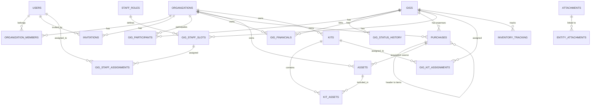
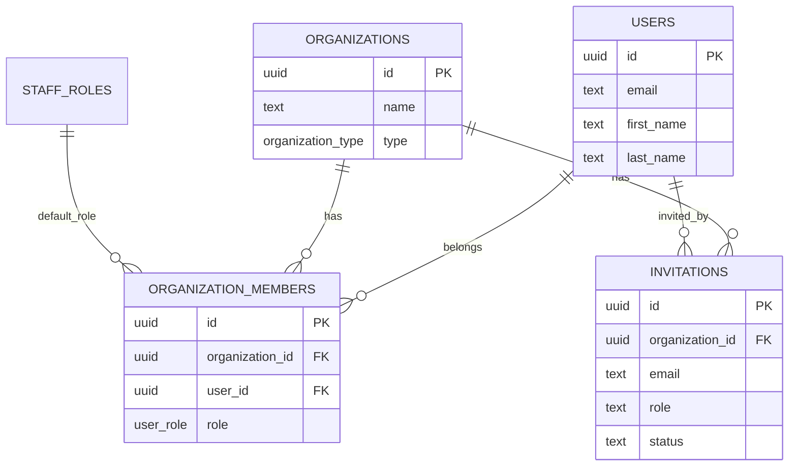
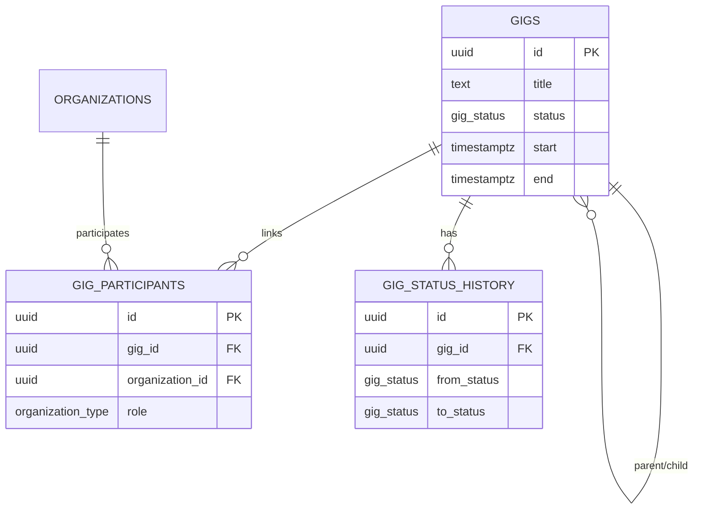
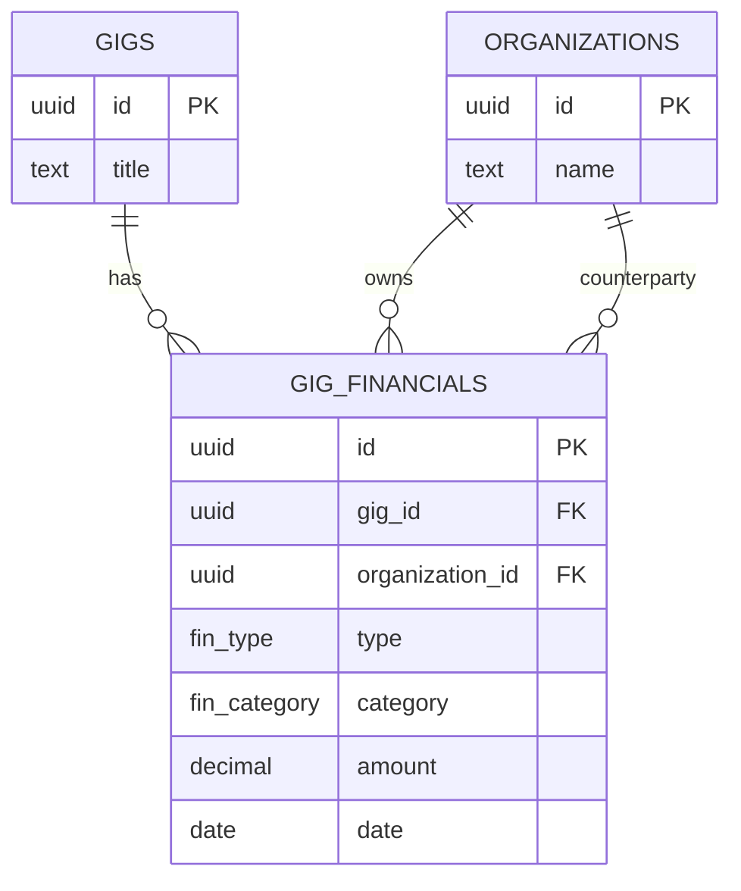
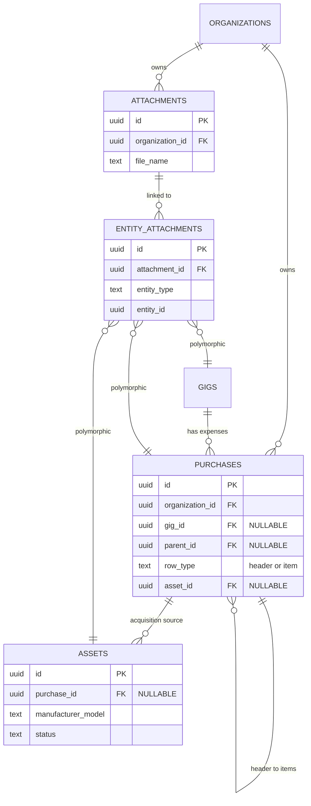
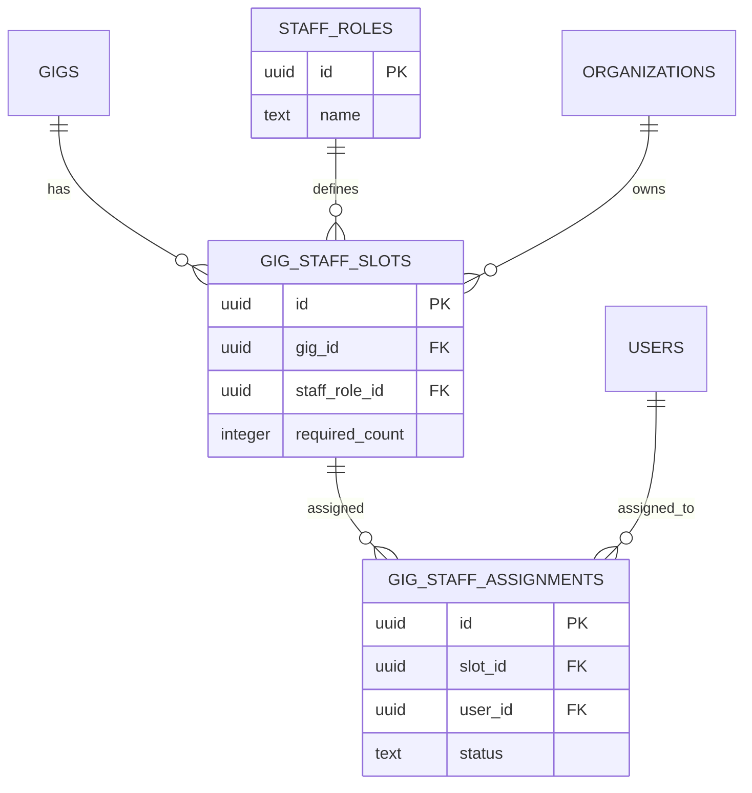
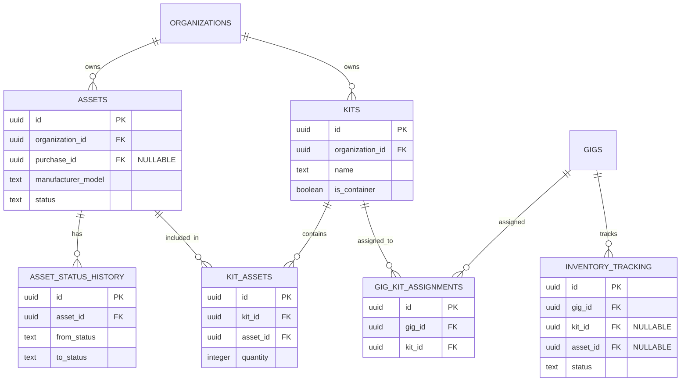

# Database Specification

**Purpose**: This document provides the complete database schema, Supabase integration details, and data access patterns for the GigManager application.

**Last Updated**: 2026-03-16

---

## Table of Contents

1. [Overview](#overview)
2. [Supabase Integration](#supabase-integration)
3. [High-Level Entity Diagram](#high-level-entity-diagram)
4. [Enum Types](#enum-types)
5. [Core Tables](#core-tables)
6. [Gig Management Tables](#gig-management-tables)
7. [Financial Management](#financial-management)
8. [Purchases & Attachments](#purchases--attachments)
9. [Staff Management Tables](#staff-management-tables)
10. [Equipment Tables](#equipment-tables)
11. [Row-Level Security (RLS)](#row-level-security-rls)
12. [Authentication](#authentication)
13. [Real-Time Features](#real-time-features)

---

## Overview

The database uses **PostgreSQL 17** hosted on **Supabase** with Row-Level Security (RLS) for multi-tenant data isolation. All enum types are defined in the SQL migration (`supabase/migrations/20260209000000_initial_schema.sql`) and mirrored in `src/utils/supabase/constants.ts`.

**Technology Stack:**
- PostgreSQL 17 database
- Supabase backend (auth, realtime, storage)
- Direct Supabase client integration (no Prisma ORM in production)
- TypeScript types generated from schema

**Key Features:**
- Multi-tenant architecture with RLS
- Real-time subscriptions via Postgres CDC
- Automatic audit trails (status history, timestamps)
- Hierarchical data structures (nested gigs)
- Flexible participant/role management

---

## Supabase Integration

### What's Implemented

**Database:**
- Complete schema with 23 tables
- Row-Level Security (RLS) policies for data isolation
- Automatic triggers for timestamp updates and status logging
- Seed data for common staff roles

**Authentication:**
- Email/Password authentication (ready to use)
- Google OAuth integration via Supabase Auth
- Multiple providers supported (GitHub, Microsoft, etc.)
- Session management with automatic token refresh
- User profile creation on first login

**Real-Time:**
- Live updates when data changes
- Multi-user sync via Postgres CDC
- Automatic subscriptions for gigs, assets, kits

**API Layer:**
- Direct Supabase client calls from frontend
- Authentication middleware via RLS
- Permission checks (Admin/Manager/Staff/Viewer roles)

### File Structure

```
/
├── src/
│   ├── services/
│   │   └── *.service.ts                 # API service functions (gig, asset, kit, etc.)
│   └── utils/
│       ├── api-error-utils.ts           # Shared API error handling
│       └── supabase/
│           ├── client.tsx               # Supabase client singleton
│           └── types.tsx                # TypeScript types matching schema
└── supabase/
    └── migrations/
        └── *.sql                        # Database migrations (source of truth for schema)
```

---

## High-Level Entity Diagram


```mermaid
erDiagram
  %% Core organizational structure
  USERS ||--o{ ORGANIZATION_MEMBERS : belongs
  ORGANIZATIONS ||--o{ ORGANIZATION_MEMBERS : has
  ORGANIZATIONS ||--o{ INVITATIONS : has
  USERS ||--o{ INVITATIONS : invited_by

  %% Gig management and participation
  GIGS ||--o{ GIG_STATUS_HISTORY : has
  GIGS ||--o{ GIG_PARTICIPANTS : links
  ORGANIZATIONS ||--o{ GIG_PARTICIPANTS : participates

  %% Financial management
  GIGS ||--o{ GIG_FINANCIALS : has
  ORGANIZATIONS ||--o{ GIG_FINANCIALS : owns

  %% Purchases & attachments
  ORGANIZATIONS ||--o{ PURCHASES : owns
  GIGS ||--o{ PURCHASES : "has expenses"
  PURCHASES ||--o{ PURCHASES : "header to items"
  PURCHASES ||--o{ ASSETS : "acquisition source"
  ATTACHMENTS ||--o{ ENTITY_ATTACHMENTS : "linked to"

  %% Staff management
  STAFF_ROLES ||--o{ GIG_STAFF_SLOTS : defines
  GIGS ||--o{ GIG_STAFF_SLOTS : has
  GIG_STAFF_SLOTS ||--o{ GIG_STAFF_ASSIGNMENTS : assigned
  USERS ||--o{ GIG_STAFF_ASSIGNMENTS : assigned_to

  %% Equipment management
  ORGANIZATIONS ||--o{ ASSETS : owns
  ORGANIZATIONS ||--o{ KITS : owns
  KITS ||--o{ KIT_ASSETS : contains
  ASSETS ||--o{ KIT_ASSETS : included_in
  GIGS ||--o{ GIG_KIT_ASSIGNMENTS : assigned
  KITS ||--o{ GIG_KIT_ASSIGNMENTS : assigned_to

  %% Inventory tracking
  GIGS ||--o{ INVENTORY_TRACKING : tracks
```

---

## Enum Types

The following custom enumeration types are defined in the database:

### organization_type
Used for categorization of organizations and their roles in gigs.
- `Production`
- `Sound`
- `Lighting`
- `Staging`
- `Rentals`
- `Venue`
- `Act`
- `Agency`

### user_role
Defines access levels within an organization.
- `Admin`
- `Manager`
- `Staff`
- `Viewer`

### gig_status
Tracks the lifecycle of a gig.
- `DateHold`
- `Proposed`
- `Booked`
- `Completed`
- `Cancelled`
- `Settled`

### fin_type
Tracks the type of financial record/transaction.
- `Bid Submitted`
- `Bid Accepted`
- `Bid Rejected`
- `Contract Submitted`
- `Contract Revised`
- `Contract Signed`
- `Contract Rejected`
- `Contract Cancelled`
- `Contract Settled`
- `Sub-Contract Submitted`
- `Sub-Contract Revised`
- `Sub-Contract Signed`
- `Sub-Contract Rejected`
- `Sub-Contract Cancelled`
- `Sub-Contract Settled`
- `Deposit Received`
- `Deposit Sent`
- `Deposit Refunded`
- `Payment Sent`
- `Payment Recieved` *(known typo — matches database enum; do not change without a migration)*
- `Expense Incurred`
- `Expense Reimbursed`
- `Invoice Issued`
- `Invoice Settled`

### fin_category
Categorizes financial records for reporting.
- `Labor`
- `Equipment`
- `Transportation`
- `Venue`
- `Production`
- `Insurance`
- `Rebillable`
- `Other`

### sync_status
Tracks Google Calendar sync state for gigs.
- `pending`
- `synced`
- `failed`
- `updated`
- `removed`

---

## Core Tables

### ER Diagram: Core Tables


```mermaid
erDiagram
    USERS {
        uuid id PK
        text email
        text first_name
        text last_name
    }
    ORGANIZATIONS {
        uuid id PK
        text name
        organization_type type
    }
    ORGANIZATION_MEMBERS {
        uuid id PK
        uuid organization_id FK
        uuid user_id FK
        user_role role
    }
    INVITATIONS {
        uuid id PK
        uuid organization_id FK
        text email
        text role
        text status
    }

    USERS ||--o{ ORGANIZATION_MEMBERS : belongs
    ORGANIZATIONS ||--o{ ORGANIZATION_MEMBERS : has
    ORGANIZATIONS ||--o{ INVITATIONS : has
    USERS ||--o{ INVITATIONS : invited_by
    STAFF_ROLES ||--o{ ORGANIZATION_MEMBERS : default_role
```

### users

User profiles (extends Supabase auth.users)

| Field | Type | Description |
|-------|------|-------------|
| id | UUID | Primary key, references auth.users(id) |
| email | TEXT | User's email address (unique, NOT NULL) |
| first_name | TEXT | User's first name (NOT NULL) |
| last_name | TEXT | User's last name (NOT NULL) |
| phone | TEXT | User's phone number (nullable) |
| avatar_url | TEXT | URL to user's avatar image (nullable) |
| address_line1 | TEXT | Street address (nullable) |
| address_line2 | TEXT | Apartment, suite, etc. (nullable) |
| city | TEXT | City (nullable) |
| state | TEXT | State or province (nullable) |
| postal_code | TEXT | ZIP/postal code (nullable) |
| country | TEXT | Country (nullable) |
| timezone | VARCHAR | IANA timezone (e.g., "America/New_York"). Default for CSV imports. (nullable) |
| role_hint | TEXT | Default staffing role hint (e.g., "FOH", "Lighting") (nullable) |
| user_status | TEXT | User account status: `active`, `pending`, `inactive` (default 'active') |
| created_at | TIMESTAMPTZ | Record creation timestamp (NOT NULL) |
| updated_at | TIMESTAMPTZ | Record last update timestamp (NOT NULL) |

**Notes:**
- Address fields structured to support both US and international addresses
- `created_by` and `updated_by` fields in other models reference User.id but don't maintain reverse relations
- RLS is **ENABLED** on this table. Users can view their own profile and profiles of users in the same organizations.

---

### organizations

Companies, venues, acts, and other entities

| Field | Type | Description |
|-------|------|-------------|
| id | UUID | Primary key |
| name | TEXT | Organization name (NOT NULL) |
| type | OrganizationType | Organization type enum (NOT NULL) |
| url | TEXT | Organization website URL (nullable) |
| phone_number | TEXT | Organization phone number (nullable) |
| address_line1 | TEXT | Street address (nullable) |
| address_line2 | TEXT | Apartment, suite, etc. (nullable) |
| city | TEXT | City (nullable) |
| state | TEXT | State or province (nullable) |
| postal_code | TEXT | ZIP/postal code (nullable) |
| country | TEXT | Country (nullable) |
| description | TEXT | Organization description (nullable), long text, markdown |
| allowed_domains | TEXT | Comma separated list of automatically allowable user email domains. |
| created_at | TIMESTAMPTZ | Record creation timestamp (NOT NULL) |
| updated_at | TIMESTAMPTZ | Record last update timestamp (NOT NULL) |

**Notes:**

- Organizations are editable only by their Admin members (via `OrganizationMember` with `Admin` role)
- All authenticated users may read organizations, but only Admin members can modify
- The `description` field is a long text in markdown format.
- RLS is **ENABLED** on this table. Anyone can view organizations (for participant selection); only Admins can update.

---

### organization_members

User memberships in organizations with roles

| Field | Type | Description |
|-------|------|-------------|
| id | UUID | Primary key |
| organization_id | UUID | Reference to organizations.id (NOT NULL) |
| user_id | UUID | Reference to users.id (NOT NULL) |
| role | UserRole | RBAC role within organization: Admin, Manager, Staff, Viewer (NOT NULL) |
| default_staff_role_id | UUID | Reference to staff_roles.id for default gig assignments (nullable) |
| created_at | TIMESTAMPTZ | Record creation timestamp (NOT NULL) |

**Notes:**
- Only Admin members can modify organization records
- Unique constraint on (organization_id, user_id) ensures a user can only be a member of an organization once
- `default_staff_role_id` allows pre-filling staff assignments for this member
- RLS is **ENABLED** on this table. Users can view members of their own organizations; Admins can manage membership.

---

### invitations

Tracks pending and completed invitations to join organizations

| Field | Type | Description |
|-------|------|-------------|
| id | UUID | Primary key |
| organization_id | UUID | Reference to organizations.id (NOT NULL) |
| email | TEXT | Email address of the invited user (NOT NULL) |
| role | TEXT | Role assigned to user: Admin, Manager, Staff, Viewer (NOT NULL) |
| invited_by | UUID | Reference to users.id (NOT NULL) |
| status | TEXT | Invitation status: `pending`, `accepted`, `expired`, `cancelled` (NOT NULL) |
| token | TEXT | Unique invitation token (unique, NOT NULL) |
| expires_at | TIMESTAMPTZ | Token expiration timestamp (NOT NULL) |
| accepted_at | TIMESTAMPTZ | When the invitation was accepted (nullable) |
| accepted_by | UUID | Reference to users.id (nullable) |
| created_at | TIMESTAMPTZ | Record creation timestamp |
| updated_at | TIMESTAMPTZ | Record last update timestamp |

**Notes:**
- RLS is **ENABLED** on this table. Users can view invitations for their organizations.
- Composite unique constraint on (organization_id, email, status) prevents duplicate pending invitations.

---

### user_devices

WebAuthn/passkey device registrations for users

| Field | Type | Description |
|-------|------|-------------|
| id | UUID | Primary key |
| user_id | UUID | Reference to auth.users(id) (NOT NULL, CASCADE delete) |
| credential_id | TEXT | WebAuthn credential ID (unique, NOT NULL) |
| public_key | TEXT | WebAuthn public key (NOT NULL) |
| device_name | TEXT | Human-readable device name (nullable) |
| created_at | TIMESTAMPTZ | Record creation timestamp (NOT NULL) |
| last_used_at | TIMESTAMPTZ | Last authentication timestamp (NOT NULL) |

**Notes:**
- RLS is **ENABLED** on this table. Users can only manage their own devices.

---

## Gig Management Tables

### ER Diagram: Gig Management


```mermaid
erDiagram
    GIGS {
        uuid id PK
        text title
        gig_status status
        timestamptz start
        timestamptz end
    }
    GIG_PARTICIPANTS {
        uuid id PK
        uuid gig_id FK
        uuid organization_id FK
        organization_type role
    }
    GIG_STATUS_HISTORY {
        uuid id PK
        uuid gig_id FK
        gig_status from_status
        gig_status to_status
    }

    GIGS ||--o{ GIG_STATUS_HISTORY : has
    GIGS ||--o{ GIG_PARTICIPANTS : links
    GIGS ||--o{ GIGS : "parent/child"
    ORGANIZATIONS ||--o{ GIG_PARTICIPANTS : participates
```

### gigs

Main gig records with status, dates, and details

| Field | Type | Description |
|-------|------|-------------|
| id | UUID | Primary key |
| parent_gig_id | UUID | Reference to gigs.id for hierarchical relationships (nullable) |
| hierarchy_depth | INTEGER | Depth level in gig hierarchy (default 0, NOT NULL) |
| title | TEXT | Gig title/name (NOT NULL) |
| start | TIMESTAMPTZ | Start date and time of the gig (NOT NULL) |
| end | TIMESTAMPTZ | End date and time of the gig (NOT NULL) |
| timezone | TEXT | IANA timezone identifier (e.g., "America/New_York") (NOT NULL) |
| status | GigStatus | Gig status enum: DateHold, Proposed, Booked, Completed, Cancelled, Settled (NOT NULL) |
| tags | TEXT[] | Array of tags for categorization (default '{}') |
| notes | TEXT | Long text field for freeform notes (Markdown-formatted, nullable) |
| created_by | UUID | Reference to users.id (informational, NOT NULL) |
| updated_by | UUID | Reference to users.id (informational, NOT NULL) |
| created_at | TIMESTAMPTZ | Record creation timestamp (NOT NULL) |
| updated_at | TIMESTAMPTZ | Record last update timestamp (NOT NULL) |

**Notes:**
- Gigs are shared (participated in) by multiple organizations so there is no 'owning' organization.
- Gigs link to organizations via `gig_participants` with a `role` using OrganizationType enum values
- Gig status transitions are recorded in `gig_status_history` for auditability
- Any status can transition to any other status (no restrictions)
- Gigs can span midnight, so we use full DateTime for both start and end
- The "gig date" shown in UI is derived from the start DateTime
- `parent_gig_id` enables hierarchical relationships between gigs (e.g., main event with sub-events)
- `hierarchy_depth` tracks the depth level in the hierarchy for performance and validation
- RLS is **ENABLED** on this table. Users can view gigs their organization participates in; Admins/Managers can update; Admins can delete.

---

### gig_status_history

Automatic audit log of status changes. Shared across all tenants.

| Field | Type | Description |
|-------|------|-------------|
| id | UUID | Primary key |
| gig_id | UUID | Reference to gigs.id (NOT NULL) |
| from_status | GigStatus | Previous status (nullable if initial status) |
| to_status | GigStatus | New status (NOT NULL) |
| changed_by | UUID | Reference to users.id (informational, NOT NULL) |
| changed_at | TIMESTAMPTZ | Status change timestamp (NOT NULL) |

**Notes:**
- `changed_by` is stored as User.id but doesn't maintain a reverse relation
- All status transitions are recorded for auditability
- RLS is **ENABLED** on this table. Users can view status history for gigs their organization participates in.

---

### gig_participants

Organizations participating in a gig (venue, act, production, etc.)

| Field | Type | Description |
|-------|------|-------------|
| id | UUID | Primary key |
| organization_id | UUID | Reference to organizations.id (the participating organization) (NOT NULL) |
| gig_id | UUID | Reference to gigs.id (NOT NULL) |
| role | OrganizationType | Participant role using OrganizationType enum values (NOT NULL) |
| notes | TEXT | Long text field for freeform notes (Markdown-formatted, nullable) |

**Notes:**
- `role` uses the same OrganizationType enum values: Production, Sound, Lighting, Staging, Rentals, Venue, Act, Agency
- Composite unique constraint on (gig_id, organization_id, role)
- RLS is **ENABLED** on this table. Users can view participants for accessible gigs; Admins/Managers can manage.

---

## Financial Management

### ER Diagram: Gig Financials


```mermaid
erDiagram
    GIGS {
        uuid id PK
        text title
    }
    ORGANIZATIONS {
        uuid id PK
        text name
    }
    GIG_FINANCIALS {
        uuid id PK
        uuid gig_id FK
        uuid organization_id FK
        fin_type type
        fin_category category
        decimal amount
        date date
    }

    GIGS ||--o{ GIG_FINANCIALS : has
    ORGANIZATIONS ||--o{ GIG_FINANCIALS : owns
    ORGANIZATIONS ||--o{ GIG_FINANCIALS : counterparty
```

### gig_financials

Centralized tracking for bids, payments, expenses, and invoices.

| Field | Type | Description |
|-------|------|-------------|
| id | UUID | Primary key |
| gig_id | UUID | Reference to gigs.id (NOT NULL) |
| organization_id | UUID | Reference to organizations.id (the owning organization) (nullable) |
| type | fin_type | Type of financial record (e.g., 'Bid Submitted', 'Payment Recieved', 'Expense Incurred') (NOT NULL, default 'Bid Submitted') |
| category | fin_category | Category for reporting (e.g., 'Labor', 'Equipment') (NOT NULL, default 'Other') |
| amount | DECIMAL(10,2) | Monetary amount (NOT NULL) |
| currency | TEXT | Currency code (default 'USD') (NOT NULL) |
| date | DATE | Transaction or record date (NOT NULL) |
| due_date | DATE | Payment due date (nullable) |
| paid_at | TIMESTAMPTZ | When payment was actually completed (nullable) |
| reference_number| TEXT | Invoice, PO, or check number (nullable) |
| counterparty_id | UUID | Reference to organizations.id for the other party in transaction (nullable) |
| external_entity_name | TEXT | Name of counterparty if not in organizations table (nullable) |
| description | TEXT | Detailed description or notes (nullable, Markdown-formatted) |
| notes | TEXT | Internal notes (nullable) |
| created_by | UUID | Reference to users.id (informational, NOT NULL) |
| updated_by | UUID | Reference to users.id (informational, nullable) |
| created_at | TIMESTAMPTZ | Record creation timestamp (NOT NULL) |
| updated_at | TIMESTAMPTZ | Record last update timestamp (NOT NULL) |

**Notes:**
- `gig_financials` replaces the legacy `gig_bids` table and `gigs.amount_paid` column.
- `Payment Recieved` is spelled with 'ie' to match database enum definition.
- RLS is **ENABLED** on this table. Access is restricted to Admins of the owning organization.
- `organization_id` represents the tenant who "owns" or is responsible for this financial record.
- `counterparty_id` or `external_entity_name` tracks who the money is coming from or going to.

---

## Purchases & Attachments

### ER Diagram: Purchases & Attachments


```mermaid
erDiagram
    PURCHASES {
        uuid id PK
        uuid organization_id FK
        uuid gig_id FK "NULLABLE"
        uuid parent_id FK "NULLABLE"
        text row_type "header or item"
        uuid asset_id FK "NULLABLE"
    }
    ASSETS {
        uuid id PK
        uuid purchase_id FK "NULLABLE"
        text manufacturer_model
        text status
    }
    ATTACHMENTS {
        uuid id PK
        uuid organization_id FK
        text file_name
    }
    ENTITY_ATTACHMENTS {
        uuid id PK
        uuid attachment_id FK
        text entity_type
        uuid entity_id
    }

    ORGANIZATIONS ||--o{ PURCHASES : owns
    GIGS ||--o{ PURCHASES : "has expenses"
    PURCHASES ||--o{ PURCHASES : "header to items"
    PURCHASES ||--o{ ASSETS : "acquisition source"

    ORGANIZATIONS ||--o{ ATTACHMENTS : owns
    ATTACHMENTS ||--o{ ENTITY_ATTACHMENTS : "linked to"
    ENTITY_ATTACHMENTS }o--|| ASSETS : "polymorphic"
    ENTITY_ATTACHMENTS }o--|| PURCHASES : "polymorphic"
    ENTITY_ATTACHMENTS }o--|| GIGS : "polymorphic"
```

### purchases

Handles acquisition headers and expense line items. Uses a self-referencing `parent_id` to link items to their header row.

| Field | Type | Description |
|-------|------|-------------|
| id | UUID | Primary key |
| organization_id | UUID | Reference to organizations.id (NOT NULL) |
| gig_id | UUID | Reference to gigs.id — links expenses to a gig (nullable) |
| parent_id | UUID | Self-reference to purchases.id — links items to their header (nullable) |
| asset_id | UUID | Reference to assets.id — links audit item rows to the asset they represent (nullable) |
| row_type | TEXT | Discriminator: `'header'` or `'item'` (NOT NULL, CHECK constraint) |
| purchase_date | DATE | Date of purchase (nullable) |
| vendor | TEXT | Vendor name (nullable) |
| total_inv_amount | NUMERIC(10,2) | Total invoice amount — header only (nullable) |
| payment_method | TEXT | Payment method — header only (nullable) |
| line_amount | NUMERIC(10,2) | Line item subtotal — item only (nullable) |
| line_cost | NUMERIC(10,2) | Line item burdened cost (incl. pro-rata tax/shipping) — item only (nullable) |
| quantity | NUMERIC(12,4) | Quantity — item only (nullable) |
| item_price | NUMERIC(10,2) | Unit price — item only (nullable) |
| item_cost | NUMERIC(10,2) | Unit burdened cost — item only (nullable) |
| description | TEXT | Line item description — item only (nullable) |
| category | TEXT | Category — item only (nullable) |
| sub_category | TEXT | Sub-category — item only (nullable) |
| created_by | UUID | Reference to users.id (default auth.uid()) |
| updated_by | UUID | Reference to users.id (default auth.uid()) |
| created_at | TIMESTAMPTZ | Record creation timestamp (NOT NULL) |
| updated_at | TIMESTAMPTZ | Record last update timestamp (NOT NULL) |

**Notes:**
- A **header** row (`row_type = 'header'`) represents an overall purchase transaction (vendor, date, total, payment method).
- **Item** rows (`row_type = 'item'`) represent individual line items and reference their header via `parent_id`.
- When assets are imported, the `create_purchase_transaction_v1` function creates audit item rows with `asset_id` linking back to the created asset.
- `gig_id` links gig-specific expenses to the relevant gig, displayed alongside `gig_financials`.
- Assets acquired in a purchase reference the header row via `assets.purchase_id`.
- RLS is **ENABLED** on this table. Users can view purchases for organizations they belong to; Admins/Managers can manage.

---

### attachments

Metadata for files stored in Supabase Storage.

| Field | Type | Description |
|-------|------|-------------|
| id | UUID | Primary key |
| organization_id | UUID | Reference to organizations.id (NOT NULL) |
| file_path | TEXT | Path to the file in Supabase Storage (NOT NULL) |
| file_name | TEXT | Original file name (NOT NULL) |
| created_by | UUID | Reference to users.id (default auth.uid(), nullable) |
| created_at | TIMESTAMPTZ | Record creation timestamp (NOT NULL) |

**Notes:**
- Files are stored in Supabase Storage; this table tracks metadata only.
- Scoped to organization via `organization_id` for tenant isolation.
- RLS is **ENABLED** on this table. Users can view attachments for their organization; Admins/Managers can manage.

---

### entity_attachments

Polymorphic junction table linking attachments to any entity type.

| Field | Type | Description |
|-------|------|-------------|
| id | UUID | Primary key |
| attachment_id | UUID | Reference to attachments.id (NOT NULL) |
| entity_type | TEXT | Discriminator: `'asset'`, `'purchase'`, or `'gig'` (NOT NULL, CHECK constraint) |
| entity_id | UUID | ID of the target entity record (NOT NULL) |
| created_by | UUID | Reference to users.id (default auth.uid(), nullable) |
| created_at | TIMESTAMPTZ | Record creation timestamp (NOT NULL) |

**Notes:**
- Enables one attachment to be linked to multiple entities (e.g., a receipt linked to both a purchase and an asset).
- `entity_type` + `entity_id` form the polymorphic reference — there is no database-level FK constraint on `entity_id`.
- RLS is **ENABLED** on this table. Access controlled via the parent attachment's organization.

---

## Staff Management Tables

### ER Diagram: Staff Management


```mermaid
erDiagram
    STAFF_ROLES {
        uuid id PK
        text name
    }
    GIG_STAFF_SLOTS {
        uuid id PK
        uuid gig_id FK
        uuid staff_role_id FK
        integer required_count
    }
    GIG_STAFF_ASSIGNMENTS {
        uuid id PK
        uuid slot_id FK
        uuid user_id FK
        text status
    }

    GIGS ||--o{ GIG_STAFF_SLOTS : has
    STAFF_ROLES ||--o{ GIG_STAFF_SLOTS : defines
    ORGANIZATIONS ||--o{ GIG_STAFF_SLOTS : owns
    GIG_STAFF_SLOTS ||--o{ GIG_STAFF_ASSIGNMENTS : assigned
    USERS ||--o{ GIG_STAFF_ASSIGNMENTS : assigned_to
```

### staff_roles

Global staff role choices (FOH, Lighting, etc.)

| Field | Type | Description |
|-------|------|-------------|
| id | UUID | Primary key |
| name | TEXT | Staff role name (e.g., "FOH", "Lighting", "Stage", "CameraOp") (unique, NOT NULL) |
| description | TEXT | Description of the staff role and responsibilities (nullable) |
| created_at | TIMESTAMPTZ | Record creation timestamp (NOT NULL) |
| updated_at | TIMESTAMPTZ | Record last update timestamp (NOT NULL) |

**Notes:**
- Staff roles are enumerated in this table to support future staffing template functionality
- Templates can be created for different gig types based on gig tags
- RLS is **ENABLED** on this table. Anyone can view staff roles.

---

### gig_staff_slots

Staff positions needed for a gig

| Field | Type | Description |
|-------|------|-------------|
| id | UUID | Primary key |
| organization_id | UUID | Reference to organizations.id (the owning organization) (nullable) |
| gig_id | UUID | Reference to gigs.id (NOT NULL) |
| staff_role_id | UUID | Reference to staff_roles.id (NOT NULL) |
| required_count | INTEGER | Number of people needed for this role (default 1, NOT NULL) |
| notes | TEXT | Notes about this staff need (nullable, Markdown-formatted) |
| created_at | TIMESTAMPTZ | Record creation timestamp (NOT NULL) |
| updated_at | TIMESTAMPTZ | Record last update timestamp (NOT NULL) |

**Notes:**
- Staff roles are enumerated via reference to staff_roles table
- This enables future staffing template functionality
- RLS is **ENABLED** on this table. Users can view slots for accessible gigs; Admins/Managers can manage.

---

### gig_staff_assignments

Actual staff assigned to positions

| Field | Type | Description |
|-------|------|-------------|
| id | UUID | Primary key |
| slot_id | UUID | Reference to gig_staff_slots.id (NOT NULL) |
| user_id | UUID | Reference to users.id (NOT NULL) |
| status | TEXT | Assignment status (e.g., "Confirmed", "Requested", "Declined") (NOT NULL) |
| rate | DECIMAL(10,2) | Hourly or daily rate for this assignment (nullable) |
| fee | DECIMAL(10,2) | Total fee for this assignment (nullable) |
| notes | TEXT | Notes about this assignment (nullable, Markdown-formatted) |
| assigned_at | TIMESTAMPTZ | Assignment timestamp (default NOW(), NOT NULL) |
| confirmed_at | TIMESTAMPTZ | Confirmation timestamp (nullable) |

**Notes:**
- There is no direct relation between Gig and User, only through GigStaffSlots and GigStaffAssignments.
- There is no direct relation between Gig and GigStaffAssignments (only through GigStaffSlots)
- RLS is **ENABLED** on this table. Users can view assignments for accessible gigs; Admins/Managers can manage; Staff can update their own.

---

## Equipment Tables

### ER Diagram: Equipment & Inventory


```mermaid
erDiagram
    ASSETS {
        uuid id PK
        uuid organization_id FK
        uuid purchase_id FK "NULLABLE"
        text manufacturer_model
        text status
    }
    ASSET_STATUS_HISTORY {
        uuid id PK
        uuid asset_id FK
        text from_status
        text to_status
    }
    KITS {
        uuid id PK
        uuid organization_id FK
        text name
        boolean is_container
    }
    KIT_ASSETS {
        uuid id PK
        uuid kit_id FK
        uuid asset_id FK
        integer quantity
    }
    GIG_KIT_ASSIGNMENTS {
        uuid id PK
        uuid gig_id FK
        uuid kit_id FK
    }
    INVENTORY_TRACKING {
        uuid id PK
        uuid gig_id FK
        uuid kit_id FK "NULLABLE"
        uuid asset_id FK "NULLABLE"
        text status
    }

    ORGANIZATIONS ||--o{ ASSETS : owns
    ORGANIZATIONS ||--o{ KITS : owns
    ASSETS ||--o{ ASSET_STATUS_HISTORY : has
    KITS ||--o{ KIT_ASSETS : contains
    ASSETS ||--o{ KIT_ASSETS : included_in
    GIGS ||--o{ GIG_KIT_ASSIGNMENTS : assigned
    KITS ||--o{ GIG_KIT_ASSIGNMENTS : assigned_to
    GIGS ||--o{ INVENTORY_TRACKING : tracks
```

### assets

Equipment and asset management

| Field | Type | Description |
|-------|------|-------------|
| id | UUID | Primary key |
| organization_id | UUID | Reference to organizations.id (tenant that owns this asset) (NOT NULL) |
| purchase_id | UUID | Reference to purchases.id — links to acquisition header (nullable) |
| acquisition_date | DATE | Date asset was acquired (NOT NULL) |
| vendor | TEXT | Vendor from which asset was purchased (nullable) |
| item_price | NUMERIC(10,2) | Unit purchase price (nullable) |
| item_cost | NUMERIC(10,2) | Burdened unit cost incl. pro-rata tax/shipping (nullable) |
| category | TEXT | Asset category (e.g., "Audio", "Lighting", "Video") (NOT NULL) |
| sub_category | TEXT | Asset sub-category (nullable) |
| insurance_policy_added | BOOLEAN | Whether asset has been added to insurance policy (default false, NOT NULL) |
| manufacturer_model | TEXT | Manufacturer and model information (NOT NULL) |
| type | TEXT | Asset type (nullable) |
| serial_number | TEXT | Asset serial number (nullable) |
| tag_number | TEXT | Physical tag number for identification (nullable) |
| description | TEXT | Long text description of asset (Markdown-formatted, nullable) |
| replacement_value | NUMERIC(10,2) | Replacement value for insurance purposes (nullable) |
| insurance_class | TEXT | Insurance classification (nullable) |
| quantity | NUMERIC(12,4) | Asset quantity (default 1) |
| status | TEXT | Asset status (default 'Active', NOT NULL) |
| retired_on | DATE | Date asset was retired/disposed of (nullable) |
| liquidation_amt | NUMERIC(10,2) | Amount received on liquidation/disposal (nullable) |
| service_life | NUMERIC | Expected service life for depreciation (nullable) |
| dep_method | TEXT | Depreciation method (nullable) |
| created_by | UUID | Reference to users.id (informational, NOT NULL) |
| updated_by | UUID | Reference to users.id (informational, NOT NULL) |
| created_at | TIMESTAMPTZ | Record creation timestamp (NOT NULL) |
| updated_at | TIMESTAMPTZ | Record last update timestamp (NOT NULL) |

**Notes:**
- `description` is a long text field that can contain Markdown-formatted content
- Assets are owned by a tenant organization via `organization_id` for RLS and filtering
- `purchase_id` links the asset back to its acquisition purchase header
- `item_cost` is the burdened cost (includes pro-rata allocation of tax, shipping, etc.)
- Status changes are tracked via `asset_status_history` and the `track_asset_status_change` trigger
- RLS is **ENABLED** on this table. Users can view assets for organizations they belong to; Admins/Managers can manage.

---

### asset_status_history

Automatic audit log of asset status changes.

| Field | Type | Description |
|-------|------|-------------|
| id | UUID | Primary key |
| asset_id | UUID | Reference to assets.id (NOT NULL, CASCADE delete) |
| from_status | TEXT | Previous status (nullable) |
| to_status | TEXT | New status (NOT NULL) |
| changed_by | UUID | Reference to auth.users(id) (nullable) |
| changed_at | TIMESTAMPTZ | Status change timestamp (NOT NULL) |

**Notes:**
- Populated automatically by the `track_asset_status_change` trigger on assets.
- RLS is **ENABLED** on this table. Users can view history for assets in their organization.

---

### kits

Reusable collections of equipment assets

| Field | Type | Description |
|-------|------|-------------|
| id | UUID | Primary key |
| organization_id | UUID | Reference to organizations.id (tenant that owns this kit) (NOT NULL) |
| name | TEXT | Kit name (e.g., "Small Lighting Setup", "XLR Cable Kit") (NOT NULL) |
| category | TEXT | Kit category for organization (e.g., "Lighting", "Audio", "Cables") |
| description | TEXT | Kit description (Markdown-formatted, nullable) |
| tags | TEXT[] | Array of tags for categorization and filtering (default '{}') |
| tag_number | TEXT | Physical tag number for identification (nullable) |
| rental_value | DECIMAL(10,2) | Daily/gig rental value for this kit (nullable) |
| is_container | BOOLEAN | Whether this kit represents a physical container (default false, NOT NULL) |
| created_by | UUID | Reference to users.id (informational, NOT NULL) |
| updated_by | UUID | Reference to users.id (informational, NOT NULL) |
| created_at | TIMESTAMPTZ | Record creation timestamp (NOT NULL) |
| updated_at | TIMESTAMPTZ | Record last update timestamp (NOT NULL) |

**Notes:**
- Kits are owned by a tenant organization via `organization_id` for RLS and filtering
- Tags enable flexible categorization and filtering
- `is_container` distinguishes physical containers (road cases, racks) from logical groupings
- RLS is **ENABLED** on this table. Users can view kits for organizations they belong to; Admins/Managers can manage.

---

### kit_assets

Junction table linking kits to their constituent assets

| Field | Type | Description |
|-------|------|-------------|
| id | UUID | Primary key |
| kit_id | UUID | Reference to kits.id (NOT NULL) |
| asset_id | UUID | Reference to assets.id (NOT NULL) |
| quantity | INTEGER | Number of this asset required in the kit (default 1, NOT NULL) |
| notes | TEXT | Notes about this asset in the kit context (nullable) |
| created_at | TIMESTAMPTZ | Record creation timestamp (NOT NULL) |

**Notes:**
- Composite unique constraint on (kit_id, asset_id) prevents duplicate assets in same kit
- Quantity allows specifying multiples of the same asset type (e.g., 2 mains, 2 subs)
- Notes can specify usage context (e.g., "Main Left", "Backup Cable")
- RLS is **ENABLED** on this table. Users can view kit assets for their organization's kits; Admins/Managers can manage.

---

### gig_kit_assignments

Junction table linking gigs to assigned kits

| Field | Type | Description |
|-------|------|-------------|
| id | UUID | Primary key |
| organization_id | UUID | Reference to organizations.id (tenant that owns this assignment) (NOT NULL) |
| gig_id | UUID | Reference to gigs.id (NOT NULL) |
| kit_id | UUID | Reference to kits.id (NOT NULL) |
| notes | TEXT | Notes about kit assignment (nullable) |
| assigned_by | UUID | Reference to users.id (who assigned the kit) (NOT NULL) |
| assigned_at | TIMESTAMPTZ | When the kit was assigned to the gig (NOT NULL) |

**Notes:**

- Scoped to organization via `organization_id` for tenant isolation
- Composite unique constraint on (gig_id, kit_id) prevents duplicate kit assignments
- `organization_id` should match the kit's organization_id
- RLS is **ENABLED** on this table. Users can view assignments for accessible gigs; Admins/Managers can manage.

---

### inventory_tracking

Tracks equipment check-in/check-out status at gigs.

| Field | Type | Description |
|-------|------|-------------|
| id | UUID | Primary key |
| organization_id | UUID | Reference to organizations.id (NOT NULL) |
| gig_id | UUID | Reference to gigs.id (NOT NULL, CASCADE delete) |
| kit_id | UUID | Reference to kits.id (nullable, SET NULL on delete) |
| asset_id | UUID | Reference to assets.id (nullable, SET NULL on delete) |
| status | TEXT | Tracking status (NOT NULL) |
| scanned_at | TIMESTAMPTZ | When the scan occurred (NOT NULL) |
| scanned_by | UUID | Reference to auth.users(id) (nullable) |
| notes | TEXT | Notes about this tracking event (nullable) |
| created_at | TIMESTAMPTZ | Record creation timestamp (NOT NULL) |

**Notes:**
- Composite index on (gig_id, kit_id, asset_id, scanned_at DESC) for efficient lookups.
- RLS is **ENABLED** on this table. Users with gig access can manage inventory tracking.

---

## Google Calendar Integration Tables

### user_google_calendar_settings

Stores user OAuth tokens and calendar preferences for Google Calendar integration.

| Field | Type | Description |
|-------|------|-------------|
| id | UUID | Primary key |
| user_id | UUID | Reference to users.id (NOT NULL, CASCADE delete) |
| calendar_id | TEXT | Google Calendar ID (NOT NULL) |
| calendar_name | TEXT | Display name of the calendar (nullable) |
| access_token | TEXT | Encrypted OAuth access token (NOT NULL) |
| refresh_token | TEXT | Encrypted OAuth refresh token (NOT NULL) |
| token_expires_at | TIMESTAMPTZ | Token expiration timestamp (NOT NULL) |
| is_enabled | BOOLEAN | Whether sync is enabled (default true, NOT NULL) |
| sync_filters | JSONB | Optional filters for status, organization, etc. (default '{}') |
| created_at | TIMESTAMPTZ | Record creation timestamp (NOT NULL) |
| updated_at | TIMESTAMPTZ | Record last update timestamp (NOT NULL) |

**Notes:**
- Unique constraint on (user_id, calendar_id) — one calendar setting per user per calendar.
- RLS is **ENABLED**. Users can only access their own calendar settings.

---

### gig_sync_status

Tracks sync status of gigs to Google Calendar per user.

| Field | Type | Description |
|-------|------|-------------|
| id | UUID | Primary key |
| gig_id | UUID | Reference to gigs.id (NOT NULL, CASCADE delete) |
| user_id | UUID | Reference to users.id (NOT NULL, CASCADE delete) |
| google_event_id | TEXT | Google Calendar event ID (nullable) |
| last_synced_at | TIMESTAMPTZ | Last successful sync timestamp (nullable) |
| sync_status | sync_status | Enum: `pending`, `synced`, `failed`, `updated`, `removed` (default 'pending', NOT NULL) |
| sync_error | TEXT | Error message from last failed sync (nullable) |
| created_at | TIMESTAMPTZ | Record creation timestamp (NOT NULL) |
| updated_at | TIMESTAMPTZ | Record last update timestamp (NOT NULL) |

**Notes:**
- Unique constraint on (gig_id, user_id) — one sync record per gig per user.
- RLS is **ENABLED**. Users can manage their own sync records; read access extends to gigs the user participates in.
- Uses the `sync_status` enum type.

---

## Common Notes

- Each first-class entity owned by the tenant has `organization_id` for RLS and filtering
- All Notes and Description fields store Markdown-formatted text
- The `created_by` and `updated_by` fields throughout the schema store User.id values but don't maintain reverse relations (they're informational only)

---

## Helper Functions & Triggers

The database includes several helper functions and triggers to manage data integrity and security.

### Helper Functions
These functions are defined with `SECURITY DEFINER` to bypass RLS when necessary (e.g., checking organization membership without causing infinite recursion).

- `user_is_member_of_org(org_id, user_uuid)`: Returns true if the user is a member of the specified organization.
- `user_is_admin_of_org(org_id, user_uuid)`: Returns true if the user is an Admin of the specified organization.
- `user_is_admin_or_manager_of_org(org_id, user_uuid)`: Returns true if the user is an Admin or Manager of the specified organization.
- `user_organization_ids(user_uuid)`: Returns a table of organization IDs the user belongs to.
- `user_has_access_to_gig(gig_id, user_uuid)`: Returns true if the user belongs to any organization participating in the gig.
- `user_can_manage_gig(gig_id, user_uuid)`: Returns true if the user is Admin or Manager in a participating organization.
- `user_is_admin_of_gig(gig_id, user_uuid)`: Returns true if the user is Admin in a participating organization.
- `get_user_email(user_uuid)`: Returns the email address from `auth.users`.
- `get_user_ids_in_same_orgs(user_uuid)`: Returns all user IDs that share an organization with the given user.
- `get_user_role_in_org(org_id, user_uuid)`: Returns the user's role in the specified organization.
- `get_complete_user_data(user_uuid)`: Returns user profile and organization memberships as JSONB.
- `get_user_profile_secure(user_uuid)`: Returns user profile row securely.
- `get_user_organizations_secure(user_uuid)`: Returns user's organization memberships securely.
- `search_users_secure(search_text)`: Searches users by name/email (excludes inactive users).
- `convert_pending_user_to_active(p_email, p_auth_user_id)`: Converts a pending user to active on first login.
- `invite_user_to_organization(...)`: Creates an invitation and pending user record.
- `create_gig_complex(p_gig_data, p_participants, p_staff_slots)`: Transactionally creates a gig with participants and staff slots.
- `create_purchase_transaction_v1(p_header, p_items, p_assets)`: Transactionally creates a purchase header with item rows and associated assets.
- `update_asset_status(p_asset_id, p_status)`: Updates asset status with permission check.

### Triggers
- `update_updated_at_column()`: Automatically updates the `updated_at` column to `NOW()` before an UPDATE. Applied to: users, organizations, gigs, gig_financials, gig_staff_slots, gig_sync_status, kits, staff_roles, user_google_calendar_settings, purchases.
- `log_gig_status_change()`: Automatically records gig status transitions in the `gig_status_history` table.
- `track_asset_status_change()`: Automatically records asset status transitions in the `asset_status_history` table.

---

## Indexes

To optimize performance, the following indexes are implemented:

### Core Tables
- `idx_users_status`: On `users(user_status)`
- `idx_users_email`: On `users(email)` where `user_status = 'pending'`
- `idx_users_timezone`: On `users(timezone)`
- `idx_org_members_org_id`: On `organization_members(organization_id)`
- `idx_org_members_user_id`: On `organization_members(user_id)`
- `idx_org_members_default_staff_role`: On `organization_members(default_staff_role_id)`
- `idx_invitations_organization`: On `invitations(organization_id)`
- `idx_invitations_email`: On `invitations(email)`
- `idx_invitations_token`: On `invitations(token)`
- `idx_invitations_status`: On `invitations(status)`

### Gigs & Staffing
- `idx_gigs_start`: On `gigs(start)`
- `idx_gigs_parent_gig_id`: On `gigs(parent_gig_id)`
- `idx_gig_participants_gig_id`: On `gig_participants(gig_id)`
- `idx_gig_participants_org_id`: On `gig_participants(organization_id)`
- `idx_gig_status_history_gig_id`: On `gig_status_history(gig_id)`
- `idx_gig_status_history_changed_at`: On `gig_status_history(changed_at)`
- `idx_gig_staff_slots_gig_id`: On `gig_staff_slots(gig_id)`
- `idx_gig_staff_slots_role_id`: On `gig_staff_slots(staff_role_id)`
- `idx_gig_staff_slots_org_id`: On `gig_staff_slots(organization_id)`
- `idx_gig_staff_assignments_slot_id`: On `gig_staff_assignments(slot_id)`
- `idx_gig_staff_assignments_user_id`: On `gig_staff_assignments(user_id)`
- `idx_staff_roles_name`: On `staff_roles(name)`

### Financials
- `idx_gig_financials_gig_id`: On `gig_financials(gig_id)`
- `idx_gig_financials_org_id`: On `gig_financials(organization_id)`

### Equipment & Inventory
- `idx_assets_org_id`: On `assets(organization_id)`
- `idx_assets_category`: On `assets(category)`
- `idx_kits_org_id`: On `kits(organization_id)`
- `idx_kits_category`: On `kits(category)`
- `idx_kit_assets_kit_id`: On `kit_assets(kit_id)`
- `idx_kit_assets_asset_id`: On `kit_assets(asset_id)`
- `idx_gig_kit_assignments_org_id`: On `gig_kit_assignments(organization_id)`
- `idx_gig_kit_assignments_gig_id`: On `gig_kit_assignments(gig_id)`
- `idx_gig_kit_assignments_kit_id`: On `gig_kit_assignments(kit_id)`
- `inventory_tracking_lookup_idx`: Composite on `inventory_tracking(gig_id, kit_id, asset_id, scanned_at DESC)`

### Google Calendar Integration
- `idx_user_google_calendar_settings_user_id`: On `user_google_calendar_settings(user_id)`
- `idx_gig_sync_status_gig_id`: On `gig_sync_status(gig_id)`
- `idx_gig_sync_status_user_id`: On `gig_sync_status(user_id)`
- `idx_gig_sync_status_sync_status`: On `gig_sync_status(sync_status)`

---

## Row-Level Security (RLS)

All tables have RLS **ENABLED**. Access is controlled through a combination of RLS policies and helper functions.

### RLS Policy Summary

| Table | SELECT | INSERT | UPDATE | DELETE |
|-------|--------|--------|--------|--------|
| `users` | Own profile + same-org members | Own record (auth) | Own record | — |
| `organizations` | All (public) | Authenticated | Admin only | — |
| `organization_members` | Own orgs | Self-join as Viewer; Admin manages | Admin only | Admin only |
| `invitations` | Own org members | Admin/Manager | Admin/Manager + invitee accept | Admin/Manager |
| `user_devices` | Own devices | Own | Own | Own |
| `gigs` | Participating orgs | Authenticated | Admin/Manager of participant | Admin of participant |
| `gig_status_history` | Participating orgs | Gig managers | — | — |
| `gig_participants` | Accessible gigs | Gig managers | Gig managers | Gig managers |
| `gig_financials` | Admin of owning org | Admin of owning org | Admin of owning org | Admin of owning org |
| `purchases` | Org members | Admin/Manager | Admin/Manager | Admin/Manager |
| `attachments` | Org members | Admin/Manager | Admin/Manager | Admin/Manager |
| `entity_attachments` | Via parent attachment org | Admin/Manager (via attachment) | Admin/Manager (via attachment) | Admin/Manager (via attachment) |
| `staff_roles` | All (public) | — | — | — |
| `gig_staff_slots` | Accessible gigs | Gig managers | Gig managers | Gig managers |
| `gig_staff_assignments` | Accessible gigs | Gig managers | Gig managers + own assignments | Gig managers |
| `assets` | Org members | Admin/Manager | Admin/Manager | Admin/Manager |
| `asset_status_history` | Via parent asset org | — | — | — |
| `kits` | Org members | Admin/Manager | Admin/Manager | Admin/Manager |
| `kit_assets` | Via parent kit org | Admin/Manager (via kit) | Admin/Manager (via kit) | Admin/Manager (via kit) |
| `gig_kit_assignments` | Accessible gigs | Gig managers | Gig managers | Gig managers |
| `inventory_tracking` | Gig access | Gig access | Gig access | Gig access |
| `user_google_calendar_settings` | Own settings | Own | Own | Own |
| `gig_sync_status` | Own + participating gigs | Own | Own | Own |

### Role Hierarchy

1. **Admins** have full control over the tenancy including user management, account settings, and all data.
2. **Managers** can manage (CRUD) all application data like Gigs, Assets, staffing, etc. but cannot manage organization members or user roles. They can view and edit team member profiles. Financials, Assets, Kits are all available.
3. **Staff** can edit their own profile, view all gigs for their organization (excepting the Financials section), accept/decline staff assignments directed at them, view equipment including assets and kits, and view the team.
4. **Viewers** can only edit their own profile and view basic gig information for gigs that their organization participates in.

### Data Isolation

- Gigs are scoped to organizations via `gig_participants`
- Only members see their organization's data
- Participants can be from any organization (public directory)

---

## Authentication

### Supported Methods

**Email/Password:**
- Built-in Supabase authentication
- No additional setup required
- User profile created on first login

**OAuth Providers:**
- Google OAuth (primary)
- GitHub, Microsoft (optional)
- Configured in Supabase Auth settings

### User Flow

1. User authenticates via Supabase Auth
2. `auth.users` entry created automatically
3. App creates `users` profile record
4. User assigned to organization via `organization_members`
5. Session managed by Supabase with auto-refresh

### Session Management

- Automatic token refresh
- Secure logout functionality
- Session state persisted in local storage
- RLS policies enforce user context

---

## Real-Time Features

### Live Updates

The application uses Supabase Realtime (Postgres CDC) for live data synchronization:

**Gigs:**
- Create/update/delete broadcasts to all connected clients
- Status changes appear instantly
- Inline edits synchronized across users

**Assets & Kits:**
- Inventory updates broadcast in real-time
- Assignment conflicts detected immediately

**Staff Assignments:**
- Assignment status changes synchronized
- Notifications triggered on changes

### Implementation

```typescript
// Automatic subscription to gig changes
supabase
  .channel('gigs')
  .on('postgres_changes',
    { event: '*', schema: 'public', table: 'gigs' },
    (payload) => {
      // Handle insert/update/delete
    }
  )
  .subscribe()
```

---

## Related Documentation

- **Requirements**: See [../product/requirements.md](../product/requirements.md) for feature requirements
- **Workflows**: See [../product/workflows/](../product/workflows/) for UI flows
- **Tech Stack**: See [tech-stack.md](./tech-stack.md) for technology details
- **Setup Guide**: See [setup-guide.md](./setup-guide.md) for installation instructions
- **Coding Guide**: See [../development/coding-guide.md](../development/coding-guide.md) for implementation patterns

---

## Document History

**2026-03-16**: Major revision — reconciled all tables with `schema_dump.sql`. Added missing tables (`asset_status_history`, `inventory_tracking`, `user_devices`). Added missing columns (`users.timezone`, `kits.is_container`, `purchases.asset_id`). Removed ghost columns from `gigs` (`venue_address`, `settlement_type`, `settlement_amount`). Fixed type mismatches (`assets.quantity` is numeric(12,4), `assets.status` is NOT NULL). Updated `sync_status` enum with `updated`/`removed` values. Updated RLS to reflect all tables now ENABLED. Added `purchases`, `attachments`, `entity_attachments` tables. Added topical ER diagrams for each major section. Moved `invitations` to Core Tables. Removed unused `kv_store_de012ad4`. Updated helper functions list.
**2026-02-24**: Fixed Prisma/schema.sql references, updated PostgreSQL version to 17, added Google Calendar integration tables (`user_google_calendar_settings`, `gig_sync_status`), documented `Payment Recieved` typo as known issue, fixed file structure paths.
**2026-02-09**: Consolidated migrations into a single initialization file, improved local development workflow, and moved troubleshooting content to `setup-guide.md`.
**2026-01-28**: Updated schema details to match `supabase/migrations/`, added missing tables (`invitations`, `kv_store`), documented helper functions, triggers, and indexes, and corrected RLS status for all tables.
**2026-01-18**: Consolidated DATABASE.md and setup/supabase-integration.md into comprehensive database specification with schema details, Supabase integration guidance, and troubleshooting information.
