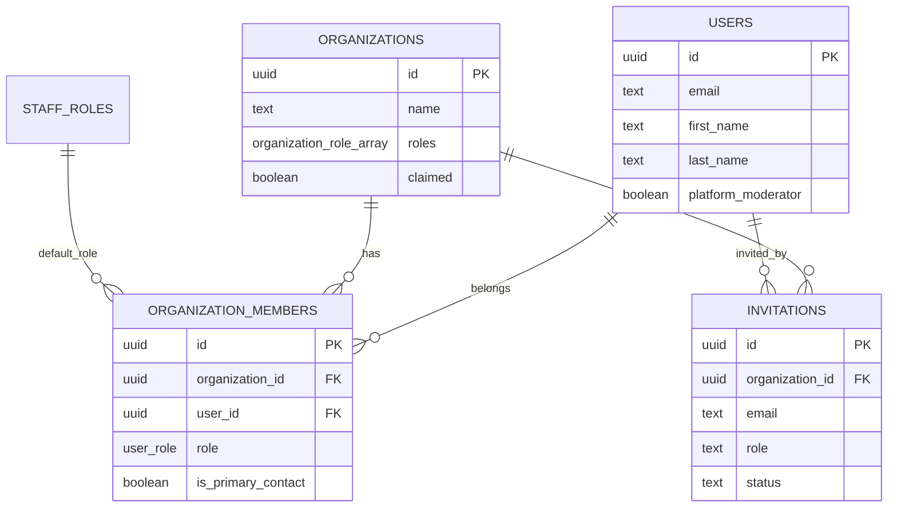
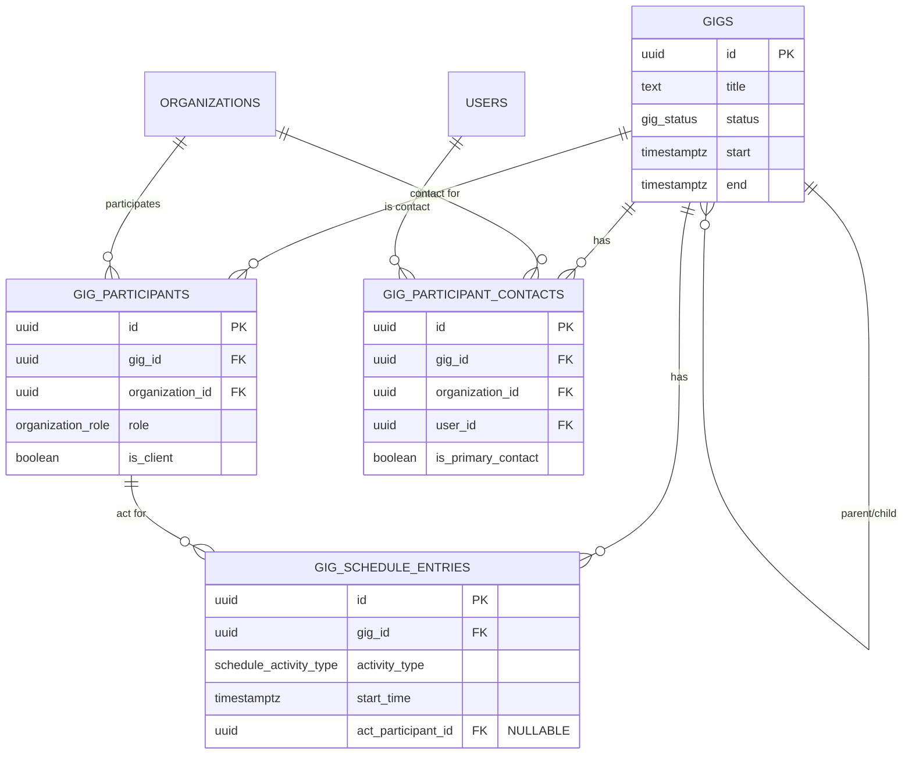
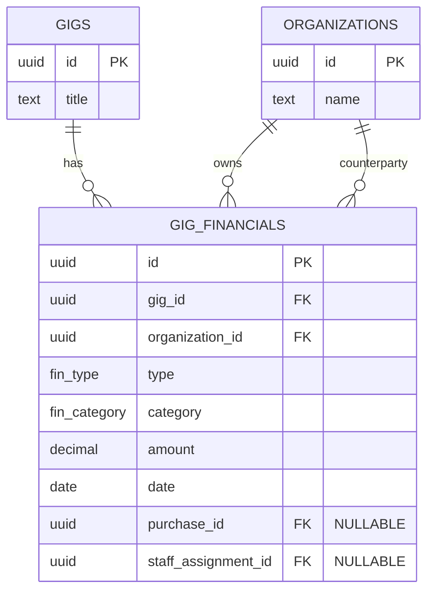
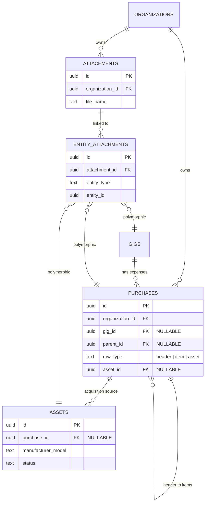
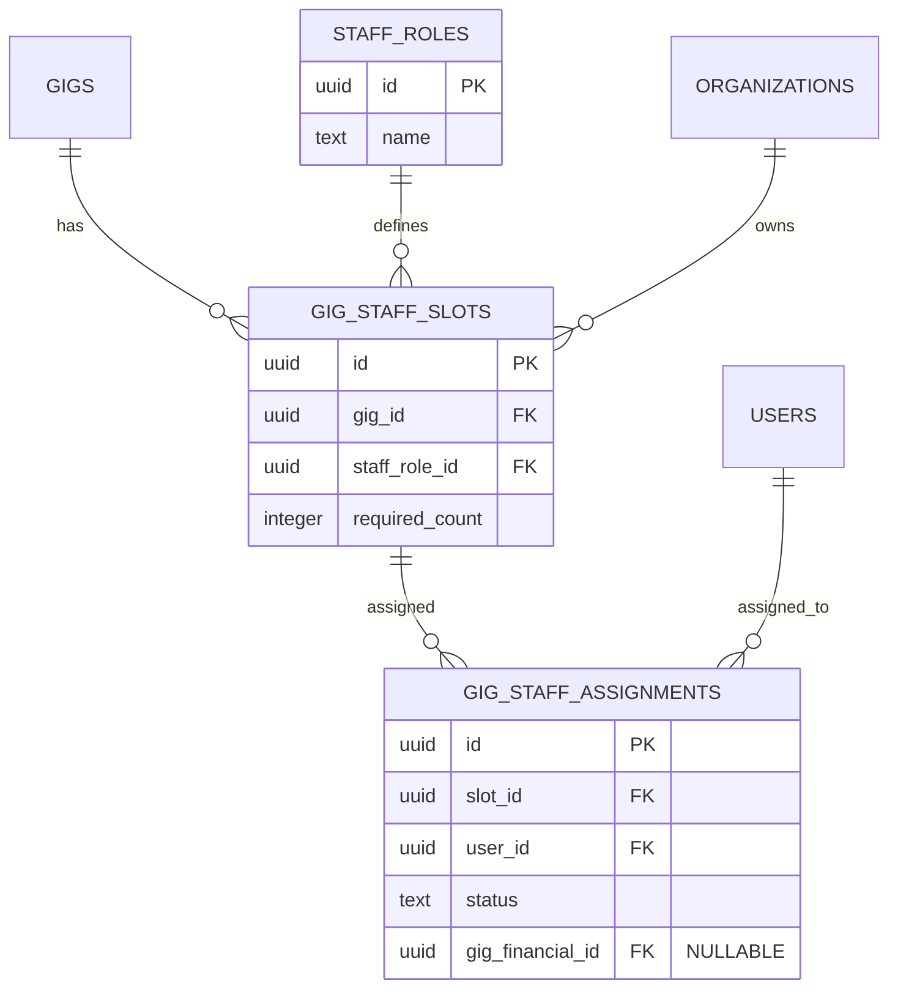
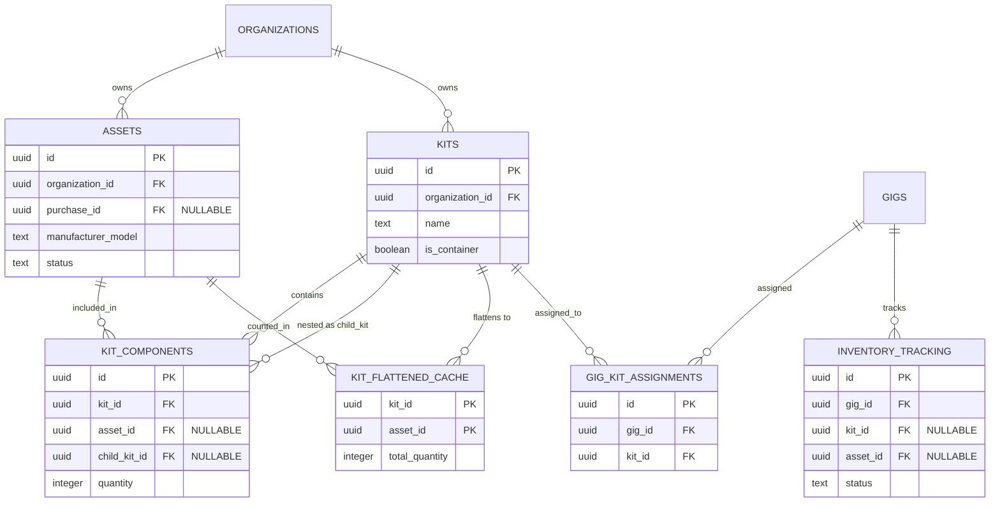

# Database Specification

**Purpose**: This document provides the complete database schema, Supabase integration details, and data access patterns for the GigWrangler application.

**Last Updated**: 2026-09-25

---

## Table of Contents

1. [Overview](#overview)
2. [Supabase Integration](#supabase-integration)
3. [High-Level Entity Diagram](#high-level-entity-diagram)
4. [Enum Types](#enum-types)
5. [Core Tables](#core-tables)
6. [Gig Management Tables](#gig-management-tables)
7. [Financial Management](#financial-management)
8. [Purchases & Attachments](#purchases--attachments)
9. [Staff Management Tables](#staff-management-tables)
10. [Equipment Tables](#equipment-tables)
11. [Google Calendar Integration Tables](#google-calendar-integration-tables)
12. [Operational Tables](#operational-tables)
13. [Helper Functions & Triggers](#helper-functions--triggers)
14. [Indexes](#indexes)
15. [Row-Level Security (RLS)](#row-level-security-rls)
16. [Authentication](#authentication)
17. [Real-Time Features](#real-time-features)

---

## Overview

The database uses **PostgreSQL 17** hosted on **Supabase** with Row-Level Security (RLS) for multi-tenant data isolation. All enum types are defined in the SQL migration (`supabase/migrations/20260209000000_initial_schema.sql`) and mirrored in `src/utils/supabase/constants.ts`.

**Technology Stack:**
- PostgreSQL 17 database
- Supabase backend (auth, realtime, storage)
- Direct Supabase client integration (no Prisma ORM in production)
- TypeScript types generated from schema

**Key Features:**
- Multi-tenant architecture with RLS
- Real-time subscriptions via Postgres CDC
- Unified activity log (`activity_log`) and automatic timestamps
- Hierarchical data structures (nested gigs, nested kits)
- Flexible participant/role management

---

## Supabase Integration

### What's Implemented

**Database:**
- Complete schema with 28 application tables
- Row-Level Security (RLS) policies for data isolation
- Automatic triggers for timestamp updates, kit-hierarchy integrity/caching, and attachment cleanup
- Scheduled jobs via `pg_cron` / `pg_net` (daily health check)
- Seed data for common staff roles

**Authentication:**
- Email/Password authentication (ready to use)
- Google OAuth integration via Supabase Auth
- Multiple providers supported (GitHub, Microsoft, etc.)
- Session management with automatic token refresh
- User profile creation on first login

**Real-Time:**
- Live updates when data changes
- Multi-user sync via Postgres CDC
- Automatic subscriptions for gigs, assets, kits

**API Layer:**
- Direct Supabase client calls from frontend
- Authentication middleware via RLS
- Permission checks (Admin/Manager/Staff/Viewer roles)

### File Structure

```
/
├── src/
│   ├── services/
│   │   └── *.service.ts                 # API service functions (gig, asset, kit, etc.)
│   └── utils/
│       ├── api-error-utils.ts           # Shared API error handling
│       └── supabase/
│           ├── client.tsx               # Supabase client singleton
│           └── types.tsx                # TypeScript types matching schema
└── supabase/
    └── migrations/
        └── *.sql                        # Database migrations (source of truth for schema)
```

---

## High-Level Entity Diagram


```mermaid
erDiagram
  %% Core organizational structure
  USERS ||--o{ ORGANIZATION_MEMBERS : belongs
  ORGANIZATIONS ||--o{ ORGANIZATION_MEMBERS : has
  ORGANIZATIONS ||--o{ INVITATIONS : has
  USERS ||--o{ INVITATIONS : invited_by
  ORGANIZATIONS ||--o{ ACCESS_REQUESTS : receives
  USERS ||--o{ ACCESS_REQUESTS : requests
  USERS ||--o{ NOTIFICATIONS : receives

  %% Gig management and participation
  GIGS ||--o{ GIG_PARTICIPANTS : links
  ORGANIZATIONS ||--o{ GIG_PARTICIPANTS : participates
  GIGS ||--o{ GIG_PARTICIPANT_CONTACTS : has
  USERS ||--o{ GIG_PARTICIPANT_CONTACTS : "is contact"
  GIGS ||--o{ GIG_SCHEDULE_ENTRIES : has
  GIG_PARTICIPANTS ||--o{ GIG_SCHEDULE_ENTRIES : "act for"

  %% Activity log
  GIGS ||--o{ ACTIVITY_LOG : "logged on"
  ORGANIZATIONS ||--o{ ACTIVITY_LOG : scopes

  %% Financial management
  GIGS ||--o{ GIG_FINANCIALS : has
  ORGANIZATIONS ||--o{ GIG_FINANCIALS : owns

  %% Purchases & attachments
  ORGANIZATIONS ||--o{ PURCHASES : owns
  GIGS ||--o{ PURCHASES : "has expenses"
  PURCHASES ||--o{ PURCHASES : "header to items"
  PURCHASES ||--o{ ASSETS : "acquisition source"
  ATTACHMENTS ||--o{ ENTITY_ATTACHMENTS : "linked to"

  %% Staff management
  STAFF_ROLES ||--o{ GIG_STAFF_SLOTS : defines
  GIGS ||--o{ GIG_STAFF_SLOTS : has
  GIG_STAFF_SLOTS ||--o{ GIG_STAFF_ASSIGNMENTS : assigned
  USERS ||--o{ GIG_STAFF_ASSIGNMENTS : assigned_to

  %% Equipment management
  ORGANIZATIONS ||--o{ ASSETS : owns
  ORGANIZATIONS ||--o{ KITS : owns
  KITS ||--o{ KIT_COMPONENTS : contains
  ASSETS ||--o{ KIT_COMPONENTS : included_in
  KITS ||--o{ KIT_COMPONENTS : "nested as child_kit"
  KITS ||--o{ KIT_FLATTENED_CACHE : "flattens to"
  GIGS ||--o{ GIG_KIT_ASSIGNMENTS : assigned
  KITS ||--o{ GIG_KIT_ASSIGNMENTS : assigned_to

  %% Inventory tracking
  GIGS ||--o{ INVENTORY_TRACKING : tracks
```

---

## Enum Types

The following custom enumeration types are defined in the database:

### organization_role
Used for categorization of organizations (`organizations.roles`, an array) and their role in a gig (`gig_participants.role`). Renamed to this name in migration 20260522000000.
- `Production`
- `Sound`
- `Lighting`
- `Staging`
- `Rentals`
- `Venue`
- `Act`
- `Agency`

### user_role
Defines access levels within an organization.
- `Admin`
- `Manager`
- `Staff`
- `Viewer`

### gig_status
Tracks the lifecycle of a gig.
- `DateHold`
- `Proposed`
- `Booked`
- `Completed`
- `Cancelled`
- `Settled`

### fin_type
Tracks the type of financial record/transaction.
- `Bid Submitted`
- `Bid Accepted`
- `Bid Rejected`
- `Contract Submitted`
- `Contract Revised`
- `Contract Signed`
- `Contract Rejected`
- `Contract Cancelled`
- `Contract Settled`
- `Sub-Contract Submitted`
- `Sub-Contract Revised`
- `Sub-Contract Signed`
- `Sub-Contract Rejected`
- `Sub-Contract Cancelled`
- `Sub-Contract Settled`
- `Deposit Received`
- `Deposit Sent`
- `Deposit Refunded`
- `Payment Sent`
- `Payment Received` *(originally misspelled `Payment Recieved`; renamed in migrations 20260322000000 / 20260328000000)*
- `Expense Incurred`
- `Expense Reimbursed`
- `Invoice Issued`
- `Invoice Settled`
- `Informal Terms` *(added in migration 20260520000001)*

### fin_category
IRS Schedule C expense categories (replaced the original `Labor / Equipment / …` set in migration 20260512000000). Only applies to expense-type records; nullable on `gig_financials`.
- `Advertising`
- `Car and truck expenses`
- `Commissions and fees`
- `Contract labor`
- `Depreciation`
- `Insurance`
- `Legal and professional services`
- `Office expense`
- `Rent or lease`
- `Repairs and maintenance`
- `Supplies`
- `Taxes and licenses`
- `Travel`
- `Meals`
- `Utilities`
- `Wages`
- `Other expenses`

### schedule_activity_type
Activity kind for a gig run-of-show entry (`gig_schedule_entries.activity_type`; migration 20260616000000).
- `Load-In`
- `Soundcheck`
- `Rehearsal`
- `Set`
- `Intermission`
- `Load-Out`
- `Other`

### sync_status
Tracks Google Calendar sync state for gigs.
- `pending`
- `synced`
- `failed`
- `updated`
- `removed`

---

## Core Tables

### ER Diagram: Core Tables


```mermaid
erDiagram
    USERS {
        uuid id PK
        text email
        text first_name
        text last_name
        boolean platform_moderator
    }
    ORGANIZATIONS {
        uuid id PK
        text name
        organization_role_array roles
        boolean claimed
    }
    ORGANIZATION_MEMBERS {
        uuid id PK
        uuid organization_id FK
        uuid user_id FK
        user_role role
        boolean is_primary_contact
    }
    INVITATIONS {
        uuid id PK
        uuid organization_id FK
        text email
        text role
        text status
    }

    USERS ||--o{ ORGANIZATION_MEMBERS : belongs
    ORGANIZATIONS ||--o{ ORGANIZATION_MEMBERS : has
    ORGANIZATIONS ||--o{ INVITATIONS : has
    USERS ||--o{ INVITATIONS : invited_by
    STAFF_ROLES ||--o{ ORGANIZATION_MEMBERS : default_role
```

### users

User profiles (extends Supabase auth.users)

| Field | Type | Description |
|-------|------|-------------|
| id | UUID | Primary key, references auth.users(id) |
| email | TEXT | User's email address (unique, **nullable** since migration 20260906180000 so login-less contacts can have no email) |
| first_name | TEXT | User's first name (NOT NULL) |
| last_name | TEXT | User's last name (NOT NULL) |
| phone | TEXT | User's phone number (nullable) |
| avatar_url | TEXT | URL to user's avatar image (nullable) |
| address_line1 | TEXT | Street address (nullable) |
| address_line2 | TEXT | Apartment, suite, etc. (nullable) |
| city | TEXT | City (nullable) |
| state | TEXT | State or province (nullable) |
| postal_code | TEXT | ZIP/postal code (nullable) |
| country | TEXT | Country (nullable) |
| timezone | VARCHAR | IANA timezone (e.g., "America/New_York"). Default for CSV imports. (nullable) |
| role_hint | TEXT | Default staffing role hint (e.g., "FOH", "Lighting") (nullable) |
| user_status | TEXT | User account status: `active`, `pending`, `inactive`, `contact` (CHECK constraint; default 'active'). `contact` added in migration 20260825180000 |
| platform_moderator | BOOLEAN | Platform-level moderator flag, distinct from org Admin; routes access requests for unclaimed orgs (default false, NOT NULL; migration 20260908000000) |
| created_at | TIMESTAMPTZ | Record creation timestamp (NOT NULL) |
| updated_at | TIMESTAMPTZ | Record last update timestamp (NOT NULL) |

**Notes:**
- Address fields structured to support both US and international addresses
- `created_by` and `updated_by` fields in other models reference User.id but don't maintain reverse relations
- `user_status = 'contact'` marks a rolodex-only person who will never log in (no `auth.users` row); created via `add_organization_contact` / `create_contact_person`.
- `platform_moderator` has no granting UI; it is set directly via SQL.
- RLS is **ENABLED** on this table. Users can view their own profile and profiles of users in the same organizations, plus users of organizations they can manage contacts for (`user_can_manage_org_contacts`) and users linked as `gig_participant_contacts` on gigs they can access.

---

### organizations

Companies, venues, acts, and other entities

| Field | Type | Description |
|-------|------|-------------|
| id | UUID | Primary key |
| name | TEXT | Organization name (NOT NULL) |
| roles | organization_role[] | Array of organization roles (NOT NULL). Renamed from scalar `type` and converted to an array in migration 20260522000000 |
| url | TEXT | Organization website URL (nullable) |
| phone_number | TEXT | Organization phone number (nullable) |
| address_line1 | TEXT | Street address (nullable) |
| address_line2 | TEXT | Apartment, suite, etc. (nullable) |
| city | TEXT | City (nullable) |
| state | TEXT | State or province (nullable) |
| postal_code | TEXT | ZIP/postal code (nullable) |
| country | TEXT | Country (nullable) |
| description | TEXT | Organization description (nullable), long text, markdown |
| allowed_domains | TEXT | Comma separated list of automatically allowable user email domains. |
| claimed | BOOLEAN | Whether the organization has an Admin yet (default true, NOT NULL; migration 20260908000000 backfilled `false` for orgs with no Admin member) |
| created_at | TIMESTAMPTZ | Record creation timestamp (NOT NULL) |
| updated_at | TIMESTAMPTZ | Record last update timestamp (NOT NULL) |

**Notes:**

- All authenticated users may read organizations (for participant selection).
- UPDATE policy "Admins can update per claimed status" (migration 20260908000000): an Admin of **this** org can always edit it; an Admin of **any** org (`user_is_admin`) can edit it only while `claimed = false`.
- `claimed` also drives access-request routing (see `access_requests`).
- The `description` field is a long text in markdown format.
- RLS is **ENABLED** on this table.

---

### organization_members

User memberships in organizations with roles

| Field | Type | Description |
|-------|------|-------------|
| id | UUID | Primary key |
| organization_id | UUID | Reference to organizations.id (NOT NULL) |
| user_id | UUID | Reference to users.id (NOT NULL) |
| role | UserRole | RBAC role within organization: Admin, Manager, Staff, Viewer (NOT NULL) |
| default_staff_role_id | UUID | Reference to staff_roles.id for default gig assignments (nullable) |
| is_primary_contact | BOOLEAN | This member is the org's default point of contact (default false, NOT NULL; migration 20260825180000) |
| contact_title | TEXT | Free-text title at this org, e.g. "Venue Manager" — distinct from `role` (nullable; migration 20260825180000) |
| created_at | TIMESTAMPTZ | Record creation timestamp (NOT NULL) |

**Notes:**
- Unique constraint on (organization_id, user_id) ensures a user can only be a member of an organization once
- Partial unique index `organization_members_one_primary_contact_per_org` on (organization_id) WHERE `is_primary_contact` — at most one primary contact per org
- `default_staff_role_id` allows pre-filling staff assignments for this member
- Contact rows are written via SECURITY DEFINER RPCs (`add_organization_contact`, `link_existing_person_to_organization`, `update_organization_contact`, `set_organization_primary_contact`, `unset_organization_primary_contact`, `remove_organization_contact`), gated by `user_can_manage_org_contacts`.
- RLS is **ENABLED** on this table. Users can view members of their own organizations and members of any org they can manage contacts for ("Users can view members of organizations they can manage contacts for", migration 20260907000000); Admins can manage membership.

---

### invitations

Tracks pending and completed invitations to join organizations

| Field | Type | Description |
|-------|------|-------------|
| id | UUID | Primary key |
| organization_id | UUID | Reference to organizations.id (NOT NULL) |
| email | TEXT | Email address of the invited user (NOT NULL) |
| role | TEXT | Role assigned to user: Admin, Manager, Staff, Viewer (NOT NULL) |
| invited_by | UUID | Reference to users.id (NOT NULL) |
| status | TEXT | Invitation status: `pending`, `accepted`, `expired`, `cancelled` (NOT NULL) |
| token | TEXT | Unique invitation token (unique, NOT NULL) |
| expires_at | TIMESTAMPTZ | Token expiration timestamp (NOT NULL) |
| accepted_at | TIMESTAMPTZ | When the invitation was accepted (nullable) |
| accepted_by | UUID | Reference to users.id (nullable) |
| created_at | TIMESTAMPTZ | Record creation timestamp |
| updated_at | TIMESTAMPTZ | Record last update timestamp |

**Notes:**
- RLS is **ENABLED** on this table. Users can view invitations for their organizations.
- Composite unique constraint on (organization_id, email, status) prevents duplicate pending invitations.

---

### user_devices

WebAuthn/passkey device registrations for users

| Field | Type | Description |
|-------|------|-------------|
| id | UUID | Primary key |
| user_id | UUID | Reference to auth.users(id) (NOT NULL, CASCADE delete) |
| credential_id | TEXT | WebAuthn credential ID (unique, NOT NULL) |
| public_key | TEXT | WebAuthn public key (NOT NULL) |
| device_name | TEXT | Human-readable device name (nullable) |
| created_at | TIMESTAMPTZ | Record creation timestamp (NOT NULL) |
| last_used_at | TIMESTAMPTZ | Last authentication timestamp (NOT NULL) |

**Notes:**
- RLS is **ENABLED** on this table. Users can only manage their own devices.

---

## Gig Management Tables

### ER Diagram: Gig Management


```mermaid
erDiagram
    GIGS {
        uuid id PK
        text title
        gig_status status
        timestamptz start
        timestamptz end
    }
    GIG_PARTICIPANTS {
        uuid id PK
        uuid gig_id FK
        uuid organization_id FK
        organization_role role
        boolean is_client
    }
    GIG_PARTICIPANT_CONTACTS {
        uuid id PK
        uuid gig_id FK
        uuid organization_id FK
        uuid user_id FK
        boolean is_primary_contact
    }
    GIG_SCHEDULE_ENTRIES {
        uuid id PK
        uuid gig_id FK
        schedule_activity_type activity_type
        timestamptz start_time
        uuid act_participant_id FK "NULLABLE"
    }

    GIGS ||--o{ GIG_PARTICIPANTS : links
    GIGS ||--o{ GIGS : "parent/child"
    ORGANIZATIONS ||--o{ GIG_PARTICIPANTS : participates
    GIGS ||--o{ GIG_PARTICIPANT_CONTACTS : has
    ORGANIZATIONS ||--o{ GIG_PARTICIPANT_CONTACTS : "contact for"
    USERS ||--o{ GIG_PARTICIPANT_CONTACTS : "is contact"
    GIGS ||--o{ GIG_SCHEDULE_ENTRIES : has
    GIG_PARTICIPANTS ||--o{ GIG_SCHEDULE_ENTRIES : "act for"
```

### gigs

Main gig records with status, dates, and details

| Field | Type | Description |
|-------|------|-------------|
| id | UUID | Primary key |
| parent_gig_id | UUID | Reference to gigs.id for hierarchical relationships (nullable) |
| hierarchy_depth | INTEGER | Depth level in gig hierarchy (default 0, NOT NULL) |
| title | TEXT | Gig title/name (NOT NULL) |
| start | TIMESTAMPTZ | Start date and time of the gig (NOT NULL) |
| end | TIMESTAMPTZ | End date and time of the gig (NOT NULL) |
| timezone | TEXT | IANA timezone identifier (e.g., "America/New_York") (NOT NULL) |
| status | GigStatus | Gig status enum: DateHold, Proposed, Booked, Completed, Cancelled, Settled (NOT NULL) |
| tags | TEXT[] | Array of tags for categorization (default '{}') |
| notes | TEXT | Long text field for freeform notes (Markdown-formatted, nullable) |
| created_by | UUID | Reference to users.id (informational, NOT NULL) |
| updated_by | UUID | Reference to users.id (informational, NOT NULL) |
| created_at | TIMESTAMPTZ | Record creation timestamp (NOT NULL) |
| updated_at | TIMESTAMPTZ | Record last update timestamp (NOT NULL) |

**Notes:**
- Gigs are shared (participated in) by multiple organizations so there is no 'owning' organization.
- Gigs link to organizations via `gig_participants` with a `role` using `organization_role` enum values
- Gig status transitions are recorded in `activity_log` (`event_type = 'gig.status_changed'`) by the application via the `log_activity` RPC — there is no longer a database trigger for this (migration 20260615000000)
- Any status can transition to any other status (no restrictions)
- Gigs can span midnight, so we use full DateTime for both start and end
- The "gig date" shown in UI is derived from the start DateTime
- `parent_gig_id` enables hierarchical relationships between gigs (e.g., main event with sub-events)
- `hierarchy_depth` tracks the depth level in the hierarchy for performance and validation
- Deleting a gig fires `trg_cleanup_attachments` (migration 20260831000100).
- RLS is **ENABLED** on this table. Users can view gigs their organization participates in; Admins/Managers can update; Admins can delete. There is **no INSERT policy** (dropped in migration 20260613000000): gigs are created only through the SECURITY DEFINER `create_gig_complex` RPC, which requires `primary_organization_id` and that the caller is Admin/Manager of it.

---

### gig_participants

Organizations participating in a gig (venue, act, production, etc.)

| Field | Type | Description |
|-------|------|-------------|
| id | UUID | Primary key |
| organization_id | UUID | Reference to organizations.id (the participating organization) (NOT NULL) |
| gig_id | UUID | Reference to gigs.id (NOT NULL) |
| role | organization_role | Participant role (single value, NOT NULL) |
| notes | TEXT | Long text field for freeform notes (Markdown-formatted, nullable) |
| is_client | BOOLEAN | This participating org is (one of) the paying client(s) for the gig (default false, NOT NULL; migration 20260825180000) |

**Notes:**
- `role` uses the `organization_role` enum values: Production, Sound, Lighting, Staging, Rentals, Venue, Act, Agency
- Composite unique constraint on (gig_id, organization_id, role)
- `is_client` is orthogonal to `role` and deliberately has no uniqueness constraint (split billing / co-promotion)
- RLS is **ENABLED** on this table. Users can view participants for accessible gigs; Admins/Managers can manage.

---

### gig_participant_contacts

Who to contact at a participating organization, for one specific gig (migration 20260906200000). Independent of `organization_members` — a person listed here need not be a member of that organization.

| Field | Type | Description |
|-------|------|-------------|
| id | UUID | Primary key |
| gig_id | UUID | Reference to gigs.id (NOT NULL, CASCADE delete) |
| organization_id | UUID | Reference to organizations.id (NOT NULL, CASCADE delete) |
| user_id | UUID | Reference to users.id (NOT NULL, CASCADE delete) |
| is_primary_contact | BOOLEAN | Primary contact for this org on this gig (default false, NOT NULL) |
| title | TEXT | Free-text role/title on this gig, e.g. "Day-of contact" (nullable) |
| created_at | TIMESTAMPTZ | Record creation timestamp (NOT NULL) |

**Notes:**
- Unique constraint on (gig_id, organization_id, user_id); partial unique index `gig_participant_contacts_one_primary_per_gig_org` on (gig_id, organization_id) WHERE `is_primary_contact` — at most one primary per gig/org.
- `is_primary_contact` defaults from `organization_members.is_primary_contact` only when the person is first added.
- RLS is **ENABLED**. SELECT for anyone with gig access (`user_has_access_to_gig`). There are **no** INSERT/UPDATE/DELETE policies — all writes go through SECURITY DEFINER RPCs (`add_gig_participant_contact`, `set_gig_participant_contact_primary`, `remove_gig_participant_contact`, plus `create_contact_person` for brand-new people), gated by `user_can_manage_org_contacts`.

---

### gig_schedule_entries

Run-of-show / multi-act schedule entries for a gig (migrations 20260616000000, 20260617000000).

| Field | Type | Description |
|-------|------|-------------|
| id | UUID | Primary key |
| gig_id | UUID | Reference to gigs.id (NOT NULL, CASCADE delete) |
| activity_type | schedule_activity_type | Kind of activity (NOT NULL) |
| label | TEXT | Optional display label (nullable) |
| start_time | TIMESTAMPTZ | Start time (NOT NULL) |
| end_time | TIMESTAMPTZ | End time (**nullable** since 20260617000000) |
| act_participant_id | UUID | Reference to gig_participants.id — the act this entry belongs to (nullable, SET NULL on delete) |
| sort_order | INTEGER | Display ordering (default 0, NOT NULL) |
| notes | TEXT | Notes (nullable) |
| created_at | TIMESTAMPTZ | Record creation timestamp (NOT NULL) |
| updated_at | TIMESTAMPTZ | Record last update timestamp (NOT NULL) |

**Notes:**
- The original `end_time > start_time` check (`schedule_entry_time_order`) was dropped in 20260617000000; an entry may have only a start time.
- No `update_updated_at_column` trigger is attached; `updated_at` must be set by the writer.
- RLS is **ENABLED**. SELECT for any member of a participating org; INSERT/UPDATE/DELETE for Admin/Manager of a participating org (inline `gig_participants` ⨝ `organization_members` checks).

---

## Financial Management

### ER Diagram: Gig Financials


```mermaid
erDiagram
    GIGS {
        uuid id PK
        text title
    }
    ORGANIZATIONS {
        uuid id PK
        text name
    }
    GIG_FINANCIALS {
        uuid id PK
        uuid gig_id FK
        uuid organization_id FK
        fin_type type
        fin_category category
        decimal amount
        date date
        uuid purchase_id FK "NULLABLE"
        uuid staff_assignment_id FK "NULLABLE"
    }

    GIGS ||--o{ GIG_FINANCIALS : has
    ORGANIZATIONS ||--o{ GIG_FINANCIALS : owns
    ORGANIZATIONS ||--o{ GIG_FINANCIALS : counterparty
```

For how `purchase_id` / `staff_assignment_id` feed the single ledger, and the
full ER diagram, see [gig-financials.md](gig-financials.md).

### gig_financials

Centralized tracking for bids, payments, expenses, and invoices.

| Field | Type | Description |
|-------|------|-------------|
| id | UUID | Primary key |
| gig_id | UUID | Reference to gigs.id (NOT NULL) |
| organization_id | UUID | Reference to organizations.id (the owning organization) (nullable) |
| type | fin_type | Type of financial record (e.g., 'Bid Submitted', 'Payment Received', 'Expense Incurred') (NOT NULL, no default — dropped in migration 20260520000000) |
| category | fin_category | Category for reporting — IRS Schedule C categories, see below (**nullable**, no default) |
| amount | DECIMAL(10,2) | Monetary amount (NOT NULL) |
| mileage | NUMERIC(10,2) | Miles travelled to/from the gig, for mileage-based expense rows (nullable; migration 20260601000000) |
| currency | TEXT | Currency code (default 'USD') (NOT NULL) |
| date | DATE | Transaction or record date (NOT NULL) |
| due_date | DATE | Payment due date (nullable) |
| paid_at | TIMESTAMPTZ | When payment was actually completed (nullable) |
| reference_number| TEXT | Invoice, PO, or check number (nullable) |
| counterparty_id | UUID | Reference to organizations.id for the other party in transaction (nullable) |
| external_entity_name | TEXT | Name of counterparty if not in organizations table (nullable) |
| purchase_id | UUID | Reference to purchases.id — the source receipt/invoice this ledger row records (nullable, ON DELETE SET NULL; migration 20260319213000) |
| staff_assignment_id | UUID | Reference to gig_staff_assignments.id — the completed assignment this labor cost came from (nullable, ON DELETE SET NULL; migration 20260319213000) |
| description | TEXT | Detailed description or notes (nullable, Markdown-formatted) |
| notes | TEXT | Internal notes (nullable) |
| created_by | UUID | Reference to users.id (informational, NOT NULL) |
| updated_by | UUID | Reference to users.id (informational, nullable) |
| created_at | TIMESTAMPTZ | Record creation timestamp (NOT NULL) |
| updated_at | TIMESTAMPTZ | Record last update timestamp (NOT NULL) |

**Notes:**
- `gig_financials` replaces the legacy `gig_bids` table and `gigs.amount_paid` column.
- The enum value is now spelled `Payment Received` (the original `Payment Recieved` typo was renamed in migration 20260322000000).
- `purchase_id` / `staff_assignment_id` are the two-way links to the source documents that feed the ledger — see [gig-financials.md](gig-financials.md) §1.
- **`fin_category`** was reworked (migrations 20260328000001 / 20260512000000) from the original `Labor / Equipment / Transportation / Venue / Production / Insurance / Rebillable / Other` set to IRS Schedule C names: `Advertising`, `Car and truck expenses`, `Commissions and fees`, `Contract labor`, `Depreciation`, `Insurance`, `Legal and professional services`, `Office expense`, `Rent or lease`, `Repairs and maintenance`, `Supplies`, `Taxes and licenses`, `Travel`, `Meals`, `Utilities`, `Wages`, `Other expenses`. It was also made nullable and lost its default (migrations 20260513000000 / 20260520000000). The authoritative list is `FIN_CATEGORY_CONFIG` in `src/utils/supabase/constants.ts`.
- RLS is **ENABLED**. Since migration 20260912000000 (cross-org leak fix, issue #61) there are exactly two policies, both scoped to the row's own `organization_id` via `user_is_admin_or_manager_of_org` — one FOR SELECT, one FOR ALL. Admins/Managers of *other* orgs participating in the same gig can no longer see or modify the row. Rows with a NULL `organization_id` are therefore invisible to all non-service-role clients.
- Deleting a row fires `trg_cleanup_attachments`, which removes its `entity_attachments` links and any solely-owned `attachments` rows (migration 20260831000100).
- `organization_id` represents the tenant who "owns" or is responsible for this financial record.
- `counterparty_id` or `external_entity_name` tracks who the money is coming from or going to.

---

## Purchases & Attachments

### ER Diagram: Purchases & Attachments


```mermaid
erDiagram
    PURCHASES {
        uuid id PK
        uuid organization_id FK
        uuid gig_id FK "NULLABLE"
        uuid parent_id FK "NULLABLE"
        text row_type "header | item | asset"
        uuid asset_id FK "NULLABLE"
    }
    ASSETS {
        uuid id PK
        uuid purchase_id FK "NULLABLE"
        text manufacturer_model
        text status
    }
    ATTACHMENTS {
        uuid id PK
        uuid organization_id FK
        text file_name
    }
    ENTITY_ATTACHMENTS {
        uuid id PK
        uuid attachment_id FK
        text entity_type
        uuid entity_id
    }

    ORGANIZATIONS ||--o{ PURCHASES : owns
    GIGS ||--o{ PURCHASES : "has expenses"
    PURCHASES ||--o{ PURCHASES : "header to items"
    PURCHASES ||--o{ ASSETS : "acquisition source"

    ORGANIZATIONS ||--o{ ATTACHMENTS : owns
    ATTACHMENTS ||--o{ ENTITY_ATTACHMENTS : "linked to"
    ENTITY_ATTACHMENTS }o--|| ASSETS : "polymorphic"
    ENTITY_ATTACHMENTS }o--|| PURCHASES : "polymorphic"
    ENTITY_ATTACHMENTS }o--|| GIGS : "polymorphic"
```

### purchases

Handles acquisition headers and expense line items. Uses a self-referencing `parent_id` to link items to their header row.

| Field | Type | Description |
|-------|------|-------------|
| id | UUID | Primary key |
| organization_id | UUID | Reference to organizations.id (NOT NULL) |
| gig_id | UUID | Reference to gigs.id — links expenses to a gig (nullable) |
| parent_id | UUID | Self-reference to purchases.id — links items to their header (nullable) |
| asset_id | UUID | Reference to assets.id — links audit item rows to the asset they represent (nullable) |
| row_type | TEXT | Discriminator: `'header'`, `'item'`, or `'asset'` (NOT NULL, CHECK constraint). `'asset'` was added in migration 20260316000001 — an `'asset'` line is an item row that also produced an `assets` record (linked via `asset_id`). |
| purchase_date | DATE | Date of purchase (nullable) |
| vendor | TEXT | Vendor name (nullable) |
| total_inv_amount | NUMERIC(10,2) | Total invoice amount — header only (nullable) |
| payment_method | TEXT | Payment method — header only (nullable) |
| line_amount | NUMERIC(10,2) | Line item subtotal — item only (nullable) |
| line_cost | NUMERIC(10,2) | Line item burdened cost (incl. pro-rata tax/shipping) — item only (nullable) |
| quantity | NUMERIC(12,4) | Quantity — item only (nullable) |
| item_price | NUMERIC(10,2) | Unit price — item only (nullable) |
| item_cost | NUMERIC(10,2) | Unit burdened cost — item only (nullable) |
| description | TEXT | Line item description — item only (nullable) |
| category | TEXT | Category — item only (nullable) |
| sub_category | TEXT | Sub-category — item only (nullable) |
| created_by | UUID | Reference to users.id (default auth.uid()) |
| updated_by | UUID | Reference to users.id (default auth.uid()) |
| created_at | TIMESTAMPTZ | Record creation timestamp (NOT NULL) |
| updated_at | TIMESTAMPTZ | Record last update timestamp (NOT NULL) |

**Notes:**
- A **header** row (`row_type = 'header'`) represents an overall purchase transaction (vendor, date, total, payment method).
- **Item** / **asset** rows represent individual line items and reference their header via `parent_id`; an `'asset'` row also has `asset_id` set.
- When assets are imported, the `create_purchase_transaction_v1` function creates `'asset'` line rows with `asset_id` linking back to the created asset. `reclassify_expense_as_asset` flips an existing `'item'` row to `'asset'` after the fact.
- `gig_id` links gig-specific expenses to the relevant gig, displayed alongside `gig_financials`. It can be set at creation, edited per line, or assigned for a whole receipt from the Purchases tab — see [gig-financials.md](gig-financials.md) §2.
- A gig-linked purchase does **not** automatically get a `gig_financials` ledger row: the on-gig receipt scan creates one, but CSV import and post-hoc line assignment only prompt/offer to. Without that ledger row the expense is invisible to gig profitability.
- Assets acquired in a purchase reference the header row via `assets.purchase_id`.
- Deleting a row fires `trg_cleanup_attachments` (migration 20260831000100), removing its `entity_attachments` links and any solely-owned `attachments` rows.
- RLS is **ENABLED** on this table. Only Admins/Managers of the owning org can view or manage purchases — the member-level SELECT policy was dropped in migration 20260613000000 (Staff/Viewer have no Financials access).

---

### attachments

Metadata for files stored in Supabase Storage.

| Field | Type | Description |
|-------|------|-------------|
| id | UUID | Primary key |
| organization_id | UUID | Reference to organizations.id (NOT NULL) |
| file_path | TEXT | Path to the file in Supabase Storage (NOT NULL) |
| file_name | TEXT | Original file name (NOT NULL) |
| created_by | UUID | Reference to users.id (default auth.uid(), nullable) |
| created_at | TIMESTAMPTZ | Record creation timestamp (NOT NULL) |

**Notes:**
- Files are stored in Supabase Storage; this table tracks metadata only.
- Scoped to organization via `organization_id` for tenant isolation.
- RLS is **ENABLED** on this table. Users can view attachments for their organization; Admins/Managers can manage.
- `file_path` MUST follow the `{organization_id}/{filename}` convention: the storage policies on the `attachments` bucket derive the owning org from the first path segment (org members can read; Admins/Managers can write — see `docs/technical/security-scheme.md` §6 and migration `20260612000000_scope_attachment_storage_policies.sql`).

---

### entity_attachments

Polymorphic junction table linking attachments to any entity type.

| Field | Type | Description |
|-------|------|-------------|
| id | UUID | Primary key |
| attachment_id | UUID | Reference to attachments.id (NOT NULL) |
| entity_type | TEXT | Discriminator: `'asset'`, `'purchase'`, `'gig'`, or `'gig_financial'` (NOT NULL, CHECK constraint). `'gig_financial'` added in migration 20260831000000. |
| entity_id | UUID | ID of the target entity record (NOT NULL) |
| created_by | UUID | Reference to users.id (default auth.uid(), nullable) |
| created_at | TIMESTAMPTZ | Record creation timestamp (NOT NULL) |

**Notes:**
- Enables one attachment to be linked to multiple entities (e.g., a receipt linked to both a purchase and an asset).
- `entity_type` + `entity_id` form the polymorphic reference — there is no database-level FK constraint on `entity_id`. Instead, each host table (`assets`, `gigs`, `purchases`, `gig_financials`) has a `trg_cleanup_attachments` BEFORE DELETE trigger that removes the dangling join rows and any solely-owned `attachments` rows (migration 20260831000100). The underlying storage object is removed best-effort by the app on `deleteGigFinancial`; other delete paths rely on a storage lifecycle sweep.
- RLS is **ENABLED** on this table. Access controlled via the parent attachment's organization — Admin/Manager to manage, org member to view; the check is independent of `entity_type`.

---

## Staff Management Tables

### ER Diagram: Staff Management


```mermaid
erDiagram
    STAFF_ROLES {
        uuid id PK
        text name
    }
    GIG_STAFF_SLOTS {
        uuid id PK
        uuid gig_id FK
        uuid staff_role_id FK
        integer required_count
    }
    GIG_STAFF_ASSIGNMENTS {
        uuid id PK
        uuid slot_id FK
        uuid user_id FK
        text status
        uuid gig_financial_id FK "NULLABLE"
    }

    GIGS ||--o{ GIG_STAFF_SLOTS : has
    STAFF_ROLES ||--o{ GIG_STAFF_SLOTS : defines
    ORGANIZATIONS ||--o{ GIG_STAFF_SLOTS : owns
    GIG_STAFF_SLOTS ||--o{ GIG_STAFF_ASSIGNMENTS : assigned
    USERS ||--o{ GIG_STAFF_ASSIGNMENTS : assigned_to
```

### staff_roles

Global staff role choices (FOH, Lighting, etc.)

| Field | Type | Description |
|-------|------|-------------|
| id | UUID | Primary key |
| name | TEXT | Staff role name (e.g., "FOH", "Lighting", "Stage", "CameraOp") (unique, NOT NULL) |
| description | TEXT | Description of the staff role and responsibilities (nullable) |
| created_at | TIMESTAMPTZ | Record creation timestamp (NOT NULL) |
| updated_at | TIMESTAMPTZ | Record last update timestamp (NOT NULL) |

**Notes:**
- Staff roles are enumerated in this table to support future staffing template functionality
- Templates can be created for different gig types based on gig tags
- RLS is **ENABLED** on this table. Anyone can view staff roles.

---

### gig_staff_slots

Staff positions needed for a gig

| Field | Type | Description |
|-------|------|-------------|
| id | UUID | Primary key |
| organization_id | UUID | Reference to organizations.id (the owning organization) (nullable) |
| gig_id | UUID | Reference to gigs.id (NOT NULL) |
| staff_role_id | UUID | Reference to staff_roles.id (NOT NULL) |
| required_count | INTEGER | Number of people needed for this role (default 1, NOT NULL) |
| notes | TEXT | Notes about this staff need (nullable, Markdown-formatted) |
| created_at | TIMESTAMPTZ | Record creation timestamp (NOT NULL) |
| updated_at | TIMESTAMPTZ | Record last update timestamp (NOT NULL) |

**Notes:**
- Staff roles are enumerated via reference to staff_roles table
- This enables future staffing template functionality
- RLS is **ENABLED** on this table. Users can view slots for accessible gigs; Admins/Managers can manage.

---

### gig_staff_assignments

Actual staff assigned to positions

| Field | Type | Description |
|-------|------|-------------|
| id | UUID | Primary key |
| slot_id | UUID | Reference to gig_staff_slots.id (NOT NULL) |
| user_id | UUID | Reference to users.id (NOT NULL) |
| status | TEXT | Assignment status (e.g., "Confirmed", "Requested", "Declined") (NOT NULL) |
| rate | DECIMAL(10,2) | Hourly or daily rate for this assignment (nullable) |
| fee | DECIMAL(10,2) | Total fee for this assignment (nullable) |
| notes | TEXT | Notes about this assignment (nullable, Markdown-formatted) |
| assigned_at | TIMESTAMPTZ | Assignment timestamp (default NOW(), NOT NULL) |
| confirmed_at | TIMESTAMPTZ | Confirmation timestamp (nullable) |
| completed_at | TIMESTAMPTZ | When the assignment was marked complete (nullable; migration 20260319213000) |
| units_completed | NUMERIC(10,2) | Units (hours/days) actually worked, used to cost the labor (nullable; migration 20260319213000) |
| gig_financial_id | UUID | Reference to gig_financials.id — the ledger row recording this labor cost (nullable, ON DELETE SET NULL; migration 20260319213000) |

**Notes:**
- There is no direct relation between Gig and User, only through GigStaffSlots and GigStaffAssignments.
- There is no direct relation between Gig and GigStaffAssignments (only through GigStaffSlots)
- `gig_financial_id` is the back-link of `gig_financials.staff_assignment_id` — see [gig-financials.md](gig-financials.md).
- RLS is **ENABLED** on this table. Users can view assignments for accessible gigs; Admins/Managers can manage; Staff can update their own ("Staff can update their own assignments", recreated in 20260319213000 with a WITH CHECK intended to stop staff changing `completed_at` / `units_completed` / `gig_financial_id` — note that as written the check compares each column to itself, so it does not actually enforce this).

---

## Equipment Tables

### ER Diagram: Equipment & Inventory


```mermaid
erDiagram
    ASSETS {
        uuid id PK
        uuid organization_id FK
        uuid purchase_id FK "NULLABLE"
        text manufacturer_model
        text status
    }
    KITS {
        uuid id PK
        uuid organization_id FK
        text name
        boolean is_container
    }
    KIT_COMPONENTS {
        uuid id PK
        uuid kit_id FK
        uuid asset_id FK "NULLABLE"
        uuid child_kit_id FK "NULLABLE"
        integer quantity
    }
    KIT_FLATTENED_CACHE {
        uuid kit_id PK
        uuid asset_id PK
        integer total_quantity
    }
    GIG_KIT_ASSIGNMENTS {
        uuid id PK
        uuid gig_id FK
        uuid kit_id FK
    }
    INVENTORY_TRACKING {
        uuid id PK
        uuid gig_id FK
        uuid kit_id FK "NULLABLE"
        uuid asset_id FK "NULLABLE"
        text status
    }

    ORGANIZATIONS ||--o{ ASSETS : owns
    ORGANIZATIONS ||--o{ KITS : owns
    KITS ||--o{ KIT_COMPONENTS : contains
    ASSETS ||--o{ KIT_COMPONENTS : included_in
    KITS ||--o{ KIT_COMPONENTS : "nested as child_kit"
    KITS ||--o{ KIT_FLATTENED_CACHE : "flattens to"
    ASSETS ||--o{ KIT_FLATTENED_CACHE : counted_in
    GIGS ||--o{ GIG_KIT_ASSIGNMENTS : assigned
    KITS ||--o{ GIG_KIT_ASSIGNMENTS : assigned_to
    GIGS ||--o{ INVENTORY_TRACKING : tracks
```

### assets

Equipment and asset management

| Field | Type | Description |
|-------|------|-------------|
| id | UUID | Primary key |
| organization_id | UUID | Reference to organizations.id (tenant that owns this asset) (NOT NULL) |
| purchase_id | UUID | Reference to purchases.id — links to acquisition header (nullable) |
| acquisition_date | DATE | Date asset was acquired (NOT NULL) |
| vendor | TEXT | Vendor from which asset was purchased (nullable) |
| item_price | NUMERIC(10,2) | Unit purchase price (nullable) |
| item_cost | NUMERIC(10,2) | Burdened unit cost incl. pro-rata tax/shipping (nullable) |
| category | TEXT | Asset category (e.g., "Audio", "Lighting", "Video") (NOT NULL) |
| sub_category | TEXT | Asset sub-category (nullable) |
| insurance_policy_added | BOOLEAN | Whether asset has been added to insurance policy (default false, NOT NULL) |
| manufacturer_model | TEXT | Manufacturer and model information (NOT NULL) |
| type | TEXT | Asset type (nullable) |
| serial_number | TEXT | Asset serial number (nullable) |
| tag_number | TEXT | Physical tag number for identification (nullable) |
| description | TEXT | Long text description of asset (Markdown-formatted, nullable) |
| replacement_value | NUMERIC(10,2) | Replacement value for insurance purposes (nullable) |
| insurance_class | TEXT | Insurance classification (nullable) |
| quantity | NUMERIC(12,4) | Asset quantity (default 1) |
| status | TEXT | Asset status (default 'Active', NOT NULL) |
| retired_on | DATE | Date asset was retired/disposed of (nullable) |
| liquidation_amt | NUMERIC(10,2) | Amount received on liquidation/disposal (nullable) |
| service_life | NUMERIC | Expected service life for depreciation (nullable) |
| dep_method | TEXT | Depreciation method (nullable) |
| created_by | UUID | Reference to users.id (informational, NOT NULL) |
| updated_by | UUID | Reference to users.id (informational, NOT NULL) |
| created_at | TIMESTAMPTZ | Record creation timestamp (NOT NULL) |
| updated_at | TIMESTAMPTZ | Record last update timestamp (NOT NULL) |

**Notes:**
- `description` is a long text field that can contain Markdown-formatted content
- Assets are owned by a tenant organization via `organization_id` for RLS and filtering
- `purchase_id` links the asset back to its acquisition purchase header
- `item_cost` is the burdened cost (includes pro-rata allocation of tax, shipping, etc.)
- Status changes are recorded in `activity_log` (`event_type = 'asset.status_changed'`) by the application via `log_activity`; the former status-history trigger was dropped in migration 20260615000000
- Deleting an asset fires `trg_cleanup_attachments` (migration 20260831000100)
- RLS is **ENABLED** on this table. Users can view assets for organizations they belong to; Admins/Managers can manage.

---

### kits

Reusable collections of equipment assets

| Field | Type | Description |
|-------|------|-------------|
| id | UUID | Primary key |
| organization_id | UUID | Reference to organizations.id (tenant that owns this kit) (NOT NULL) |
| name | TEXT | Kit name (e.g., "Small Lighting Setup", "XLR Cable Kit") (NOT NULL) |
| category | TEXT | Kit category for organization (e.g., "Lighting", "Audio", "Cables") |
| description | TEXT | Kit description (Markdown-formatted, nullable) |
| tags | TEXT[] | Array of tags for categorization and filtering (default '{}') |
| tag_number | TEXT | Physical tag number for identification (nullable) |
| rental_value | DECIMAL(10,2) | Daily/gig rental value for this kit (nullable) |
| is_container | BOOLEAN | Whether this kit represents a physical container (default false, NOT NULL) |
| created_by | UUID | Reference to users.id (informational, NOT NULL) |
| updated_by | UUID | Reference to users.id (informational, NOT NULL) |
| created_at | TIMESTAMPTZ | Record creation timestamp (NOT NULL) |
| updated_at | TIMESTAMPTZ | Record last update timestamp (NOT NULL) |

**Notes:**
- Kits are owned by a tenant organization via `organization_id` for RLS and filtering
- Tags enable flexible categorization and filtering
- `is_container` distinguishes physical containers (road cases, racks) from logical groupings
- RLS is **ENABLED** on this table. Users can view kits for organizations they belong to; Admins/Managers can manage.

---

### kit_components

Junction table linking a kit to its components — either an asset or a nested child kit (hierarchical kits, migration 20260826000000; formerly the asset-only junction table, renamed in that migration).

| Field | Type | Description |
|-------|------|-------------|
| id | UUID | Primary key |
| kit_id | UUID | Reference to kits.id — the parent kit (NOT NULL) |
| asset_id | UUID | Reference to assets.id (nullable; CASCADE delete) |
| child_kit_id | UUID | Reference to kits.id — a nested kit (nullable; CASCADE delete) |
| quantity | INTEGER | Number of this asset/child kit in the kit (default 1, NOT NULL) |
| notes | TEXT | Notes about this component in the kit context (nullable) |
| created_at | TIMESTAMPTZ | Record creation timestamp (NOT NULL) |

**Notes:**
- CHECK `kit_components_exactly_one_target`: exactly one of `asset_id` / `child_kit_id` is set. CHECK `kit_components_no_self_reference`: `child_kit_id <> kit_id`.
- Partial unique indexes `kit_components_kit_asset_key` (kit_id, asset_id) WHERE asset_id IS NOT NULL and `kit_components_kit_childkit_key` (kit_id, child_kit_id) WHERE child_kit_id IS NOT NULL prevent duplicate components.
- Cycles are blocked by the `kit_components_prevent_cycle` BEFORE INSERT/UPDATE trigger (`prevent_kit_hierarchy_cycle` → `kit_would_create_cycle`), raising SQLSTATE 23514.
- Every write fires `kit_components_refresh_cache` (AFTER INSERT/UPDATE/DELETE), which rebuilds `kit_flattened_cache` for the kit and all its ancestors.
- Quantity allows specifying multiples (e.g., 2 mains, 2 subs); nested quantities multiply through the hierarchy.
- RLS is **ENABLED**. SELECT for members of the parent kit's org; ALL for Admin/Manager of the parent kit's org **and**, when `child_kit_id` is set, Admin/Manager of the child kit's org.

---

### kit_flattened_cache

Write-time-maintained flattened contents of each kit: total quantity of every asset, recursively through nested kits (migration 20260826000000).

| Field | Type | Description |
|-------|------|-------------|
| kit_id | UUID | Reference to kits.id (PK part, NOT NULL, CASCADE delete) |
| asset_id | UUID | Reference to assets.id (PK part, NOT NULL, CASCADE delete) |
| total_quantity | INTEGER | Total quantity of the asset in the kit including nested kits (NOT NULL) |
| updated_at | TIMESTAMPTZ | When the row was last rebuilt (default now(), NOT NULL) |

**Notes:**
- Primary key (kit_id, asset_id). Maintained only by `refresh_kit_flattened_cache` / `refresh_kit_flattened_cache_cascade` via the `kit_components_refresh_cache` trigger — never written by clients.
- RLS is **ENABLED** with a SELECT-only policy for members of the kit's org; no write policies.

---

### gig_kit_assignments

Junction table linking gigs to assigned kits

| Field | Type | Description |
|-------|------|-------------|
| id | UUID | Primary key |
| organization_id | UUID | Reference to organizations.id (tenant that owns this assignment) (NOT NULL) |
| gig_id | UUID | Reference to gigs.id (NOT NULL) |
| kit_id | UUID | Reference to kits.id (NOT NULL) |
| notes | TEXT | Notes about kit assignment (nullable) |
| assigned_by | UUID | Reference to users.id (who assigned the kit) (NOT NULL) |
| assigned_at | TIMESTAMPTZ | When the kit was assigned to the gig (NOT NULL) |

**Notes:**

- Scoped to organization via `organization_id` for tenant isolation
- Composite unique constraint on (gig_id, kit_id) prevents duplicate kit assignments
- `organization_id` should match the kit's organization_id
- RLS is **ENABLED** on this table. Users can view assignments for accessible gigs; Admins/Managers can manage.

---

### inventory_tracking

Tracks equipment check-in/check-out status at gigs.

| Field | Type | Description |
|-------|------|-------------|
| id | UUID | Primary key |
| organization_id | UUID | Reference to organizations.id (NOT NULL) |
| gig_id | UUID | Reference to gigs.id (NOT NULL, CASCADE delete) |
| kit_id | UUID | Reference to kits.id (nullable, SET NULL on delete) |
| asset_id | UUID | Reference to assets.id (nullable, SET NULL on delete) |
| status | TEXT | Tracking status (NOT NULL) |
| scanned_at | TIMESTAMPTZ | When the scan occurred (NOT NULL) |
| scanned_by | UUID | Reference to public.users(id) (nullable, SET NULL on delete; re-pointed from auth.users in migration 20260530000000) |
| notes | TEXT | Notes about this tracking event (nullable) |
| location | TEXT | Free-text location for the tracking event (nullable; migration 20260529000000) |
| created_at | TIMESTAMPTZ | Record creation timestamp (NOT NULL) |

**Notes:**
- Composite index on (gig_id, kit_id, asset_id, scanned_at DESC) for efficient lookups.
- RLS is **ENABLED** on this table. Users with gig access can manage inventory tracking.

---

## Google Calendar Integration Tables

### user_google_calendar_settings

Stores user OAuth tokens and calendar preferences for Google Calendar integration.

| Field | Type | Description |
|-------|------|-------------|
| id | UUID | Primary key |
| user_id | UUID | Reference to users.id (NOT NULL, CASCADE delete) |
| calendar_id | TEXT | Google Calendar ID (NOT NULL) |
| calendar_name | TEXT | Display name of the calendar (nullable) |
| access_token | TEXT | Encrypted OAuth access token (NOT NULL) |
| refresh_token | TEXT | Encrypted OAuth refresh token (NOT NULL) |
| token_expires_at | TIMESTAMPTZ | Token expiration timestamp (NOT NULL) |
| is_enabled | BOOLEAN | Whether sync is enabled (default true, NOT NULL) |
| sync_filters | JSONB | Optional filters for status, organization, etc. (default '{}') |
| created_at | TIMESTAMPTZ | Record creation timestamp (NOT NULL) |
| updated_at | TIMESTAMPTZ | Record last update timestamp (NOT NULL) |

**Notes:**
- Unique constraint on (user_id) — one calendar integration per user (replaced the former (user_id, calendar_id) constraint in migration 20260528000000).
- RLS is **ENABLED**. Users can only access their own calendar settings.

---

### gig_sync_status

Tracks sync status of gigs to Google Calendar per user.

| Field | Type | Description |
|-------|------|-------------|
| id | UUID | Primary key |
| gig_id | UUID | Reference to gigs.id (NOT NULL, CASCADE delete) |
| user_id | UUID | Reference to users.id (NOT NULL, CASCADE delete) |
| google_event_id | TEXT | Google Calendar event ID (nullable) |
| last_synced_at | TIMESTAMPTZ | Last successful sync timestamp (nullable) |
| sync_status | sync_status | Enum: `pending`, `synced`, `failed`, `updated`, `removed` (default 'pending', NOT NULL) |
| sync_error | TEXT | Error message from last failed sync (nullable) |
| created_at | TIMESTAMPTZ | Record creation timestamp (NOT NULL) |
| updated_at | TIMESTAMPTZ | Record last update timestamp (NOT NULL) |

**Notes:**
- Unique constraint on (gig_id, user_id) — one sync record per gig per user.
- RLS is **ENABLED**. Users can manage their own sync records; read access extends to gigs the user participates in.
- Uses the `sync_status` enum type.

---

## Operational Tables

### ai_scan_usage

Usage log for the `ai-scan` edge function, used for per-user rate limiting (20 scans/hour).

| Field | Type | Description |
|-------|------|-------------|
| id | UUID | Primary key |
| user_id | UUID | The user who requested the scan (NOT NULL) |
| organization_id | UUID | The organization the scan was for (NOT NULL) |
| created_at | TIMESTAMPTZ | Scan timestamp (NOT NULL) |

**Notes:**
- RLS is **ENABLED with no policies** — only the edge function's service-role client can read or write.
- Not a long-term audit log: the edge function opportunistically deletes rows older than 24 hours.
- Indexed on (user_id, created_at) (`idx_ai_scan_usage_user_time`) for the trailing-hour quota query.
- No foreign keys on `user_id` / `organization_id` (migration 20260612000001).

---

### activity_log

Unified, append-only activity/audit log for gigs, assets and other entities (migration 20260615000000). Replaced the former per-entity gig and asset status-history tables, whose rows were migrated in with `context_version = 1` and `'[Historical Record]'` placeholders.

| Field | Type | Description |
|-------|------|-------------|
| id | UUID | Primary key |
| organization_id | UUID | Reference to organizations.id — the org the event is scoped to (nullable, SET NULL on delete) |
| actor_id | UUID | Reference to users.id — who performed the action (nullable, SET NULL on delete) |
| event_type | TEXT | Dotted event name, e.g. `gig.status_changed`, `asset.status_changed` (NOT NULL) |
| entity_type | TEXT | Kind of entity the event is about, e.g. `gig`, `asset` (NOT NULL) |
| entity_id | UUID | ID of that entity — polymorphic, no FK (NOT NULL) |
| gig_id | UUID | Reference to gigs.id when the event is gig-scoped (nullable, CASCADE delete) |
| context | JSONB | Denormalised display context (actor name, titles, from/to status, …) (default '{}', NOT NULL) |
| occurred_at | TIMESTAMPTZ | When the event happened (default NOW(), NOT NULL) |

**Notes:**
- Written only through the SECURITY DEFINER `log_activity(p_organization_id, p_event_type, p_entity_type, p_entity_id, p_gig_id, p_context)` RPC, which sets `actor_id = auth.uid()` and checks gig access (or org membership when `p_gig_id` is NULL). There are no INSERT/UPDATE/DELETE policies.
- RLS is **ENABLED**. Two SELECT policies: gig-scoped rows (`gig_id` set) are visible to anyone with `user_has_access_to_gig`; non-gig rows are visible to members of `organization_id`.
- Event type catalogue lives in `src/utils/activityLog.events.ts`.

---

### access_requests

Viewer/Staff → Manager/Admin elevation requests (migration 20260908000000). Routed to platform moderators while the target org is unclaimed, and to the org's own Admins once it is claimed.

| Field | Type | Description |
|-------|------|-------------|
| id | UUID | Primary key |
| organization_id | UUID | Reference to organizations.id (NOT NULL, CASCADE delete) |
| requester_id | UUID | Reference to users.id (NOT NULL, CASCADE delete) |
| requested_role | user_role | Role requested — CHECK limits to `Manager` or `Admin` (NOT NULL) |
| message | TEXT | Requester's message (nullable) |
| status | TEXT | `pending`, `approved`, or `rejected` (CHECK; default 'pending', NOT NULL) |
| handled_by | UUID | Reference to users.id — who approved/rejected (nullable) |
| handled_at | TIMESTAMPTZ | When it was handled (nullable) |
| response_message | TEXT | Handler's response (nullable) |
| created_at | TIMESTAMPTZ | Record creation timestamp (NOT NULL) |

**Notes:**
- `requester_seen_at` existed originally but was dropped in migration 20260916000000 (outcome notices now come from `notifications`).
- Partial unique index `access_requests_one_pending_per_requester` on (organization_id, requester_id) WHERE `status = 'pending'`; plus indexes `access_requests_org_status_idx` (organization_id, status) and `access_requests_requester_idx` (requester_id, status).
- All app reads/writes go through the `server` edge function (service role). RLS is **ENABLED** with SELECT-only policies as a backstop / for realtime: requester sees own requests; org Admins see their org's requests; platform moderators see requests for unclaimed orgs. `authenticated` is granted SELECT only.

---

### notifications

Generic per-user notification feed read by the NotificationBell (migration 20260916000000). Domain tables such as `access_requests` remain the durable record; this is the one-shot "something happened" side-channel.

| Field | Type | Description |
|-------|------|-------------|
| id | UUID | Primary key |
| recipient_id | UUID | Reference to users.id (NOT NULL, CASCADE delete) |
| type | TEXT | Notification type, e.g. `access_request.outcome`, `invitation.accepted` (NOT NULL) |
| payload | JSONB | Type-specific data (default '{}', NOT NULL) |
| read_at | TIMESTAMPTZ | When the recipient marked it read (nullable) |
| created_at | TIMESTAMPTZ | Record creation timestamp (NOT NULL) |

**Notes:**
- Partial index `notifications_recipient_unread_idx` on (recipient_id) WHERE `read_at IS NULL`.
- Inserted by the service-role edge function, and by `convert_pending_user_to_active` (one `invitation.accepted` row per accepted invitation, to its inviter).
- RLS is **ENABLED**: recipients can SELECT and UPDATE (mark read) their own rows; `authenticated` is granted SELECT, UPDATE only.

---

### Scheduled jobs

Migration 20260919000000 enables the `pg_cron` and `pg_net` extensions and schedules the `daily-health-check` cron job (13:00 UTC daily), which POSTs to the health-check edge function. The URL and bearer token are read at call time from Supabase Vault secrets `health_check_function_url` and `health_check_cron_secret` (one-time per-project setup — see [deployment.md](deployment.md)). No tables are added.

---

## Common Notes

- Each first-class entity owned by the tenant has `organization_id` for RLS and filtering
- All Notes and Description fields store Markdown-formatted text
- The `created_by` and `updated_by` fields throughout the schema store User.id values but don't maintain reverse relations (they're informational only)

---

## Helper Functions & Triggers

The database includes several helper functions and triggers to manage data integrity and security.

### Helper Functions
These functions are defined with `SECURITY DEFINER` to bypass RLS when necessary (e.g., checking organization membership without causing infinite recursion).

- `user_is_member_of_org(org_id, user_uuid)`: Returns true if the user is a member of the specified organization.
- `user_is_admin_of_org(org_id, user_uuid)`: Returns true if the user is an Admin of the specified organization.
- `user_is_admin_or_manager_of_org(org_id, user_uuid)`: Returns true if the user is an Admin or Manager of the specified organization.
- `user_organization_ids(user_uuid)`: Returns a table of organization IDs the user belongs to.
- `user_has_access_to_gig(gig_id, user_uuid)`: Returns true if the user belongs to any organization participating in the gig.
- `user_can_manage_gig(gig_id, user_uuid)`: Returns true if the user is Admin or Manager in a participating organization.
- `user_is_admin_of_gig(gig_id, user_uuid)`: Returns true if the user is Admin in a participating organization.
- `get_user_email(user_uuid)`: Returns the email address from `auth.users`.
- `get_user_ids_in_same_orgs(user_uuid)`: Returns all user IDs that share an organization with the given user.
- `get_user_role_in_org(org_id, user_uuid)`: Returns the user's role in the specified organization.
- `get_complete_user_data(user_uuid)`: Returns user profile and organization memberships as JSONB.
- `get_user_profile_secure(user_uuid)`: Returns user profile row securely.
- `get_user_organizations_secure(user_uuid)`: Returns user's organization memberships securely.
- `search_users_secure(search_text)`: Searches users by name/email (excludes inactive users).
- `convert_pending_user_to_active(p_email, p_auth_user_id)`: Converts a pending user to active on first login.
- `invite_user_to_organization(...)`: Creates an invitation and pending user record.
- `create_gig_complex(p_gig_data, p_participants, p_staff_slots)`: Transactionally creates a gig with participants and staff slots. Since migration 20260613000000 it requires `p_gig_data.primary_organization_id` and that the caller is Admin/Manager of that org; it is the only gig-creation path (no gigs INSERT policy).
- `create_purchase_transaction_v1(p_header, p_items, p_assets)`: Transactionally creates a purchase header with item rows and associated assets.
- `reclassify_expense_as_asset(p_purchase_item_id)`: Converts an existing purchase `'item'` row into an `'asset'` row and creates the linked asset (migration 20260607000000).
- `update_asset_status(p_asset_id, p_status)`: Updates asset status; requires the caller to be a member of the asset's org.
- `user_is_admin(user_uuid)`: Returns true if the user is Admin of **at least one** organization (not a global admin; migration 20260522000000).
- `user_can_manage_org_contacts(p_organization_id, p_user_id)`: True if the user is `user_is_admin`, Admin/Manager of the org, or Admin/Manager of an org sharing a gig with it. Gates all contact RPCs and the broadened member/user read policies.
- `user_is_contact_status(p_user_id)`: True if the user's `user_status = 'contact'` (breaks RLS recursion between `users` and `organization_members`).
- Organization-contact RPCs: `add_organization_contact`, `link_existing_person_to_organization`, `update_organization_contact`, `set_organization_primary_contact`, `unset_organization_primary_contact`, `remove_organization_contact`.
- Gig-contact RPCs: `create_contact_person`, `add_gig_participant_contact`, `set_gig_participant_contact_primary`, `remove_gig_participant_contact` (the only write path for `gig_participant_contacts`).
- `log_activity(p_organization_id, p_event_type, p_entity_type, p_entity_id, p_gig_id, p_context)`: The only write path for `activity_log`; returns the new row id.
- `kit_would_create_cycle(p_parent_kit_id, p_child_kit_id)`: True if nesting the child kit under the parent would create a cycle.
- `kits_that_would_cycle(p_parent_kit_id, p_candidate_kit_ids)`: Batch form of the above for the kit picker (migration 20260826230000).
- `get_kit_hierarchy_tree(p_kit_id)`: Returns (parent_kit_id, child_kit_id, quantity, depth) rows for a kit's nested structure; requires org membership.
- `refresh_kit_flattened_cache(p_kit_id)` / `refresh_kit_flattened_cache_cascade(p_kit_id)`: Rebuild `kit_flattened_cache` for a kit (and, for the cascade form, all its ancestor kits).

### Triggers
- `update_updated_at_column()`: Automatically updates the `updated_at` column to `NOW()` before an UPDATE. Applied to: users, organizations, gigs, gig_financials, gig_staff_slots, gig_sync_status, kits, staff_roles, user_google_calendar_settings, purchases. (Not applied to `gig_schedule_entries`.)
- `kit_components_prevent_cycle` → `prevent_kit_hierarchy_cycle()`: BEFORE INSERT/UPDATE on `kit_components` when `child_kit_id` is set; rejects circular nesting.
- `kit_components_refresh_cache` → `trigger_refresh_kit_flattened_cache()`: AFTER INSERT/UPDATE/DELETE on `kit_components`; refreshes `kit_flattened_cache` for the kit and its ancestors.
- `trg_cleanup_attachments` → `cleanup_orphaned_attachments(entity_type)`: BEFORE DELETE on `assets`, `gigs`, `purchases`, and `gig_financials`; removes the row's `entity_attachments` links and any `attachments` rows linked only to it (migration 20260831000100). Does not delete storage objects.
- The former gig and asset status-history triggers were dropped in migration 20260615000000; status changes are now logged by the app via `log_activity`.

---

## Indexes

To optimize performance, the following indexes are implemented:

### Core Tables
- `idx_users_status`: On `users(user_status)`
- `idx_users_email`: On `users(email)` where `user_status = 'pending'`
- `idx_users_timezone`: On `users(timezone)`
- `idx_org_members_org_id`: On `organization_members(organization_id)`
- `idx_org_members_user_id`: On `organization_members(user_id)`
- `idx_org_members_default_staff_role`: On `organization_members(default_staff_role_id)`
- `idx_invitations_organization`: On `invitations(organization_id)`
- `idx_invitations_email`: On `invitations(email)`
- `idx_invitations_token`: On `invitations(token)`
- `idx_invitations_status`: On `invitations(status)`
- `organization_members_one_primary_contact_per_org`: Unique on `organization_members(organization_id)` WHERE `is_primary_contact`
- `access_requests_org_status_idx`: On `access_requests(organization_id, status)`
- `access_requests_requester_idx`: On `access_requests(requester_id, status)`
- `access_requests_one_pending_per_requester`: Unique on `access_requests(organization_id, requester_id)` WHERE `status = 'pending'`
- `notifications_recipient_unread_idx`: On `notifications(recipient_id)` WHERE `read_at IS NULL`

### Gigs & Staffing
- `idx_gigs_start`: On `gigs(start)`
- `idx_gigs_parent_gig_id`: On `gigs(parent_gig_id)`
- `idx_gig_participants_gig_id`: On `gig_participants(gig_id)`
- `idx_gig_participants_org_id`: On `gig_participants(organization_id)`
- `gig_participant_contacts_one_primary_per_gig_org`: Unique on `gig_participant_contacts(gig_id, organization_id)` WHERE `is_primary_contact`
- `idx_gig_participant_contacts_gig_org`: On `gig_participant_contacts(gig_id, organization_id)`
- `idx_schedule_entries_gig`: On `gig_schedule_entries(gig_id)`
- `idx_schedule_entries_act`: On `gig_schedule_entries(act_participant_id)`
- `idx_gig_staff_slots_gig_id`: On `gig_staff_slots(gig_id)`
- `idx_gig_staff_slots_role_id`: On `gig_staff_slots(staff_role_id)`
- `idx_gig_staff_slots_org_id`: On `gig_staff_slots(organization_id)`
- `idx_gig_staff_assignments_slot_id`: On `gig_staff_assignments(slot_id)`
- `idx_gig_staff_assignments_user_id`: On `gig_staff_assignments(user_id)`
- `idx_staff_roles_name`: On `staff_roles(name)`

### Financials
- `idx_gig_financials_gig_id`: On `gig_financials(gig_id)`
- `idx_gig_financials_org_id`: On `gig_financials(organization_id)`

### Equipment & Inventory
- `idx_assets_org_id`: On `assets(organization_id)`
- `idx_assets_category`: On `assets(category)`
- `idx_kits_org_id`: On `kits(organization_id)`
- `idx_kits_category`: On `kits(category)`
- `idx_kit_assets_kit_id`: On `kit_components(kit_id)` (index kept its pre-rename name)
- `idx_kit_assets_asset_id`: On `kit_components(asset_id)` (index kept its pre-rename name)
- `idx_kit_components_child_kit_id`: On `kit_components(child_kit_id)` WHERE `child_kit_id IS NOT NULL`
- `kit_components_kit_asset_key`: Unique on `kit_components(kit_id, asset_id)` WHERE `asset_id IS NOT NULL`
- `kit_components_kit_childkit_key`: Unique on `kit_components(kit_id, child_kit_id)` WHERE `child_kit_id IS NOT NULL`
- `idx_kit_flattened_cache_asset_id`: On `kit_flattened_cache(asset_id)`
- `idx_gig_kit_assignments_org_id`: On `gig_kit_assignments(organization_id)`
- `idx_gig_kit_assignments_gig_id`: On `gig_kit_assignments(gig_id)`
- `idx_gig_kit_assignments_kit_id`: On `gig_kit_assignments(kit_id)`
- `inventory_tracking_lookup_idx`: Composite on `inventory_tracking(gig_id, kit_id, asset_id, scanned_at DESC)`

### Google Calendar Integration
- `idx_user_google_calendar_settings_user_id`: On `user_google_calendar_settings(user_id)`
- `idx_gig_sync_status_gig_id`: On `gig_sync_status(gig_id)`
- `idx_gig_sync_status_user_id`: On `gig_sync_status(user_id)`
- `idx_gig_sync_status_sync_status`: On `gig_sync_status(sync_status)`

### Operational
- `idx_ai_scan_usage_user_time`: On `ai_scan_usage(user_id, created_at)`
- `idx_activity_log_gig_id`: On `activity_log(gig_id, occurred_at DESC)`
- `idx_activity_log_entity`: On `activity_log(entity_type, entity_id, occurred_at DESC)`
- `idx_activity_log_org_id`: On `activity_log(organization_id, occurred_at DESC)`
- `idx_activity_log_actor_id`: On `activity_log(actor_id, occurred_at DESC)`

---

## Row-Level Security (RLS)

All tables have RLS **ENABLED**. Access is controlled through a combination of RLS policies and helper functions.

### RLS Policy Summary

| Table | SELECT | INSERT | UPDATE | DELETE |
|-------|--------|--------|--------|--------|
| `users` | Own profile + same-org members + users of orgs you can manage contacts for + gig participant contacts on accessible gigs | Own record (auth) | Own record | — |
| `organizations` | All (public) | Authenticated | Admin of this org; any org's Admin only while `claimed = false` | — |
| `organization_members` | Own orgs + orgs you can manage contacts for | Self-join as Viewer; Admin manages | Admin only | Admin only |
| `invitations` | Own org members | Admin/Manager | Admin/Manager + invitee accept | Admin/Manager |
| `user_devices` | Own devices | Own | Own | Own |
| `access_requests` | Own requests; org Admins; platform moderators (unclaimed orgs) | — (service role) | — (service role) | — (service role) |
| `notifications` | Own | — (service role / SECURITY DEFINER) | Own (mark read) | — |
| `gigs` | Participating orgs | — (only via `create_gig_complex`) | Admin/Manager of participant | Admin of participant |
| `gig_participants` | Accessible gigs | Gig managers | Gig managers | Gig managers |
| `gig_participant_contacts` | Accessible gigs | — (RPC only) | — (RPC only) | — (RPC only) |
| `gig_schedule_entries` | Participating org members | Admin/Manager of participant | Admin/Manager of participant | Admin/Manager of participant |
| `activity_log` | Accessible gigs (gig rows); org members (non-gig rows) | — (`log_activity` only) | — | — |
| `gig_financials` | Admin/Manager of owning org | Admin/Manager of owning org | Admin/Manager of owning org | Admin/Manager of owning org |
| `purchases` | Admin/Manager | Admin/Manager | Admin/Manager | Admin/Manager |
| `attachments` | Org members | Admin/Manager | Admin/Manager | Admin/Manager |
| `entity_attachments` | Via parent attachment org | Admin/Manager (via attachment) | Admin/Manager (via attachment) | Admin/Manager (via attachment) |
| `staff_roles` | All (public) | — | — | — |
| `gig_staff_slots` | Accessible gigs | Gig managers | Gig managers | Gig managers |
| `gig_staff_assignments` | Accessible gigs | Gig managers | Gig managers + own assignments | Gig managers |
| `assets` | Org members | Admin/Manager | Admin/Manager | Admin/Manager |
| `kits` | Org members | Admin/Manager | Admin/Manager | Admin/Manager |
| `kit_components` | Via parent kit org | Admin/Manager of parent kit org (+ child kit org if nested) | Same | Same |
| `kit_flattened_cache` | Via kit org | — (trigger-maintained) | — | — |
| `gig_kit_assignments` | Accessible gigs | Gig managers | Gig managers | Gig managers |
| `inventory_tracking` | Gig access | Gig access | Gig access | Gig access |
| `user_google_calendar_settings` | Own settings | Own | Own | Own |
| `gig_sync_status` | Own + participating gigs | Own | Own | Own |
| `ai_scan_usage` | — (service role only) | — | — | — |

### Role Hierarchy

1. **Admins** have full control over the tenancy including user management, account settings, and all data.
2. **Managers** can manage (CRUD) all application data like Gigs, Assets, staffing, etc. but cannot manage organization members or user roles. They can view and edit team member profiles. Financials, Assets, Kits are all available.
3. **Staff** can edit their own profile, view all gigs for their organization (excepting the Financials section), accept/decline staff assignments directed at them, view equipment including assets and kits, and view the team.
4. **Viewers** can only edit their own profile and view basic gig information for gigs that their organization participates in.

### Data Isolation

- Gigs are scoped to organizations via `gig_participants`
- Only members see their organization's data
- Participants can be from any organization (public directory)

---

## Authentication

### Supported Methods

**Email/Password:**
- Built-in Supabase authentication
- No additional setup required
- User profile created on first login

**OAuth Providers:**
- Google OAuth (primary)
- GitHub, Microsoft (optional)
- Configured in Supabase Auth settings

### User Flow

1. User authenticates via Supabase Auth
2. `auth.users` entry created automatically
3. App creates `users` profile record
4. User assigned to organization via `organization_members`
5. Session managed by Supabase with auto-refresh

### Session Management

- Automatic token refresh
- Secure logout functionality
- Session state persisted in local storage
- RLS policies enforce user context

---

## Real-Time Features

### Live Updates

The application uses Supabase Realtime (Postgres CDC) for live data synchronization:

**Gigs:**
- Create/update/delete broadcasts to all connected clients
- Status changes appear instantly
- Inline edits synchronized across users

**Assets & Kits:**
- Inventory updates broadcast in real-time
- Assignment conflicts detected immediately

**Staff Assignments:**
- Assignment status changes synchronized
- Notifications triggered on changes

### Implementation

```typescript
// Automatic subscription to gig changes
supabase
  .channel('gigs')
  .on('postgres_changes',
    { event: '*', schema: 'public', table: 'gigs' },
    (payload) => {
      // Handle insert/update/delete
    }
  )
  .subscribe()
```

---

## Related Documentation

- **Requirements**: See [../product/requirements.md](../product/requirements.md) for feature requirements
- **Workflows**: See [../product/workflows/](../product/workflows/) for UI flows
- **Tech Stack**: See [tech-stack.md](./tech-stack.md) for technology details
- **Setup Guide**: See [setup-guide.md](./setup-guide.md) for installation instructions
- **Coding Guide**: See [../development/coding-guide.md](../development/coding-guide.md) for implementation patterns

---

## Document History

**2026-09-25**: Reconciled with all migrations through `20260919000000` (first full pass since 2026-03-16). Enum `organization_type` → `organization_role`, `organizations.type` → `roles` (array); `fin_type` typo fixed to `Payment Received` plus `Informal Terms`; `fin_category` listed as IRS Schedule C values; added `schedule_activity_type`. Removed the dropped `gig_status_history` / `asset_status_history` tables and their triggers in favour of the new `activity_log` table and `log_activity` RPC. `kit_assets` → `kit_components` (asset or `child_kit_id`, cycle-prevention trigger) and new `kit_flattened_cache`. Added `gig_schedule_entries`, `gig_participant_contacts`, `access_requests`, `notifications`, and the `pg_cron` daily health-check job. New columns: `users.platform_moderator` / `contact` status / nullable `email`, `organizations.claimed`, `organization_members.is_primary_contact` / `contact_title`, `gig_participants.is_client`, `gig_staff_assignments.completed_at` / `units_completed` / `gig_financial_id`, `inventory_tracking.location`. Updated RLS for `gig_financials` (owning-org Admin/Manager only, 20260912000000), `purchases` (Admin/Manager reads), `gigs` (no INSERT policy), `organizations` (claimed-aware UPDATE), broadened `users` / `organization_members` reads; refreshed helper functions, triggers, indexes, ER diagrams, and the Google Calendar one-setting-per-user constraint.
**2026-03-16**: Major revision — reconciled all tables with `schema_dump.sql`. Added missing tables (`asset_status_history`, `inventory_tracking`, `user_devices`). Added missing columns (`users.timezone`, `kits.is_container`, `purchases.asset_id`). Removed ghost columns from `gigs` (`venue_address`, `settlement_type`, `settlement_amount`). Fixed type mismatches (`assets.quantity` is numeric(12,4), `assets.status` is NOT NULL). Updated `sync_status` enum with `updated`/`removed` values. Updated RLS to reflect all tables now ENABLED. Added `purchases`, `attachments`, `entity_attachments` tables. Added topical ER diagrams for each major section. Moved `invitations` to Core Tables. Removed unused `kv_store_de012ad4`. Updated helper functions list.
**2026-02-24**: Fixed Prisma/schema.sql references, updated PostgreSQL version to 17, added Google Calendar integration tables (`user_google_calendar_settings`, `gig_sync_status`), documented `Payment Recieved` typo as known issue, fixed file structure paths.
**2026-02-09**: Consolidated migrations into a single initialization file, improved local development workflow, and moved troubleshooting content to `setup-guide.md`.
**2026-01-28**: Updated schema details to match `supabase/migrations/`, added missing tables (`invitations`, `kv_store`), documented helper functions, triggers, and indexes, and corrected RLS status for all tables.
**2026-01-18**: Consolidated DATABASE.md and setup/supabase-integration.md into comprehensive database specification with schema details, Supabase integration guidance, and troubleshooting information.
