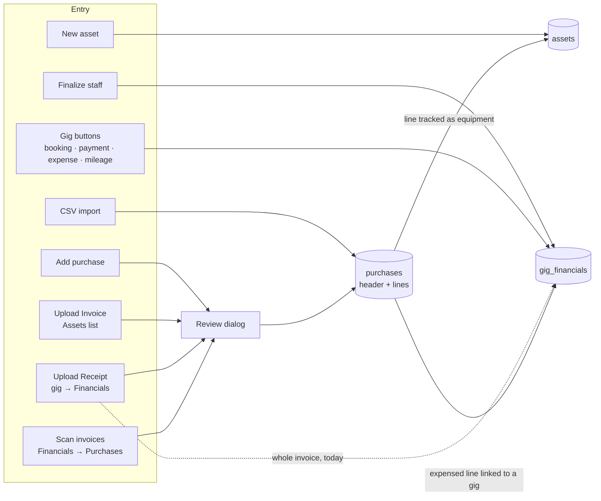

# Financial Data — Technical Reference

How GigWrangler records money: purchases (invoices and their lines), equipment (`assets`), the gig ledger (`gig_financials`), staff pay (`gig_staff_assignments`), and filed tax years (`tax_years`). The tables, the rules that join them, how each screen writes them, and how the numbers are counted.

This replaces `gig-financials.md` and `purchases-assets-expenses.md`, which now point here. The user-facing version is the Financials section of the user guide (`website/docs/src/content/docs/financials/`).

**Last Updated**: 2026-10-06 (#133 steps 1–2: migrations `20261006000000_purchase_tax_treatment` and `20261007000000_purchase_tax_treatment_writers`, and the UI)

---

## 1. The model in one page

- **A purchase is one invoice.** It is stored in `purchases` as one **header** row plus one row per **line**.
- **Each line answers two independent questions** (#133):
  1. **Tax treatment** (`purchases.tax_treatment`): `expense` or `depreciate`.
  2. **Tracked as equipment?** Yes if the line has an `assets` row (`purchases.asset_id`). Only equipment can go in kits.
- **Rules** (enforced in the database):
  - A depreciated line must be tracked as equipment, and it can never be a gig expense.
  - An expensed line may be tracked as equipment, linked to a gig, both, or neither.
- **The gig ledger** (`gig_financials`) holds every gig's **money in** and **money out**, each row at a **stage**. It answers "did this gig make money?". Rows come from:
  - the gig's own buttons (bookings, payments, quick expenses, mileage);
  - finalized staff pay;
  - purchase lines linked to the gig.
- **Tax reporting** reads two sources, and nothing is counted twice:
  - purchase lines, which carry the tax treatment and category;
  - gig money-out rows with **no** `purchase_id` (quick expenses, mileage, staff pay).

  A gig row that points at a purchase line is for gig accounting only.
- **Filed tax years are locked** (`tax_years`). Purchases dated in a locked year keep their tax fields. Equipment links and descriptions can still change.



---

## 2. Tables

### 2.1 `purchases`: invoices and their lines

| Column | Meaning |
|---|---|
| `row_type` | `header` or `line` (migration `20261012000000`; the old `item` / `asset` became `line`). Whether a line is tracked as equipment is `asset_id`; its tax treatment is `tax_treatment`. |
| `parent_id` | A line's header. Deleting a header deletes its lines. |
| `purchase_date`, `vendor`, `payment_method` | Copied onto every line when the purchase is created. |
| `total_inv_amount` | Header only: the invoice grand total, including tax, shipping and fees. |
| `item_price`, `line_amount` | Unit and line price as printed, before tax and shipping. Empty on CSV-imported lines. |
| `item_cost`, `line_cost` | Unit and line cost **after** tax, shipping and fees are spread across the lines ("burdened"). `line_cost` is the authoritative cost; `item_cost` is the per-item cost the tax thresholds use. |
| `quantity` | Can be fractional. |
| `category` | Free text. An **expensed** line's `category` is an expense category (a name from `expense_categories`, §6); a **depreciated** line's is its equipment category, the same as its asset's. An expensed line tracked as equipment keeps its equipment category on the asset. Lines inherit the header's when left blank. |
| `tax_treatment` | Lines only: `expense` or `depreciate` (§3). NULL on headers. |
| `gig_id` | Lines only: the gig this **expensed** line is a cost of. Constraints `purchases_header_no_gig` and `purchases_depreciate_no_gig` (migration 20261009000000) keep it off headers and depreciated lines. That migration moved the 10 header links onto their expensed lines. |
| `asset_id` | The line's equipment record, if it is tracked. |

**Cost allocation.** The invoice total includes tax and shipping, but the printed lines don't, so the difference is spread across the lines and the lines' `line_cost` adds up to the header's `total_inv_amount`:
- **Review dialog** (scan, manual, edit): when a price, quantity or the total changes, every line is scaled by `total_inv_amount ÷ Σ(basis × quantity)`. The basis is the line's printed price, or its stored cost if it has no price (CSV imports). Opening a saved purchase changes nothing (#128).
- **CSV import:** lines that give a cost keep it; the rest are scaled to make up the remainder, and the last line absorbs the rounding.
- **Worked example:** a $100 cable and a $300 amp on a $448 invoice ($32 tax, $16 shipping). The factor is 448 ÷ 400 = 1.12, so the cable costs $112 and the amp $336.

**Returns and refunds.**
- A returned **equipment** item keeps its line. Its `assets` row gets status Returned, `retired_on` (the date the refund was issued) and `liquidation_amt` (the refund, net of return shipping).
- A returned **expensed** item gets a negative line on a return invoice dated the refund date. For example, the 2025 Sweetwater shelf.
- Store credit counts as payment: the order's total is the full price, and its payment method names the credit.

### 2.2 `assets`: equipment

| Column | Meaning |
|---|---|
| `manufacturer_model`, `description`, `serial_number`, `tag_number`, `type` | Identity. |
| `category`, `type` | `category` is a name from the organization's `equipment_categories` (§6). `type` is a comma path from general to specific ("Cable, XLR, Snake"); the forms suggest the types already used in the chosen category. (`sub_category` was folded into `type` and dropped, migration 20261011000000.) |
| `acquisition_date`, `vendor` | When and where it was bought. |
| `item_cost`, `item_price`, `quantity` | Copied from the purchase line when the asset is created; the line stays authoritative for tax. |
| `replacement_value`, `insurance_policy_added`, `insurance_class` | Insurance, per item. |
| `status` | Free text; the UI offers Active, Inactive, Maintenance, Disposed, Returned. |
| `retired_on`, `liquidation_amt` | Date disposed and sale proceeds (or refund). Entering an amount in the form sets the status to Disposed. |
| `recovery_period` | **Depreciated equipment only** (its line has `tax_treatment = depreciate`): 5, 7 or 15 years. The tax program computes depreciation; GigWrangler only records the period. See "Recovery period" in §3. Migration `20261013000000` moved it here from `purchases` and dropped `service_life` and `dep_method`. |
| `purchase_id` | The purchase **header**. The line points the other way, through `purchases.asset_id`. |

The tax treatment and cost stay on the purchase line. The equipment record holds the two tax facts that belong to the thing itself: its **recovery period**, and its **disposal** (a physical event). Reports join both back to the line.

Deleting the equipment record of a **depreciated** line is refused. Mark it disposed or returned instead, or change the line to an expense first.

### 2.3 `gig_financials`: the gig ledger

Each row is **money in** (`direction = 'in'`: fees, deposits, reimbursements) or **money out** (`direction = 'out'`: sub-contractors, staff, expenses), and sits at one **stage**.

| Stage | Money in | Money out | Counts toward |
|---|---|---|---|
| `requested` | (not used) | Bid requested | Nothing; no amount needed |
| `quoted` | Quoted | Bid received | Nothing (pipeline) |
| `accepted` | Accepted (incl. verbal / informal) | Accepted | Expected |
| `contract_sent` | Contract sent | Contract sent | Expected |
| `contracted` | Contracted | Contracted | Expected |
| `invoiced` | Invoiced | Owed | Expected; due on its due date |
| `paid` | Paid | Paid | Expected and received/paid, at `amount_settled` |
| `declined`, `cancelled` | Declined, Cancelled | Declined, Cancelled | Nothing |

**Stages.** Every stage except `paid` is optional. A verbal agreement goes from `accepted` straight to `paid`; mileage is created `paid`.

**Fields:**
- `amount`: the agreed amount. NULL only at `requested`.
- `amount_settled`: what actually moved, set when the row is paid.
- `date`: when the item started.
- `due_date`: when payment is due. With none, an unpaid committed row is due once the gig is over.
- `paid_at`: when it was paid.
- `category` (`fin_category`, IRS Schedule C): what a row is for. Money out only in the UI.
- `counterparty_id` / `external_entity_name`: the other party.
- `purchase_id`: the purchase line this cost came from. Old scan-from-gig rows that pointed at a header were moved to its line by migration 20261009000000 when it had one expensed line.
- `staff_assignment_id`: the staff assignment that produced this row.
- `legacy_type`: the pre-2026-10 type, kept for audit.

Check constraints: `amount` is NULL only at `requested`, and a `paid` row has `paid_at` and `amount_settled`.

**One row per payment.** A planned deposit and balance are two rows. An unplanned partial payment splits the row (`recordGigFinancialPayment`): the row becomes paid at what arrived, and a new row keeps the rest at the original stage. Alternatively the user settles for less, which lowers the agreed amount.

**History.** Each write logs one `activity_log` event (`entity_type = 'financial'`): `financial.added`, `financial.updated` (with `field_changes`), `financial.paid`, `financial.removed`. The 2026-10 conversion logged `financial.converted` with the source rows in `context.sources` (migration `20261005000000_fin_direction_stage`, tested by `supabase/tests/conversion/`).

Never send `''` for `category` or the uuid and date columns; the service turns `''` into NULL (issue #71).

### 2.4 `gig_staff_assignments`: staff pay

| Column | Meaning |
|---|---|
| `staff_slot_id`, `user_id` | The role slot on the gig and the person in it. |
| `status` | Requested, Confirmed, … |
| `fee` / `rate` | Flat fee, or a rate per unit. |
| `units_completed` | Units worked, entered when a rate-based assignment is finalized. |
| `completed_at` | Set by "Finalize". |
| `gig_financial_id` | The ledger row created at finalize; the back-link of `gig_financials.staff_assignment_id`. |

The assignment is the **plan** and the ledger row is the **actual**:
1. **Before finalize:** the assignment counts as a projected staff cost (fee, or rate when there is no fee).
2. **Finalize:** a money-out row is created, at stage `invoiced` (Owed), category Contract labor, description "Labor: {role}", amount = fee, or rate × units.
3. **Paid:** the same row moves to `paid`.

"Undo Finalize" deletes the row.

### 2.5 `tax_years`: filed years

| Column | Meaning |
|---|---|
| `organization_id`, `year` | Primary key. One row per filed year per organization. |
| `locked` | Default true. Unlocking (e.g. to amend) re-opens the year. |
| `filed_on`, `notes` | For the record. |

RLS: an organization's Admins and Managers read it; only its Admins add, change or remove rows.

**The lock** (trigger `purchases_c_tax_year_lock`) applies to purchases dated in a locked year. A line with no date uses its invoice's date.
- **Refused:**
  - changes to `tax_treatment`, `row_type`, `parent_id`, `organization_id`, `purchase_date`, `total_inv_amount`, `quantity`, `item_price`, `item_cost`, `line_amount`, `line_cost` and `category` (an equipment record's recovery period has its own rule: filled in, not changed; §3);
  - moving a row into or out of the year;
  - adding or deleting rows.
- **Allowed:** `asset_id` (so expensed gear from a filed year can be tracked and put in kits), `gig_id`, `description`, `vendor` and `payment_method`.

**Gig money in a locked year** (trigger `gig_financials_tax_year_lock`, migration `20261012000000`, tests in `46_line_type_and_gig_money_lock.test.sql`). The rows that are tax data are locked: income (`direction = 'in'`), and expenses with no `purchase_id` (quick expenses, mileage, staff pay). The year is the row's `date`.
- **Refused:** adding or deleting such a row; changes to `organization_id`, `direction`, `stage`, `amount`, `amount_settled`, `currency`, `date`, `paid_at`, `category`, `mileage` and `purchase_id` (so a purchase-linked row can't be unlinked into tax data); moving a row into or out of the year.
- **Allowed:** `notes`, `description`, `reference_number`, `external_entity_name`, `counterparty_id`, `due_date`, `staff_assignment_id`, `gig_id`.
- **Not locked:** a gig expense linked to a purchase line. It is gig accounting only, and the purchase line is the tax record.
- Deleting a gig, or an organization, that has locked gig money is refused too.
- The app shows the database's message (`lockedYearMessage` in `src/utils/taxTreatment.ts`) instead of a generic "failed to save".

### 2.6 Attachments

Files live in the `attachments` table and storage bucket, joined through `entity_attachments` (`entity_type`, `entity_id`).

| `entity_type` | Holds |
|---|---|
| `purchase` | The invoice or receipt, on the purchase **header**. |
| `gig_financial` | A receipt or document for one gig ledger row. |
| `asset` | Manuals, photos and other documents for a piece of equipment. |
| `gig` | General gig documents; not financial. |

`purchase_scan_queue` holds invoices uploaded to Scan invoices that are waiting to be read or reviewed. A row is removed when its purchase is saved or the invoice is discarded. Deleting a row that has attachments runs `trg_cleanup_attachments`.

---

## 3. Tax treatment rules (#133)

| | Expense | Depreciate |
|---|---|---|
| Equipment record (`asset_id`) | optional | **required** (checked at commit) |
| Gig expense (a `gig_financials` row pointing at the line) | optional | **not allowed** |
| Recovery period (on the equipment record) | none | 5, 7 or 15 |
| Headers | no `tax_treatment`, no equipment | |

**How the rules are enforced** (migration `20261006000000`, tests in `supabase/tests/rls/40_tax_treatment.test.sql`):
- **Check constraints** on the values and on "lines only".
- **Default trigger:** a line written without a treatment is an expense. A row written with the old `row_type` `item` / `asset` (an app from before 10-07) is stored as `line`, taking its treatment from the old type when none is given (`asset` → depreciate, `item` → expense).
- **Deferred constraint trigger** for "depreciate has equipment". `create_purchase_transaction_v1` inserts a line before linking its asset, so the check waits for the end of the transaction.
- **Triggers on both tables** for "never a gig expense": one on `gig_financials` (insert, or a change of `purchase_id`), and one on `purchases` (a change to depreciate).

**Writers** (migration `20261007000000`, tests in `41_tax_treatment_writers.test.sql`):
- `create_purchase_transaction_v1` stores each line's `tax_treatment` when given (and, since #125, an equipment entry's `recovery_period`; see below), and writes every line as `row_type = 'line'`. A line sent with `track: true` gets the next entry of `p_assets` as its equipment record (the old `row_type: 'asset'` still works).
- `track_purchase_line_as_equipment(line)` (Admins and Managers) creates the equipment record from the line and links it. It changes nothing else, so it works on lines in a locked year.

**Choosing the treatment** (UI, #133 step 2: `ReviewScannedDataDialog`, `src/utils/taxTreatment.ts`). Each line on the review screen has a **Track as equipment** checkbox (column "Equip") and an **Expense | Depreciate** switch with a (?) that shows:

> For tax purposes, do you want to mark this item as an expense, or a depreciable asset. (Per-item cost of less than $200 should automatically be expensed. Any item over $2500 should be depreciated. From $200 to $2500 is a grey zone.)

- **Per-item cost** is `item_cost`.
- **Pre-sets:** under $200 is Expense; over $2,500 is Depreciate; nothing is pre-set in between.
- **Changeable** until the year is locked. Whether the de minimis safe harbor is elected is only known at filing, so the app never forces it.
- **Saving waits** until every grey-zone line has a choice.
- **Depreciate ticks equipment** and keeps it ticked.
- **Edit mode:**
  - you can change the treatment, or start tracking a line (the dialog calls `track_purchase_line_as_equipment` first, then saves the treatment);
  - Depreciate is disabled on a line that's a gig expense;
  - a purchase dated in a locked year shows a notice, and only descriptions are sent (plus tracking).
- **Purchases report:**
  - type badges show the treatment, with a separate **Equipment** chip;
  - the Type filter is All, Expensed, Depreciated or Equipment;
  - **Track as equipment** replaces **Reclassify as Asset**;
  - **Assign Gig** and **Add to gig ledger** appear only on expensed lines;
  - a purchase is never assigned to a gig as a whole: **Assign receipt to gig** was removed in #133 step 3; lines are linked one at a time (`reconcileLedgerForLineGigChange`).
- **Tax years:** Admins lock and unlock years under **Financials → Reporting → Filed tax years** (`TaxYearsCard`, `taxYear.service.ts`); Managers see them read-only.

"Track as equipment" is a separate question.

**Recovery period** (#125, migration `20261013000000`, tests in `47_asset_recovery_period.test.sql`):
- **Where:** `assets.recovery_period`, 5, 7 or 15. Only depreciated equipment has one; a trigger refuses it on anything else (no depreciated line, or no line at all).
- **Defaults:** `equipment_categories.default_recovery_period`. The starter set (Cameron, 10-07): Computer, Networking, Software and Misc 5; Audio, Lighting, Video, Rigging and Truss, Staging, Power, Communications, Backline, Effects, Cases and Bags, Rack, Tools, and Vehicles and Trailers 7. An Admin can set a category to none ("Ask each time") in **Settings → Categories**.
- **Filled in by the database** when depreciated equipment has none: when a line becomes depreciated, when equipment is created or linked for a depreciated line, and when the equipment's category changes. Expensing the line (or unlinking it) clears the period, unless another depreciated line still points at the record. `equipment_category_recovery_period(org, category)` reads the default (the starter set for an organization with no list yet).
- **Asked by the app** when the category has no default: the Equipment details pop-up and the review screen won't save a depreciated line without one, and the equipment form shows a **Recovery period** picker on depreciated equipment.
- **Writers:** `create_purchase_transaction_v1` takes `recovery_period` on the `p_assets` entry (an older app's value on the line still works) and applies it after linking, only if the line is depreciated. The review screen sets a period for equipment it creates while editing after the line is depreciated.
- **Filed years:** a blank period can be filled in; a set one can't change until the year is unlocked.
- **Conversion:** depreciated equipment in unfiled years took its category's default. Filed years (2024, 2025) were left blank, to be filled in from the filed returns. `service_life` ("MACRS, 5" on 150 records, which the returns didn't use) was not carried over.

**Backfill.** Asset lines became `depreciate` and item lines `expense`, which reproduces the 2024 and 2025 returns as filed.
- Production at migration time: 193 depreciate, 269 expense, 292 headers.
- One exception is applied by a data fix: Excellines XLR 10-pack (2025-02-14), expensed on the return, becomes `expense` and stays equipment.
- After that fix, 2024 and 2025 are locked.

---

## 4. How each screen writes

| Where (UI) | Writes | Notes |
|---|---|---|
| Financials → Purchases → **Scan invoices** (title-row button) | Header + lines; an `assets` row per line marked as equipment; the file as `purchase` attachment | Several files at once, read in the background two at a time, reviewed one at a time. RPC `create_purchase_transaction_v1`. |
| Financials → Purchases → **Add purchase** (title-row button) | Same, without a file | Attach the file afterwards with **Attach Doc** on the report. |
| Gig → Financials → **Upload Receipt** | Same, then each **expensed** line gets the gig's `gig_id` and its own money-out row (`createLedgerEntryForPurchaseLine`) | Scans one file. Depreciated lines are not the gig's cost (#130, fixed 10-06). |
| Assets list → **Upload Invoice** | Same as Scan invoices, for one file | Opens manual entry if the file can't be scanned. |
| Purchases report → **Attach Doc** | A `purchase` attachment on the header | No scan. |
| Import → **CSV Import** | Headers, lines and assets from rows | No gig links, no attachments. `source` 0 = header, 1 = equipment line + asset, 2 = expense line. See `purchases-field-mapping.md`. |
| Assets → new asset | An `assets` row only | No purchase. |
| Gig → **Booking** / **Payment received** / **Other** | Money-in or money-out rows | |
| Gig → **Expense / Mileage** | One money-out row | Mileage = miles × the IRS rate for the date (`src/utils/financials.utils.ts`; 2025–26 rates wrong, #125 F1). A simple expense can carry a receipt (`gig_financial`). |
| Staffing → **Finalize** | Money-out row at Owed | §2.4 |
| Purchases report → line → **Assign Gig** | Line `gig_id`; then offers a paid money-out row at `line_cost` | Moving the line moves the row; clearing the gig offers to delete it; **Add to gig ledger** covers lines linked earlier. |
| Purchases report → line → **Track as equipment** | An `assets` row linked to the line (RPC `track_purchase_line_as_equipment`) | Tax treatment unchanged; works in locked years. Replaced **Reclassify as Asset** (#133 step 2). |
| Review screen (edit) → **Expense / Depreciate** | The line's `tax_treatment` | Depreciating first tracks the line as equipment. Not on a gig expense or in a locked year. |
| Financials → Reporting → **Filed tax years** | `tax_years` rows (Admins) | Lock with the filed date; unlock to amend. |

The AI scan suggests whether each line is equipment (a $50 durable rule) and suggests categories; the user can change both before saving.

---

## 5. Counting

All gig money calculations live in `src/utils/moneyFlow.ts`, so the gig page, Gig Accounting and the CSV export agree.

```
EXPECTED IN   = Σ money in at accepted or later   (paid rows at amount_settled)
RECEIVED      = Σ amount_settled, money in, paid
OWED TO YOU   = Σ amount, money in, accepted … invoiced
DUE NOW       = the part of OWED TO YOU past its due date, or with no due date on a gig that is over

EXPECTED OUT  = Σ money out at accepted or later   (paid rows at amount_settled)
PAID OUT      = Σ amount_settled, money out, paid
YOU OWE       = Σ amount, money out, accepted … invoiced
PROJECTED STAFF = Σ unfinalized Confirmed/Requested assignments (fee, else rate)

TOTAL COSTS   = EXPECTED OUT + PROJECTED STAFF
NET           = EXPECTED IN − TOTAL COSTS        MARGIN = NET / EXPECTED IN
```

**Tax year, cash basis** (Financials → Reporting, #125; `src/utils/taxReports.ts`, data from `src/services/taxReport.service.ts`, screen `ReportingTab`):

```
EXPENSES  = purchase lines with tax_treatment = expense, by line date
          + gig money-out rows with no purchase_id, by paid date
DEPRECIABLE = purchase lines with tax_treatment = depreciate, by line date
              (cost, recovery period; disposals from the equipment record)
INCOME    = amount_settled of paid money-in rows, by paid date
```

Gig rows **with** a `purchase_id` are skipped, because the line already counts.

The three reports, each for one tax year with a CSV download:
- **Income:** every payment received (date received, gig, from, description, reference, amount).
- **Expenses:** totals by Schedule C line, then category, then every expense. A purchase line takes its line from its expense category (`expense_categories.schedule_c_line`); a gig row from its `fin_category` (`FIN_CATEGORY_LINE`). A category that isn't on the organization's list (an older equipment-style value) has no line and is flagged. Mileage shows its miles.
- **Assets:** depreciated lines bought in the year, with cost (the basis: the line's cost including its share of tax and shipping), category, recovery period (a missing one links to the equipment form), totals by period, and **de minimis candidates** (per-item cost of $2,500 or less). Then **disposals**: depreciated equipment with `retired_on` in the year, whenever it was bought, with sale proceeds (`liquidation_amt`), and its own CSV.

---

## 6. Categories and mileage

**Two kinds of category** (2026-10-06):
- **Expense categories:** `expense_categories`, one list per organization (migration 20261010000000; 20261008000000 created it as a single shared list). Each row is filed on a `schedule_c_line`, a code in the read-only `schedule_c_lines` reference (IRS Part II lines 8–27b). An expensed purchase line stores the **name** in `purchases.category`. Act4Audio's list is the 15 headings Cameron filed on his 2025 Schedule C (all Part V, line 27b) plus "Reimbursable (not deducted)" (no line), with the starter categories it didn't have turned off.
- **Equipment categories:** `equipment_categories`, one list per organization; assets store the **name** in `assets.category`, and a depreciated line's `category` is the same value. Organizations that had equipment were given the categories their assets already used.
- **Starter sets:** rows with `organization_id` NULL in either table. Only platform moderators (`users.platform_moderator`, `is_platform_moderator()`) see or edit them, under header menu → **Starter categories**. `ensure_org_categories(org)` (SECURITY DEFINER, any member) copies them into an organization the first time it needs a list; after that its Admins edit their own copy in **Settings → Categories** (Managers read; Staff read equipment categories only).
- Categories are turned off rather than deleted, and the editor won't rename one that records already use, since records store the name.

`src/utils/purchaseCategories.ts` holds the rules: `suggestExpenseCategory` maps old and scanned values to a heading (Audio → Small audio parts, …), and `retargetCategories` moves a line's categories when its treatment changes (depreciating takes the equipment category onto the line; expensing keeps it for the asset and suggests a heading). The review dialog won't save a new equipment record without an equipment category, since `assets.category` is required.

Not yet joined up: gig money out still uses the `fin_category` Schedule C enum, and purchase categories map to it only on an exact name match (anything else becomes Other expenses). Older expensed lines still carry equipment-style values (Audio, Lighting, …); the dropdown shows them as "not on the list" until #125 F3 maps them.

**Mileage** is recorded only on a gig: miles × the IRS standard rate for the trip's date. The rate table is fixed in #125 F1. It needs 70¢ for 2025, and 72.5¢ to 2026-06-30 then 76¢.

---

## 7. Known problems (2026-10-07)

| # | Problem | Issue |
|---|---|---|
| 1 | Duplicating an asset copies its serial number and tag (its purchase link is cleared since #131). | |
| 2 | **Add purchase** and editing a purchase can't attach a file. Use **Attach Doc** on the report. | |
| 3 | Mileage rates for 2025–26; older lines' categories not yet mapped to the expense list (F3); gig money out still uses `fin_category`. | #125 |

Fixed:
- #128: editing a cost-only purchase zeroed its costs (2026-10-05).
- #129: Reclassify as Asset deleted ledger rows by the header id. The function is gone (#133, migration `20261011000000`).
- #131 (2026-10-07):
  - changing a purchase's date moves its lines too;
  - a linked gig expense follows the line cost (amount, and the settled amount when it was settled);
  - new equipment keeps the scanned manufacturer/model (Type since #143);
  - a duplicated asset has no purchase link;
  - `scripts/invoice_import.py` is retired.

The 2025 data was reconciled with the filed return on 2026-10-05 (see `WORK_PLAN.md`).

---

## 8. Related documents

- [database.md](database.md): column lists for every table.
- [purchases-field-mapping.md](purchases-field-mapping.md): CSV import mapping.
- `docs/product/development-plan/07_gig-financials-workflow.md`: the original design; describes the older `fin_type` model.
- User guide: `website/docs/src/content/docs/financials/`.
