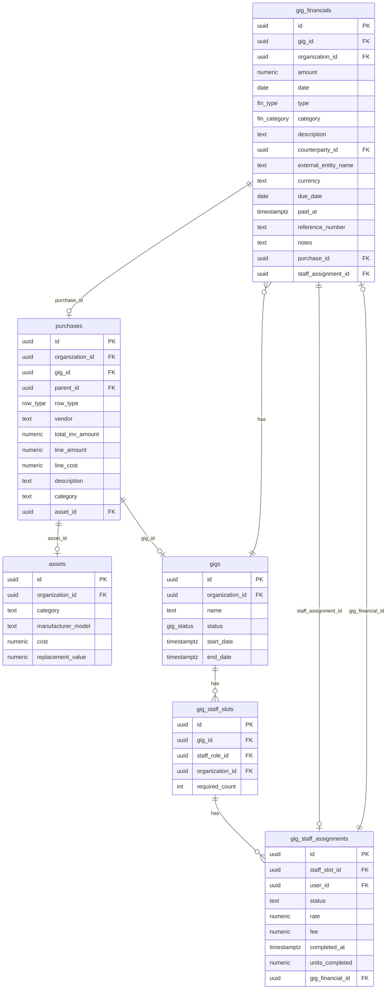
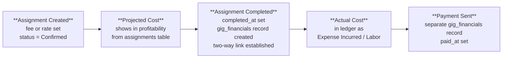

# Gig Financials — Technical Reference

Technical documentation for the gig financial management system. For the design analysis and implementation plan, see [07_gig-financials-workflow.md](../product/development-plan/07_gig-financials-workflow.md).

**Last Updated**: 2026-03-19

---

## 1. Single-Ledger Architecture

`gig_financials` is the single source of truth for all gig financial data. Every financial event — revenue, expense, staff labor cost — is a row in this table. Profitability is calculated by querying this one table (plus uncompleted staff assignments for projected costs).

Other tables serve as **source documents** that feed into the ledger with **two-way linking**:

| Table | Role | Link to Ledger | Link Back |
|-------|------|---------------|-----------|
| `purchases` | Receipt/invoice archive | `gig_financials.purchase_id` → purchases.id | `purchases.gig_id` (for tracking) |
| `gig_staff_assignments` | Staff scheduling + projected costs | `gig_financials.staff_assignment_id` → gig_staff_assignments.id | `gig_staff_assignments.gig_financial_id` → gig_financials.id |
| `assets` | Capital equipment inventory | (not in gig_financials — assets are not gig expenses) | `purchases.asset_id` → assets.id |

This two-way linking pattern is consistent across the system: purchases ↔ assets, purchases ↔ gig_financials, gig_staff_assignments ↔ gig_financials.

### Entity Relationship Diagram



---

## 2. Data Boundaries

### `gig_financials` vs. `purchases`

**`purchases`** is the receipt box — it stores invoices and receipts with line-item detail and file attachments. Created via AI receipt scanning or CSV import.

**`gig_financials`** is the ledger — it records the financial effect of that purchase as a gig expense.

**When a receipt is scanned on a gig page**, the system creates both:
1. A `purchases` record (header + items, `gig_id` set) — the archive
2. A `gig_financials` record (type = `Expense Incurred`, `purchase_id` → purchases.id) — the ledger entry

**When a receipt is scanned outside a gig context** (general business receipt), only the `purchases` record is created. No ledger entry.

**Capital asset purchases** (where items create `assets` records) do NOT create `gig_financials` entries. Asset purchases are inventory acquisitions, not gig expenses.

**Edit propagation**: If a purchase record is edited after the linked `gig_financials` record was created, the amounts may diverge. The `gig_financials` record is the financial truth; the purchase is the receipt archive. A future enhancement could flag discrepancies for reconciliation.

### `gig_financials` vs. `gig_staff_assignments`

**`gig_staff_assignments`** holds the plan — who's working, what they'll be paid.

**`gig_financials`** holds the actuals — what you actually owe/paid.

**Staff cost lifecycle:**



For rate-based assignments, completion requires entering `units_completed`. The ledger amount = rate × units_completed.

---

## 3. Financial Type Groupings

The `fin_type` enum has 24 values to support future multi-tenant workflows. For the single-org sound company, the UI groups types into practical categories via `FIN_TYPE_GROUPS`:

**Revenue** (money coming in): `Informal Terms`, `Contract Signed`, `Bid Accepted`, `Deposit Received`, `Payment Recieved`

**Cost** (money going out): `Expense Incurred`, `Payment Sent`, `Deposit Sent`

**Tracking** (informational): `Invoice Issued`, `Invoice Settled`

**Advanced** (bid/contract workflow — future use): All `Bid *`, `Contract *`, and `Sub-Contract *` types

Each `gig_financials` record also has a `category` (`fin_category` enum): Labor, Equipment, Transportation, Venue, Production, Insurance, Rebillable, Other. The `type` describes *what happened*; the `category` describes *what it's for*.

---

## 4. Profitability Calculation

The system calculates a single set of numbers that reflects the best available picture at any point in the gig lifecycle — using formal contract records when present, and falling back to actual receipts when they're not. All three summary tiles (Revenue, Total Costs, Profit) update in real time as records are added.

### Revenue

```
FORMAL REVENUE   = SUM(amount) WHERE type = 'Contract Signed'      [if any exist]
                   ELSE SUM(amount) WHERE type = 'Bid Accepted'    [if any exist]
                   ELSE SUM(amount) WHERE type = 'Informal Terms'

                   Priority order prevents double-counting: Contract Signed > Bid Accepted > Informal Terms.
                   Only one tier contributes; lower tiers are ignored when a higher one is present.

RECEIVED         = SUM(amount) WHERE type IN (Deposit Received, Payment Received)

REVENUE          = MAX(FORMAL REVENUE, RECEIVED)
```

`REVENUE` is the effective top line. If a formal contract record exists, that defines the expected revenue (even if not yet received). If there is no formal contract record, money actually received IS the revenue — a `Payment Received` record alone is sufficient to establish both revenue and a profit baseline.

```
OUTSTANDING REV  = MAX(0, REVENUE - RECEIVED)
```

### Costs

```
ACTUAL COSTS     = SUM(amount) WHERE type IN (Expense Incurred, Payment Sent, Deposit Sent)

PROJECTED STAFF  = SUM(gig_staff_assignments.fee) WHERE completed_at IS NULL
                   AND status IN (Confirmed, Requested)
                   [rate used as proxy for fee when fee is null]

TOTAL COSTS      = ACTUAL COSTS + PROJECTED STAFF
```

Projected staff costs disappear as assignments are completed: each completion creates a ledger entry (`Expense Incurred / Labor`) and removes the assignment from the projection.

### Profit

```
PROFIT           = REVENUE - TOTAL COSTS
MARGIN           = PROFIT / REVENUE × 100
```

### Lifecycle examples

| Stage | Revenue tile | Costs tile | Profit tile |
|-------|-------------|------------|-------------|
| Contract signed, no costs yet | Formal contract amount | $0 | = contract amount |
| Contract + some staff confirmed | Formal contract amount | Projected staff | Contract − staff projection |
| Payment received, no contract | Received amount | Actual costs | Received − costs |
| Fully settled | Contract amount (= received) | Actual costs only | Final margin |

All settled/actual financials come from `gig_financials`. Projected staff costs are the only read-time calculation from a second table, and they disappear as assignments are completed into ledger entries.

---

## 5. Attachments

`gig_financials` supports file attachments via the existing `entity_attachments` polymorphic attachment system. Receipts, invoices, and supporting documents can be attached directly to financial records, independent of any linked `purchases` record.
