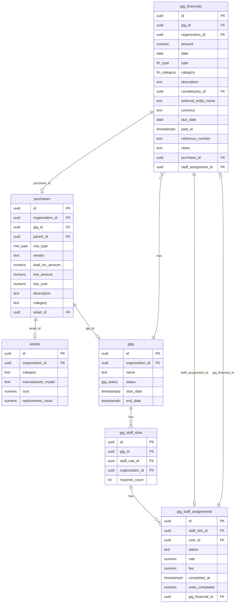
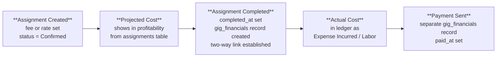

# Gig Financials — Technical Reference

Technical documentation for the gig financial management system. For the design analysis and implementation plan, see [gig-financials-workflow-analysis.md](../product/development-plan/gig-financials-workflow-analysis.md).

**Last Updated**: 2026-03-19

---

## 1. Single-Ledger Architecture

`gig_financials` is the single source of truth for all gig financial data. Every financial event — revenue, expense, staff labor cost — is a row in this table. Profitability is calculated by querying this one table (plus uncompleted staff assignments for projected costs).

Other tables serve as **source documents** that feed into the ledger with **two-way linking**:

| Table | Role | Link to Ledger | Link Back |
|-------|------|---------------|-----------|
| `purchases` | Receipt/invoice archive | `gig_financials.purchase_id` → purchases.id | `purchases.gig_id` (for tracking) |
| `gig_staff_assignments` | Staff scheduling + projected costs | `gig_financials.staff_assignment_id` → gig_staff_assignments.id | `gig_staff_assignments.gig_financial_id` → gig_financials.id |
| `assets` | Capital equipment inventory | (not in gig_financials — assets are not gig expenses) | `purchases.asset_id` → assets.id |

This two-way linking pattern is consistent across the system: purchases ↔ assets, purchases ↔ gig_financials, gig_staff_assignments ↔ gig_financials.

### Entity Relationship Diagram



---

## 2. Data Boundaries

### `gig_financials` vs. `purchases`

**`purchases`** is the receipt box — it stores invoices and receipts with line-item detail and file attachments. Created via AI receipt scanning or CSV import.

**`gig_financials`** is the ledger — it records the financial effect of that purchase as a gig expense.

**When a receipt is scanned on a gig page**, the system creates both:
1. A `purchases` record (header + items, `gig_id` set) — the archive
2. A `gig_financials` record (type = `Expense Incurred`, `purchase_id` → purchases.id) — the ledger entry

**When a receipt is scanned outside a gig context** (general business receipt), only the `purchases` record is created. No ledger entry.

**Capital asset purchases** (where items create `assets` records) do NOT create `gig_financials` entries. Asset purchases are inventory acquisitions, not gig expenses.

**Edit propagation**: If a purchase record is edited after the linked `gig_financials` record was created, the amounts may diverge. The `gig_financials` record is the financial truth; the purchase is the receipt archive. A future enhancement could flag discrepancies for reconciliation.

### `gig_financials` vs. `gig_staff_assignments`

**`gig_staff_assignments`** holds the plan — who's working, what they'll be paid.

**`gig_financials`** holds the actuals — what you actually owe/paid.

**Staff cost lifecycle:**



For rate-based assignments, completion requires entering `units_completed`. The ledger amount = rate × units_completed.

---

## 3. Financial Type Groupings

The `fin_type` enum has 24 values to support future multi-tenant workflows. For the single-org sound company, the UI groups types into practical categories via `FIN_TYPE_GROUPS`:

**Revenue** (money coming in): `Contract Signed`, `Bid Accepted`, `Deposit Received`, `Payment Recieved`

**Cost** (money going out): `Expense Incurred`, `Payment Sent`, `Deposit Sent`

**Tracking** (informational): `Invoice Issued`, `Invoice Settled`

**Advanced** (bid/contract workflow — future use): All `Bid *`, `Contract *`, and `Sub-Contract *` types

Each `gig_financials` record also has a `category` (`fin_category` enum): Labor, Equipment, Transportation, Venue, Production, Insurance, Rebillable, Other. The `type` describes *what happened*; the `category` describes *what it's for*.

Note: The `fin_type` enum has a permanent typo: `Payment Recieved` (not Received). Use the misspelled version in code; the display label corrects it.

---

## 4. Profitability Calculation

```
CONTRACT AMOUNT  = SUM(gig_financials.amount) WHERE type IN (Contract Signed, Bid Accepted)
RECEIVED         = SUM(gig_financials.amount) WHERE type IN (Deposit Received, Payment Recieved)
OUTSTANDING REV  = CONTRACT AMOUNT - RECEIVED

ACTUAL COSTS     = SUM(gig_financials.amount) WHERE type IN (Expense Incurred, Payment Sent, Deposit Sent)
PROJECTED STAFF  = SUM(gig_staff_assignments.fee) WHERE completed_at IS NULL
                   AND status IN (Confirmed, Requested)
TOTAL COSTS      = ACTUAL COSTS + PROJECTED STAFF

PROFIT           = CONTRACT AMOUNT - TOTAL COSTS
MARGIN           = PROFIT / CONTRACT AMOUNT × 100
```

All settled/actual financials come from one table. Projected staff costs are the only read-time calculation from another table, and those go away as assignments are completed into ledger entries.

---

## 5. Schema Changes (from baseline)

```sql
-- gig_financials: add two FK columns for source document linking
ALTER TABLE gig_financials ADD COLUMN purchase_id UUID REFERENCES purchases(id) ON DELETE SET NULL;
ALTER TABLE gig_financials ADD COLUMN staff_assignment_id UUID REFERENCES gig_staff_assignments(id) ON DELETE SET NULL;

-- gig_staff_assignments: add completion tracking + back-link
ALTER TABLE gig_staff_assignments ADD COLUMN completed_at TIMESTAMPTZ;
ALTER TABLE gig_staff_assignments ADD COLUMN units_completed NUMERIC(10,2);
ALTER TABLE gig_staff_assignments ADD COLUMN gig_financial_id UUID REFERENCES gig_financials(id) ON DELETE SET NULL;

-- purchases: keep gig_id (no change needed — analogous to asset_id for tracking)
```

Since we're on test data, no migration needed — just reset the schema.

---

## 6. Attachments

`gig_financials` supports file attachments via the existing `entity_attachments` polymorphic attachment system. Receipts, invoices, and supporting documents can be attached directly to financial records, independent of any linked `purchases` record.
