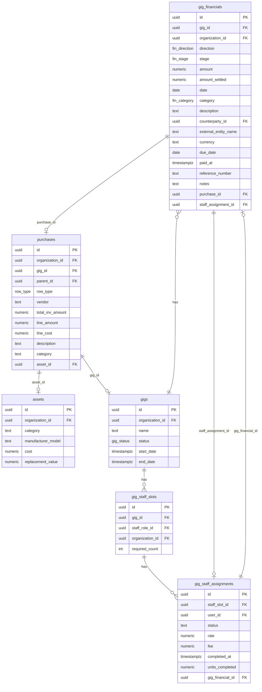
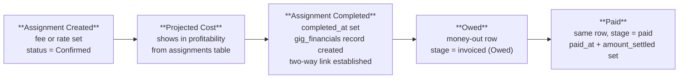

# Gig Financials — Technical Reference

Technical documentation for the gig financial management system. For the design analysis and implementation plan, see [07_gig-financials-workflow.md](../product/development-plan/07_gig-financials-workflow.md).

**Last Updated**: 2026-10-05 (money in / money out with stages; migration `20261005000000_fin_direction_stage`)

---

## 1. Single-Ledger Architecture

`gig_financials` is the single source of truth for all gig financial data. Every financial event — revenue, expense, staff labor cost — is a row in this table. Profitability is calculated by querying this one table (plus uncompleted staff assignments for projected costs).

Other tables serve as **source documents** that feed into the ledger with **two-way linking**:

| Table | Role | Link to Ledger | Link Back |
|-------|------|---------------|-----------|
| `purchases` | Receipt/invoice archive | `gig_financials.purchase_id` → purchases.id | `purchases.gig_id` (for tracking) |
| `gig_staff_assignments` | Staff scheduling + projected costs | `gig_financials.staff_assignment_id` → gig_staff_assignments.id | `gig_staff_assignments.gig_financial_id` → gig_financials.id |
| `assets` | Capital equipment inventory | (not in gig_financials — assets are not gig expenses) | `purchases.asset_id` → assets.id |

This two-way linking pattern is consistent across the system: purchases ↔ assets, purchases ↔ gig_financials, gig_staff_assignments ↔ gig_financials.

### Entity Relationship Diagram


```mermaid
erDiagram
    gig_financials {
        uuid id PK
        uuid gig_id FK
        uuid organization_id FK
        fin_direction direction
        fin_stage stage
        numeric amount
        numeric amount_settled
        date date
        fin_category category
        text description
        uuid counterparty_id FK
        text external_entity_name
        text currency
        date due_date
        timestamptz paid_at
        text reference_number
        text notes
        uuid purchase_id FK
        uuid staff_assignment_id FK
    }

    purchases {
        uuid id PK
        uuid organization_id FK
        uuid gig_id FK
        uuid parent_id FK
        row_type row_type
        text vendor
        numeric total_inv_amount
        numeric line_amount
        numeric line_cost
        text description
        text category
        uuid asset_id FK
    }

    gig_staff_assignments {
        uuid id PK
        uuid staff_slot_id FK
        uuid user_id FK
        text status
        numeric rate
        numeric fee
        timestamptz completed_at
        numeric units_completed
        uuid gig_financial_id FK
    }

    gig_staff_slots {
        uuid id PK
        uuid gig_id FK
        uuid staff_role_id FK
        uuid organization_id FK
        int required_count
    }

    assets {
        uuid id PK
        uuid organization_id FK
        text category
        text manufacturer_model
        numeric cost
        numeric replacement_value
    }

    gigs {
        uuid id PK
        uuid organization_id FK
        text name
        gig_status status
        timestamptz start_date
        timestamptz end_date
    }

    gigs ||--o{ gig_financials : "has"
    gigs ||--o{ gig_staff_slots : "has"
    gig_staff_slots ||--o{ gig_staff_assignments : "has"
    gig_financials ||--o| purchases : "purchase_id"
    gig_financials ||--o| gig_staff_assignments : "staff_assignment_id"
    gig_staff_assignments ||--o| gig_financials : "gig_financial_id"
    purchases ||--o| assets : "asset_id"
    purchases ||--o| gigs : "gig_id"
```

---

## 2. Data Boundaries

### `gig_financials` vs. `purchases`

**`purchases`** is the receipt box — it stores invoices and receipts with line-item detail and file attachments. Created via AI receipt scanning or CSV import.

**`gig_financials`** is the ledger — it records the financial effect of that purchase as a gig expense.

**When a receipt is scanned on a gig page**, the system creates both:
1. A `purchases` record (header + items, `gig_id` set) — the archive
2. A `gig_financials` record (type = `Expense Incurred`, `purchase_id` → purchases.id) — the ledger entry

**When a receipt is scanned outside a gig context** (general business receipt), only the `purchases` record is created. No ledger entry.

**CSV-imported purchases never create a ledger entry** — not even when the imported rows carry a `gig_id`. `create_purchase_transaction_v1` only writes `purchases` (+ `assets`). Such an expense stays invisible to gig profitability until a ledger row is created for it (see "Assigning an expense to a gig after the fact" below).

**Capital asset purchases** (where items create `assets` records) do NOT create `gig_financials` entries. Asset purchases are inventory acquisitions, not gig expenses.

**Edit propagation**: If a purchase record is edited after the linked `gig_financials` record was created, the amounts may diverge. The `gig_financials` record is the financial truth; the purchase is the receipt archive. A future enhancement could flag discrepancies for reconciliation.

### Assigning an expense to a gig after the fact

An expense that entered the system without a gig — a receipt scanned off a gig page, or a CSV import — can be linked to one later, from the **Purchases** tab (web, Admin/Manager):

- **Per line**: expand a purchase line and use the "Assign Gig" picker. Assigning, reassigning, or clearing a line's gig keeps its auto-created ledger entry in sync — a first assignment offers to create the "Expense Incurred" entry; a reassignment **moves** the existing entry to the new gig; clearing the gig prompts before deleting the entry. Creation is dedup-guarded, so a line can never end up with two ledger entries.
- **Per receipt**: the header row has an "Assign receipt to gig" picker that sets the header's `gig_id` and cascades to every unlinked child line, then offers to create ledger entries for the expense lines in one step. Lines already on a *different* gig are left alone (reassign them individually so their ledger entry can follow).
- **Recovering a skipped prompt**: any expense line that is linked to a gig but has no ledger entry (prompt dismissed, or CSV import) shows a persistent "Add to gig ledger" button in its line detail.

These operations only touch `gig_financials` rows that were auto-created from a purchase link (identified by `purchase_id`); a manually-entered ledger row is never moved or deleted by them.

### `gig_financials` vs. `gig_staff_assignments`

**`gig_staff_assignments`** holds the plan — who's working, what they'll be paid.

**`gig_financials`** holds the actuals — what you actually owe/paid.

**Staff cost lifecycle:**


```mermaid
flowchart LR
    A["**Assignment Created**<br />fee or rate set<br />status = Confirmed"] --> B["**Projected Cost**<br />shows in profitability<br />from assignments table"]
    B --> C["**Assignment Completed**<br />completed_at set<br />gig_financials record created<br />two-way link established"]
    C --> D["**Owed**<br />money-out row<br />stage = invoiced (Owed)"]
    D --> E["**Paid**<br />same row, stage = paid<br />paid_at + amount_settled set"]
```

For rate-based assignments, completion requires entering `units_completed`. The ledger amount = rate × units_completed.

---

## 3. Money in, money out, and stages

Since 2026-10 every row is either **money in** (`direction = 'in'`: fees, deposits, reimbursements) or **money out** (`direction = 'out'`: sub-contractors, staff, expenses), and sits at one **stage**. The 25-value `fin_type` enum is gone from the app; the old value is kept on converted rows as `legacy_type` for audit and will be dropped later.

| Stage | Money in label | Money out label | Counts toward |
|---|---|---|---|
| `requested` | Bid requested | Bid requested | Nothing (no amount needed) |
| `quoted` | Bid sent | Bid received | Nothing (pipeline only) |
| `accepted` | Accepted | Accepted | Expected |
| `contract_sent` | Contract sent | Contract sent | Expected |
| `contracted` | Contracted | Contracted | Expected |
| `invoiced` | Invoiced | Owed | Expected; due on its due date |
| `paid` | Paid | Paid | Expected and received / paid, at `amount_settled` |
| `declined` | Declined | Declined | Nothing |
| `cancelled` | Cancelled | Cancelled | Nothing |

Every stage except `paid` is optional. A verbal agreement goes from `accepted` straight to `paid`; a mileage expense is created `paid`.

**Fields.** `amount` is the agreed amount (NULL only at `requested`). `amount_settled` is what actually moved, set when the row is paid (more than agreed is recorded as is). `date` is when the item started. `due_date` is when payment is due; with none, an unpaid committed row is **due once the gig is over** (`gigs.end` in the past). `paid_at` is when it was paid. Two check constraints enforce this: `amount` may be NULL only at `requested`, and a `paid` row must have `paid_at` and `amount_settled`.

**One row per payment.** A planned deposit and balance are two rows from the start. An unplanned partial payment splits the row (`recordGigFinancialPayment`): the row becomes paid at what arrived, and the rest becomes a new row at the original stage and due date. Alternatively the user can settle for less, which lowers the agreed amount.

**History.** Each write logs one `activity_log` event against the row (`entity_type = 'financial'`): `financial.added`, `financial.updated` (with `field_changes`), `financial.paid`, `financial.removed`. The conversion logged one `financial.converted` per surviving row, listing the old rows it came from in `context.sources`.

**Writers.** Finalizing a staff assignment creates a money-out row at `invoiced` (Owed) with `staff_assignment_id`. Linking a purchase to a gig creates a `paid` money-out row with `purchase_id`. A scanned receipt saved against a gig does the same.

`category` (`fin_category`, IRS Schedule C, nullable) says what a row is for. Never send `''` for it, or for the uuid and date columns; the service turns `''` into NULL (issue #71).

**The conversion** (`20261005000000_fin_direction_stage.sql`, tested by `supabase/tests/conversion/`): per gig and organization, the fee rows (terms, bids, contracts, invoices) collapse into the most recent one at the furthest stage reached; payments fold in, the last one settling the fee row and earlier ones staying as their own paid rows; if less than the fee was received the fee row keeps the remainder. A fee on a cancelled gig with nothing paid becomes `cancelled`. Money-out rows convert one for one; expenses with no `paid_at` were spent on their date.

---

## 4. Profitability Calculation

All calculations live in `src/utils/moneyFlow.ts` so the gig page, the Gig Accounting report and the CSV export agree.

```
EXPECTED IN   = Σ money in at accepted or later   (paid rows at amount_settled)
RECEIVED      = Σ amount_settled, money in, paid
OWED TO YOU   = Σ amount, money in, accepted … invoiced
DUE NOW       = the part of OWED TO YOU past its due date, or with no due date on a gig that is over

EXPECTED OUT  = Σ money out at accepted or later   (paid rows at amount_settled)
PAID OUT      = Σ amount_settled, money out, paid
YOU OWE       = Σ amount, money out, accepted … invoiced

PROJECTED STAFF = Σ gig_staff_assignments.fee (rate when fee is null)
                  WHERE completed_at IS NULL AND status IN (Confirmed, Requested)

TOTAL COSTS   = EXPECTED OUT + PROJECTED STAFF
NET (PROFIT)  = EXPECTED IN − TOTAL COSTS
MARGIN        = NET / EXPECTED IN × 100
```

The gig's money-in badge comes from its least advanced unpaid money-in row: "Payment due" or "Overdue" when due now, else that row's stage ("Invoiced, due Oct 26"), else "Paid".

---

## 5. Attachments

`gig_financials` supports file attachments via the `entity_attachments` polymorphic system (`entity_type = 'gig_financial'`, added in migration 20260831000000). Receipts, invoices, and supporting documents attach directly to a financial record, independent of any linked `purchases` record — so a manually-entered expense or mileage row can carry its own receipt.

- **Web**: a paperclip button with a count badge on each money-out row in `GigFinancialsSection` opens a per-row modal (`AttachmentManager`); money-in cards show it in edit mode.
- **Mobile**: the transaction detail sheet in `MobileGigFinancials` mounts the same `AttachmentManager`; list rows show a paperclip when attachments exist.
- Not wired into the Simple Expense / Mileage **entry** modals — attach after the row exists.
- Storage, RLS, and the `{org_id}/{filename}` path convention are shared with all other attachments. Deleting a `gig_financials` row triggers `trg_cleanup_attachments` (metadata) and a best-effort storage-blob removal in `deleteGigFinancial`.
