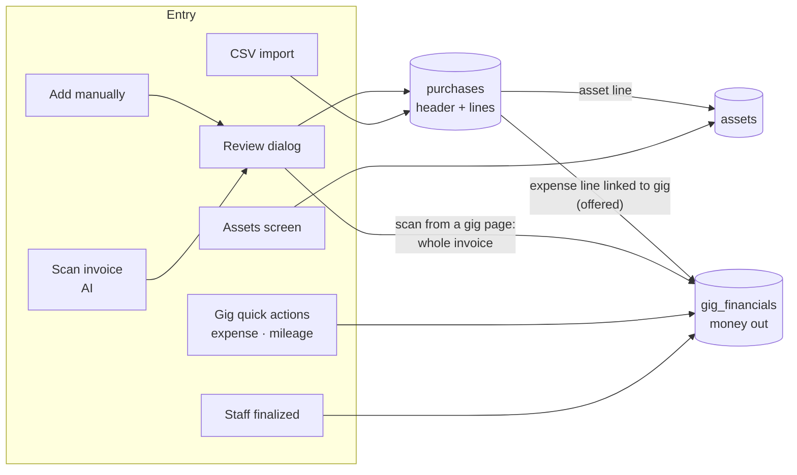

# Purchases, Assets and Expenses — How Money Out Is Recorded

How GigWrangler records money going out: purchases, the assets they create, expenses, and how both reach a gig's financials. Written 2026-10-05 from the code and production data, as groundwork for tax reporting ([#125](https://github.com/corourke/GigManager/issues/125)). For the gig ledger itself (money in / money out, stages) see [gig-financials.md](gig-financials.md).

**Last Updated**: 2026-10-05

---

## 1. The short version

- A **purchase** is one invoice: a **header** row plus one **line** per item, all in the `purchases` table.
- Each line is either an **expense line** (`row_type = 'item'`) or an **asset line** (`row_type = 'asset'`). An asset line also creates a row in `assets` — that is how a purchase becomes tracked equipment. **This split is today's only record of "expensed vs capitalized".**
- Tax, shipping and fees are not stored on their own. They are spread across the lines: each line's **`line_cost`** is its share of the invoice total, and the lines' `line_cost` add up to the header's `total_inv_amount`.
- A purchase line can be **linked to a gig**. For an expense line the app then offers to add a matching money-out row to the gig's ledger (`gig_financials`, pointing back with `purchase_id`). Asset lines never get one.
- Expenses can also be recorded **without a purchase**: gig quick actions (simple expense, mileage) and staff pay write money-out rows straight into `gig_financials`.

---

## 2. Tables and how they link

### `purchases` — invoices and their lines

| Column | Meaning |
|---|---|
| `row_type` | `header`, `item` (expense line) or `asset` (asset line) |
| `parent_id` | A line's header. Deleting a header deletes its lines. |
| `purchase_date`, `vendor`, `payment_method` | Copied onto every line when the purchase is created |
| `total_inv_amount` | Header only: the invoice grand total, tax, shipping and fees included |
| `item_price`, `line_amount` | The unit and line price **as printed**, before tax/shipping |
| `item_cost`, `line_cost` | The unit and line cost **after** spreading tax/shipping/fees ("burdened"). `line_cost` is the authoritative figure. |
| `quantity` | Can be fractional |
| `category`, `sub_category` | **Free text**, no list. Lines inherit the header's when left blank. |
| `gig_id` | Optional gig link, on the header, on lines, or both |
| `asset_id` | Asset line → its `assets` row |

### `assets` — tracked equipment

| Column | Meaning |
|---|---|
| `manufacturer_model`, `description`, `serial_number`, `tag_number` | Identity |
| `category`, `sub_category`, `type` | **Free text**; the form suggests values already used on other assets |
| `acquisition_date` | Date bought |
| `item_cost`, `item_price`, `quantity` | Burdened unit cost, printed unit price, quantity. Cost basis = `item_cost × quantity` (there is no line total on the asset). |
| `replacement_value` | Per item, for insurance |
| `status` | Free text; the UI offers Active, Inactive, Maintenance, Disposed, Returned |
| `retired_on`, `liquidation_amt` | Date disposed, sale proceeds. Entering proceeds sets status to Disposed. |
| `dep_method`, `service_life` | Free-text method and years. To be replaced by a recovery period (#125). |
| `purchase_id` | The purchase **header** (not the line) |

The two links run at different levels: **line → asset** via `purchases.asset_id`, and **asset → header** via `assets.purchase_id`. To find the line an asset came from, look up the line whose `asset_id` is the asset.

### `gig_financials` — the gig ledger

Money-out rows from purchases carry `purchase_id`. That id is **a line** when the row was created by linking a line to a gig, but **a header** when the invoice was scanned from a gig page (see §3). Category is the fixed IRS Schedule C list (`fin_category`). Staff pay rows carry `staff_assignment_id`; mileage rows carry `mileage` (miles). Full detail: [gig-financials.md](gig-financials.md).

### Attachments

Receipts attach to the purchase **header** (`entity_attachments`, `entity_type = 'purchase'`); gig expense rows can carry their own (`'gig_financial'`). The scan queue (`purchase_scan_queue`) holds invoices waiting to be scanned or reviewed; a row is removed once its purchase is saved or the invoice discarded.

---

## 3. Ways money out gets recorded

| Path | Where | Creates |
|---|---|---|
| **Add manually** | Financials → Purchases → Add manually | Header + lines; an `assets` row per line ticked "asset". RPC `create_purchase_transaction_v1`. |
| **Scan invoices** | Financials → Purchases → Scan invoices (queue), or Upload Receipt on a gig | Same as manual: the AI fills the review dialog, the user corrects and saves. |
| **Scan from a gig page** | Gig → Financials → Upload Receipt | As above, plus **one** gig money-out row for the **whole invoice total** (asset lines included), `purchase_id` = header. |
| **CSV import** | Import → Purchases | `source` 0 = header, 1 = asset line + asset, 2 = expense line. Lines with no matching header get a synthesized one. No gig links. |
| **Assets screen** | Equipment → Assets → New | An `assets` row only. No purchase, no expense. |
| **Gig simple expense** | Gig → Financials → Expense | A gig money-out row only (paid or owed), optional receipt. No purchase. |
| **Mileage** | Gig → Financials → Mileage | A gig money-out row: miles × the IRS rate for the year, category Car and truck. |
| **Staff pay** | Finalizing a staff assignment | A gig money-out row at "Owed", category Contract labor. |
| `scripts/invoice_import.py` | Command line | Inserts straight into `assets`. **Stale**: writes a `cost` column that was renamed to `item_cost`. |

The AI scan suggests whether each line is an asset (a $50 durable rule) and suggests categories from two short lists in its prompt; the user can change both in the review dialog.

---

## 4. Cost allocation — what `line_cost` means

The invoice total includes tax, shipping and fees, but the lines are printed without them. GigWrangler spreads the difference across the lines so that Σ `line_cost` = `total_inv_amount`:

- **Review dialog** (manual and scanned): every line is scaled by one factor, `total_inv_amount ÷ Σ(item_price × quantity)`.
- **CSV import**: lines that already give a cost stay fixed; the rest are scaled to make up the remainder, and the last line absorbs the rounding pennies.

`line_cost` is therefore the right figure for "what this line cost", and it is what the Purchases report totals.

---

## 5. Linking purchases to gigs

- **Per line** (Purchases report → line → assign gig): sets the line's `gig_id`. For an expense line with no ledger row yet, the app **asks** whether to add one (amount = `line_cost`, paid). Moving the line to another gig moves the row; clearing the gig offers to delete it. A persistent "Add to gig ledger" button covers lines linked earlier.
- **Per header**: sets the header and every unlinked line, then offers ledger rows for the expense lines.
- **Asset lines never get a ledger row** — equipment is not a gig cost.

---

## 6. Moving a line between expense and asset

- **Expense → asset**: "Reclassify as Asset" on an expense line (RPC `reclassify_expense_as_asset`). It creates an `assets` row from the line (copying description, category, quantity, price, cost, vendor, date), sets the line to `row_type = 'asset'`, links them, and — if the **header** has a gig — deletes gig ledger rows whose `purchase_id` is the **header**. It cannot be undone.
- **Asset → expense**: **no such action.** The only way is to delete the asset (which leaves the line as an asset line with no asset) or edit rows by hand.
- After a move, the line and the asset hold duplicate copies of description, category, quantity, cost, vendor and date. Editing the purchase later proposes matching changes to the asset; nothing flows the other way.

---

## 7. Categories

Three unconnected vocabularies today:

| Where | Values | Notes |
|---|---|---|
| Purchase header and lines | Free text | Production: Lighting, Audio, Software, Supplies, Computer, Power, Marketing, Training, Meals, Insurance, "Car and Truck Exp", Cases/Bags, Small Parts, … (20 values on lines); 153 headers blank |
| Assets | Free text | Production: Lighting, Audio, Cases/Bags, Cases, Tools, Networking, Rack, Power, Computer, Misc, Software, Small Parts |
| Gig money out | Fixed IRS Schedule C list (`fin_category`, 17 values) | Purchase categories map to it only on an exact name match; everything else becomes "Other expenses" |

There is no Schedule C line number anywhere and no link from a category to a recovery period. #125 replaces all three with one shared category table.

---

## 8. Mileage

`src/utils/financials.utils.ts` holds one IRS rate per year; the amount is miles × rate, stored on the gig row with the miles. The table is wrong for 2025 (67.5¢; the IRS rate is 70¢) and has no mid-2026 change (72.5¢ to June 30, 76¢ from July 1). Production: 19 mileage rows, all 2026, priced at 67.5¢ (#125, fix F1). Mileage can only be recorded on a gig.

---

## 9. Known problems (as of 2026-10-05)

Ordered by risk. Production counts are from read-only queries. Items 5–8 are tracked in [#131](https://github.com/corourke/GigManager/issues/131); 9–11 in [#125](https://github.com/corourke/GigManager/issues/125).

1. **Editing a cost-only purchase zeroes its costs** ([#128](https://github.com/corourke/GigManager/issues/128)). The review dialog recomputes every line's cost from the printed price when it opens. CSV-imported lines have no printed price, so the cost becomes $0, and saving writes it (and proposes $0 to linked assets). **401 of 461 lines (249 purchases) in production are cost-only.** No production data has been damaged yet: the only $0 lines are deliberate (IDJ Now 2025-02-23, where a store credit was put entirely on the T-bar, and a Mac Mini bought with airline points).
2. **Reclassify deletes the wrong ledger rows** ([#129](https://github.com/corourke/GigManager/issues/129)). It deletes by the header's id, so a per-line ledger row survives (the line is then both an asset and a gig expense), while a scan-from-gig whole-invoice row is deleted along with the expense lines' share. Production: 6 per-line and 4 header-level purchase ledger rows exist.
3. **Scanning on a gig page books the whole invoice as a gig expense** ([#130](https://github.com/corourke/GigManager/issues/130)), asset lines included, and later per-line links on the same invoice can count the expense lines a second time.
4. **No way back from asset to expense** ([#129](https://github.com/corourke/GigManager/issues/129)); deleting the asset leaves an asset line with no asset.
5. **Editing a purchase's date doesn't reach its lines** (and lines added while editing get no date), so a line can fall in the wrong tax year.
6. **Ledger edits from the purchase dialog** update the row's amount but not the paid amount, and use the printed price instead of `line_cost`.
7. **Assets created on the Assets screen or by the Python script have no purchase**, and duplicating an asset copies the original's purchase link.
8. **Review dialog drops fields at save**: the asset "Type" and the AI's manufacturer/model.
9. **Lines that don't add up to the invoice total.** Five Amazon purchases from 2025 (06-07, 06-15, 08-11, 08-13, 09-20) have line costs summing to more or less than the header total, most likely several orders filed under one header. They need checking against the invoices before the reports use them.
10. **Mileage rates** wrong for 2025 and 2026 (§8).
11. **Free-text categories and status** (§7, §2).

---

## 10. Other documents

| Document | Status |
|---|---|
| [gig-financials.md](gig-financials.md) | Current for the ledger and stages. Its purchase sections are partly stale: lines don't get `gig_id` on creation; scan-from-gig does put capital cost in the ledger; the ERD still shows `assets.cost`; linking a line only *offers* a ledger row. This document supersedes those parts. |
| [database.md](database.md) | Accurate column lists for `purchases`, `assets`, `gig_financials`. |
| [purchases-field-mapping.md](purchases-field-mapping.md) | CSV column mapping. Stale: source 1 creates an asset line *and* an asset; column is `sub_category`. |
| `docs/product/requirements.md`, `docs/product/development-plan/07_gig-financials-workflow.md`, `docs/product/reporting-gap-202608.md` | Historical design; describe the old `fin_type` model. |
| `docs/development/expense-gig-linking-and-receipts-manual-test-checklist.md` | Test steps for gig linking and receipts; current. |
