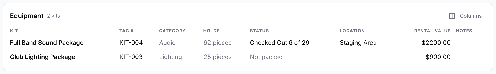
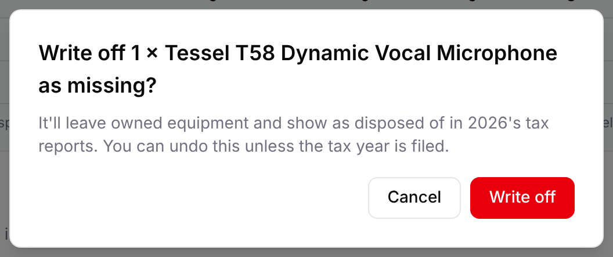

You put equipment on a gig by assigning kits to it on the gig's **Equipment** tab.
After the gig, the same tab shows what hasn't come back. Admins and Managers can mark
it returned there, or write it off as missing.

## Assigning a kit

Admins and Managers assign kits in edit mode.

1. Open the gig and select **Edit**.
2. On the **Equipment** tab, open **Select kit to assign...** at the top right of the
   **Equipment** card, and choose a kit. Kits already on the gig aren't offered.

The kit is added and saved straight away. The table lists each kit's **Name**,
**Tag #**, **Category** and **Rental Value**. In **Actions**, the notes button opens
**Equipment Notes** for a note about that kit on this gig (select **Save Notes**), and
the trash button takes the kit off the gig.

Assign the top kit you'll take, such as "Full Band Sound Package". Its nested kits and
containers come with it. If two kits on the same gig contain the same equipment, an
**Overlapping equipment** warning names them. Conflicts with other gigs show here too;
see [Conflict detection](/gigs/conflict-detection/).

<!-- TODO: the Tracking page (Out on gigs) and scanning, once #185/#186 land. -->

## The gig's equipment table

Open a gig and select the **Equipment** tab. The **Equipment** card at the top lists your
organization's kits assigned to the gig, with how many there are, such as "2 kits". If
there are none, you'll see "No equipment assigned yet".

The columns are:

- **Kit**: the kit's name. It's always shown.
- **Tag #** and **Category**: the kit's tag and category.
- **Holds**: how many pieces are in the kit, such as "25 pieces" for the Club Lighting Package. It counts everything,
  including what's inside containers. The "Mic Case" adds its 15 mics and DI boxes, not 1.
- **Rental value**: the kit's rental value. Only Admins and Managers see it.
- **Notes**: the note on the kit's assignment to this gig.

Select **Columns** to choose which columns to show. GigWrangler remembers your choice in
this browser.

### Status and Location

Two more columns are off at first. Turn them on under **Columns** to see where each
kit's pieces are for this gig. They count pieces the way the
[packing list](/equipment/inventory-reports/#packing-list) does, so a container is one
piece. That's why these numbers can be lower than **Holds**.

**Status** sums up the scan status of the kit's packed pieces:

- "All On Site": every piece is packed and has the same status.
- "Checked Out 9 of 15": 9 of the kit's 15 pieces are checked out, and the rest aren't
  packed yet.
- "On Site 6 of 15 · In Transit 3": the pieces are in more than one status. The most
  common comes first.
- "Not packed", in gray: nothing has been scanned out to this gig. Pieces that are
  checked back in at the warehouse don't count as packed either.

Point to a **Status** cell to see the full breakdown, such as "Checked Out 6 · Not
packed 23".

**Location** shows where the packed pieces are, such as "Staging Area". If they're in
more than one place, it shows "Mixed"; point to it to see each place and how many are
there. It's empty when nothing is packed.

For example, with the demo data, the Harvest Gala Dinner & Dance shows the Full Band Sound
Package as "Checked Out 6 of 29" at "Staging Area", and the Club Lighting Package as
"Not packed".

## The Not returned list

Open a gig and select the **Equipment** tab. The **Not returned** card sits below
**Equipment needed** and above the **Packing list**. It lists your organization's
equipment that was scanned out to the gig and hasn't been scanned back in. Next to the
title you see how many pieces are still out, such as "3 pieces still out".

The card appears once the gig's end time has passed and something is still out.
Before then, it shows only pieces you've already left at the gig as not returned (see
[Writing off part of a lot](#writing-off-part-of-a-lot)). When everything is back and
nothing was written off, there's no card.

Each row shows:

- The item, with its tag number if it has one.
- The kit it went out in, such as "in Full Band Sound Package", or "no kit".
- For a unit, its last scan status, such as **Checked Out**, **In Transit** or **On Site**.
  For a lot, how many pieces are out, such as "2 not returned".
- Where it was last scanned, such as "Staging Area" or "Venue Area".

A lot that went out in two kits has a row for each kit.

Only equipment that was scanned to the gig appears here. Gear in the gig's kits that
was never scanned out isn't listed.

Staff and Viewers see the list, but not the buttons.

## Marking equipment returned

If the gear is back but nobody scanned it in, Admins and Managers can clear it here.

1. On the gig's **Equipment** tab, find the row in **Not returned**.
2. Select **Returned**.

You'll see "Marked returned", and the row leaves the list. Every piece on that row is
now back at the **Warehouse**.

## Writing off missing equipment

When gear is lost or stolen at a gig, write it off. Only Admins and Managers can do this.

1. On the gig's **Equipment** tab, find the row in **Not returned**.
2. Select **Mark missing**.
3. For a lot, enter how many are missing in the number box. It starts at the number on
   the row. For a unit, there's nothing to enter.
4. Select **Write off**. To back out, select **Cancel**.
5. GigWrangler asks you to confirm, for example "Write off 2 × XLR Cable, 50 ft as
   missing? They'll leave owned equipment and show as disposed of in 2026's tax
   reports. You can undo this unless the tax year is filed." Select **Write off**.

You'll see "Written off: 2 missing", for example. The row moves to **Written off at
this gig**, further down the card, and the gig's [History](/gigs/change-history/) shows
**Equipment Written Off**.

### What a write-off does

- **A unit, or a whole lot,** gets the status **Missing**, dated today.
- **Part of a lot** is split off into its own lot with the status **Missing**. The
  original lot keeps the rest. For example, writing off 2 of a lot of 10 "XLR Cable,
  50 ft" leaves a lot of 8 and a missing lot of 2.
- **Missing equipment is no longer owned.** It drops out of **Owned**, **Available** and
  the total and insured values, on the item page and on the dashboard. It also stops
  counting as free when GigWrangler checks gigs for
  [conflicts](/gigs/conflict-detection/).
- **On the item page,** the **Inventory** card adds **Written off** with how many are
  missing, such as "2 missing". In **Units and lots**, the record has a **Missing**
  status badge, and a split-off lot reads like "Lot of 2 · Missing".
- **Its record is locked.** In the equipment form, **Status**, **Retired On** and
  **Disposal or Salvage Amount** can't be changed, and you see "Written off as missing.
  To bring it back, use Undo in the gig's Not returned list."
- **In a kit,** a written-off unit shows in red: "Missing: no longer owned. Remove it
  from the kit." If you undo the write-off later, it's still in the kit unless you
  removed it.

### Writing off part of a lot

If fewer pieces are missing than the row shows, the rest stay on the list as still out
at the gig. For example, if a row shows "4 not returned" and you write off 1, the row
then shows "3 not returned". Select **Returned** when those come back, or scan them in.

### Taxes

A write-off counts as getting rid of the equipment, with no sale proceeds, in the year
you write it off.

- **Depreciated equipment** appears in **Financials → Reporting → Assets** under
  **Disposed of in {year}**. Each written-off unit or lot has its own row, at its share
  of the purchase line's cost. **Sale proceeds** shows "—" and **Status** shows
  **Missing**. See [Disposed of in {year}](/financials/reporting/#disposed-of-in-year).
- **Expensed equipment,** such as most cables, doesn't appear in the tax reports. Its
  cost was already deducted in the year you bought it.

You can't write off equipment once this year's taxes are filed and the year is locked.
You'll see "The 2026 tax year is locked (filed), so equipment can't be written off in
it." See [Filed years are locked](/financials/tax-treatment/#filed-years-are-locked).

## Undoing a write-off

If missing gear turns up, an Admin or Manager can undo the write-off from the gig where
it was written off.

1. On the gig's **Equipment** tab, find the item under **Written off at this gig**. Each
   entry shows how many are missing and the date, such as "written off Oct 11, 2026".
2. Select **Undo**.

You'll see "Write-off undone", and the entry leaves the list. Undo is only on the gig
where the equipment was written off.

- **A unit or a whole lot** gets back the status it had before. It's still out at the
  gig, so it returns to the **Not returned** list. Select **Returned** or scan it in.
- **Pieces split off a lot** go back into that lot, at home. If that lot is gone (written
  off or disposed of), they come back as a lot of their own.

:::caution[Filed years]
Once the year of the write-off is locked, **Undo** is turned off. You'll see "This
write-off is in a filed tax year, so it can't be undone. If the equipment turns up, add
it again as new equipment."
:::

## Related

- [Conflict detection](/gigs/conflict-detection/)
- [Reporting](/financials/reporting/)
- [Tax treatment and equipment](/financials/tax-treatment/)
