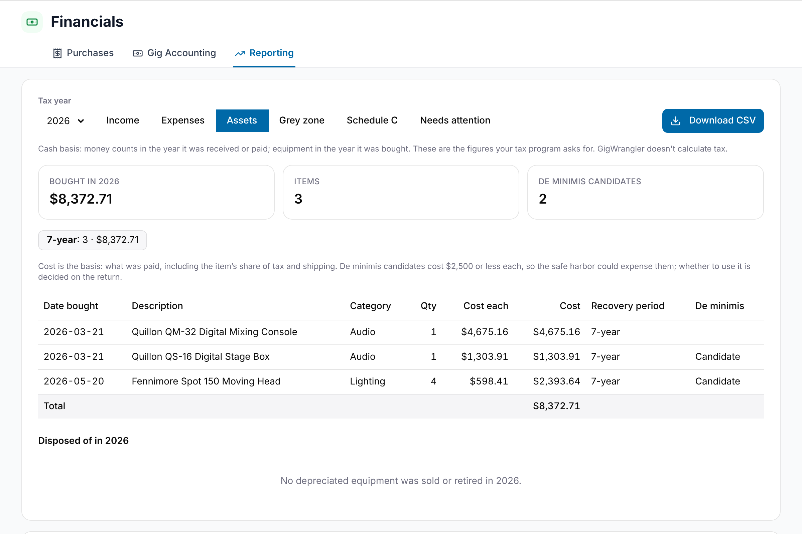
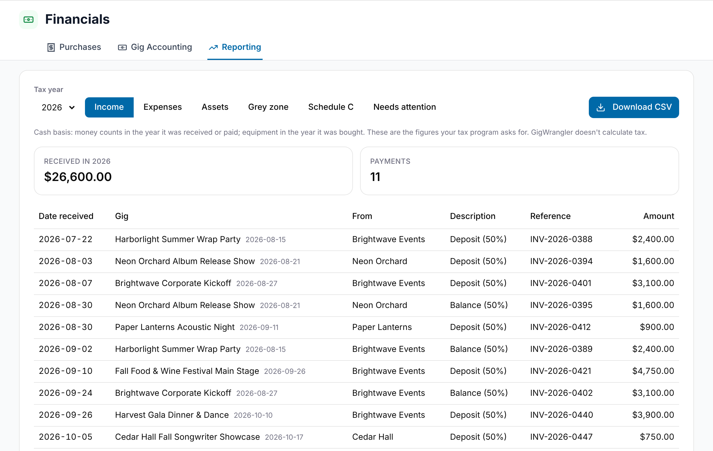

**Financials → Reporting** gathers a tax year's figures into four reports: **Income**, **Expenses**, **Assets** and **Grey zone**. Each one downloads as a CSV file you can give to your tax program or accountant. Admins and Managers can open it. GigWrangler doesn't calculate tax; it lists what you received, spent and bought.

The reports use the cash basis. Money counts in the year it was received or paid, and equipment counts in the year it was bought.

## Choosing a year and a report

1. Open **Financials → Reporting**.
2. Choose a year in **Tax year**. The list holds this year and every year in which you have purchases, paid gig money or equipment you sold or retired.
3. Select **Income**, **Expenses**, **Assets** or **Grey zone**.

If an Admin has marked the year as filed, a **{year} is filed** badge appears beside the report buttons. See [Filing a year](#filing-a-year).

## Downloading a CSV

Select **Download CSV** to save the report you're looking at for the year you chose. The file is named after your organization, the report and the year, such as `demo-sound-lighting-expenses-2026.csv`. The Assets report also has **Download disposals CSV**, described below.

## The Income report

The Income report lists every gig payment you received in the year: money in that has reached the paid stage, counted on the date it was paid. It counts the amount actually received.

The boxes at the top show **Received in {year}** and the number of **Payments**. The table has these columns: **Date received**, **Gig**, **From**, **Description**, **Reference** and **Amount**, with a **Total** at the bottom. The gig's own date appears beside its title.

If nothing was received, you'll see "No gig payments were received in {year}."

## The Expenses report

The Expenses report lists what you paid in the year, from two places:

- **Purchases:** every purchase line you chose to **Expense**, on the line's date. Depreciated lines go in the Assets report instead.
- **Gigs:** money out that has been paid and didn't come from a purchase, such as quick expenses, mileage and staff pay, on the date it was paid.

A gig cost that came from a purchase isn't listed twice. The purchase counts it once.

The boxes at the top show **Expenses in {year}** and the number of **Items**. The first table groups the expenses by IRS Schedule C line, with each line's categories under it and a **Total**. Anything without a Schedule C line goes under "No Schedule C line", at the end.

Below it, **Every expense** lists each item with **Date paid**, **Source** (**Purchase** or **Gig**), **Payee**, **Description**, **Category**, **Line** and **Amount**. Mileage shows its miles beside the description. A purchase's amount includes its share of tax and shipping (see [Cost allocation](/financials/cost-allocation/)).

An item whose category isn't on your expense list, or has none, can't be placed on a Schedule C line. An amber **Need a category** box counts them, and the category shows in amber. For a purchase, edit the purchase to choose a category; for a gig's own cost, choose it on the gig's [Financials tab](/financials/gig-expenses/). Your lists are under [Expense and equipment categories](/settings/categories/).

The CSV adds the line number and name, the gig and the miles as separate columns.

## The Assets report

The Assets report lists the depreciated equipment you bought in the year, counted on the purchase date. Items you expensed aren't here.

The boxes at the top show **Bought in {year}**, the number of **Items**, **Need a recovery period** (when any are missing) and **De minimis candidates**. A row of totals by recovery period follows, with "No period yet" for items without one.

The table has **Date bought**, **Description**, **Category**, **Qty**, **Cost each**, **Cost** (what was paid, including tax and shipping), **Recovery period** and **De minimis**, with a **Total**.

- **Recovery period** shows 5-year, 7-year or 15-year. If an item has none, select **Choose…** to open its equipment record and pick one. See [Recovery period](/financials/tax-treatment/#recovery-period).
- **Candidate** in **De minimis** marks items costing $2,500 or less each. The safe harbor could expense them, but you decide that when you file.

If you bought no depreciated equipment, you'll see "No depreciated equipment was bought in {year}."

### Disposed of in {year}

**Disposed of in {year}** lists depreciated equipment you sold or retired in the year, whenever you bought it. It shows **Description**, **Date bought**, **Cost**, **Date disposed**, **Sale proceeds** and **Status**. Select **Download disposals CSV** to save it.

## The Grey zone report

The Grey zone report lists the equipment you bought in the year that cost from $200 to $2,500 each, including its share of tax and shipping. Items in that range can be expensed or depreciated, and the choice is yours, so this is the list to check before you file. Equipment means items filed under an equipment category, or tracked as equipment. Both treatments are listed.

The boxes at the top show **Grey zone in {year}**, and how many are **Expensed** and **Depreciated**. The table has **Date bought**, **Description**, **Category**, **Qty**, **Cost each**, **Cost** and **Treatment** (**Expense** or **Depreciate**), with a **Total**.

To change an item's treatment, select **Change…** beside it. The purchase opens for editing; choose **Expense** or **Depreciate** on the line and select **Save Changes**. The report updates when you save. In a filed year the report is read-only and **Change…** doesn't appear. See [Tax treatment and equipment](/financials/tax-treatment/).

If nothing falls in the range, you'll see "No equipment costing $200 to $2,500 each was bought in {year}."

The CSV adds the vendor and a **Tracked as equipment** column.

## Filing a year

Below the reports, **Filed tax years** shows which years are locked. An Admin locks a year after filing; Managers can see the list. Locking, and what it protects, is explained in [Tax treatment and equipment](/financials/tax-treatment/#filed-years-are-locked).

## Related

- [Tax treatment and equipment](/financials/tax-treatment/)
- [Purchases](/financials/purchases/)
- [Expense and equipment categories](/settings/categories/)
