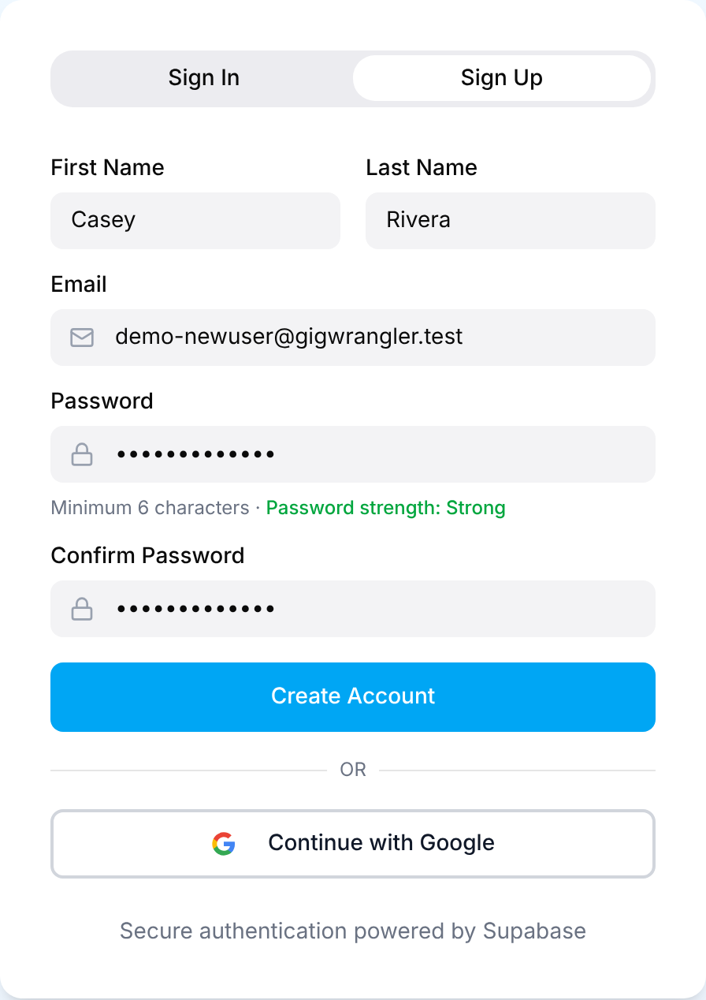
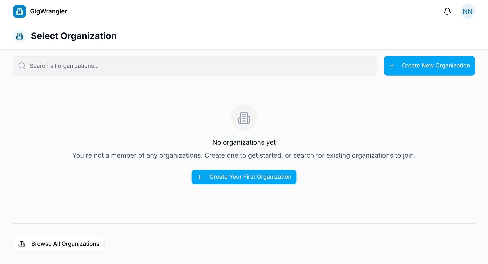
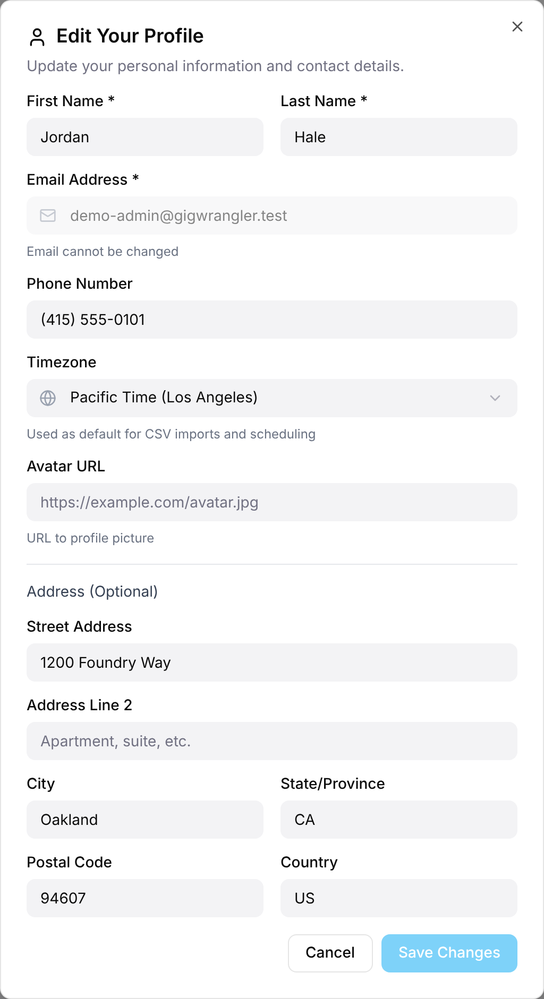
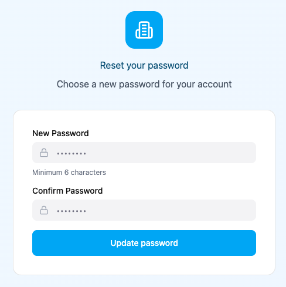

## Create your account

1. Go to the app and choose **Sign Up**.
2. Enter your first name, last name, email, and a password (at least 6 characters).
   A hint under the password rates it **Weak**, **Fair** or **Strong**. It's only
   advice: longer passwords that mix upper and lower case, numbers and symbols
   rate higher.
3. Type the password again in **Confirm Password**. If the two don't match, you'll
   see an error and can't continue until they do.
4. Select **Create Account**.

You see "Please check your email to confirm your account before signing in."
GigWrangler emails you a link to confirm your address. Follow it: you're signed in
and taken to the **Select Organization** screen. Your account exists, but it isn't
part of any organization yet. That's the next step:
[Getting into an organization](/getting-started/organizations/).

You can also **Continue with Google** instead of email/password.

## Completing your profile

If GigWrangler doesn't have your first and last name yet — for example, the
first time you sign in with Google, or when you join from an invitation — it
shows **Welcome to GigWrangler!** and asks you to complete your profile first:

- **First Name** and **Last Name** (required).
- **Set Password** and **Confirm Password** (required, at least 6 characters).
- Optionally **Phone Number**, **Timezone** and an address.

Select **Continue** to go on.

## Your profile

Open the avatar menu (top-right) → **Edit Profile** to change your name, phone,
**Timezone**, avatar and address. The avatar menu is also where you **Switch Organization**
and **Sign Out**.

## Forgot your password?

On the **Sign In** tab, choose **Forgot password?**, enter your email and select
**Send reset link**. You see "If an account exists for {your email}, a password reset
link has been sent. Check your email."

Follow the emailed link. On **Reset your password**, enter a **New Password** (at
least 6 characters), type it again in **Confirm Password**, and select **Update
password**. You see "Your password has been updated. Please sign in with your new
password.", and you sign in on the **Sign In** tab. If the link has expired, request
a new one.

