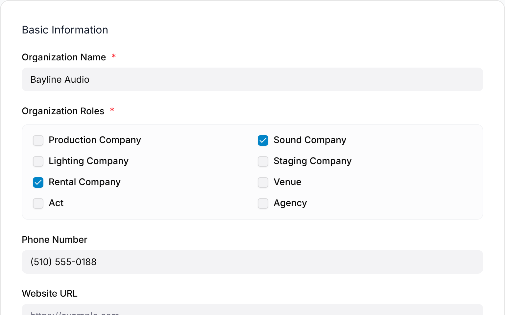
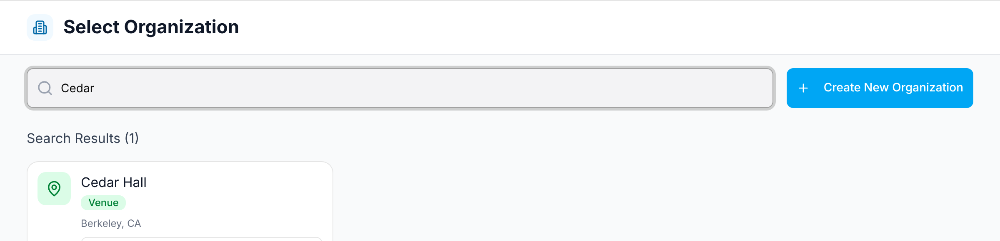
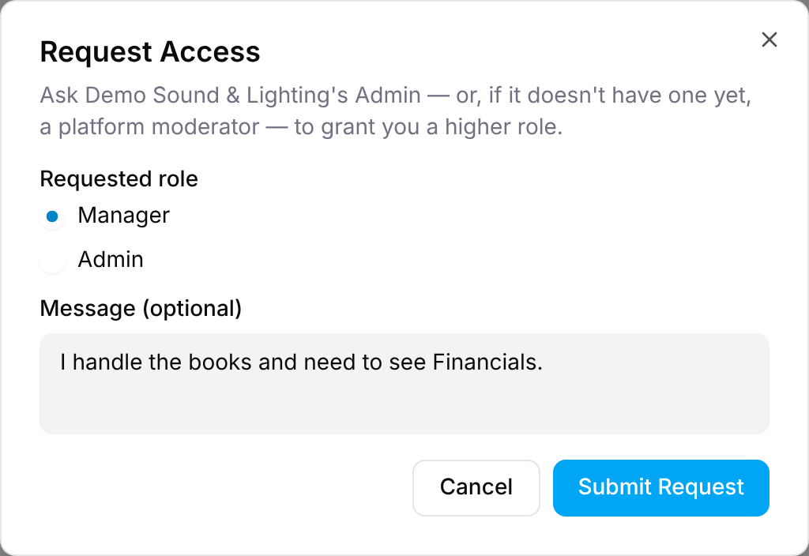

Everything in GigWrangler belongs to an **organization**. A new account isn't in
one yet, so your first move is one of four paths.

## 1. Create a new organization

From **Select Organization**, choose **Create New Organization** (or
**Create Your First Organization** if you aren't in any yet).

- You can search for your business on Google to auto-fill its details, or choose
  **Skip search and enter details manually**.
- Required: a **name** and at least one **Organization Role** (Production Company,
  Sound Company, Lighting Company, Staging Company, Rental Company, Venue, Act,
  Agency).
- Optional: **Phone Number**, **Website URL**, **Allowed Email Domains** (people
  whose email matches can join without an invite), a **Description**, and an
  address.
- Choose **Create and Join**. You become the organization's **Admin**.

:::note[Create without Joining]
There's also a **Create without Joining** option, for registering a partner
organization — a venue or vendor you work with but aren't part of. That
organization is then **unclaimed** (see below) until someone takes it over.
:::

## 2. Claim or request access to an existing organization

If the organization already exists (for example, a venue that was added as a gig
participant), you don't create a duplicate — you get access to the real one.

1. On **Select Organization**, search for the organization by name in
   **Search all organizations...**. (Once you're in an organization, the avatar
   menu's **Switch Organization** takes you back to this screen.)
2. On its card, choose **Join as Viewer**. You're now a read-only member.

   

3. Open that organization → **Team** → **Request Access** (top-right). Viewers and
   Staff see this button.
4. Pick the **Requested role** — **Manager** or **Admin** — add an optional
   message, and select **Submit Request**.

   

What happens next depends on the organization:

- **It already has an Admin** → that Admin approves or rejects your request.
- **It has no Admin yet** (an unclaimed organization) → a **platform moderator**
  reviews it.

You're notified of the decision by email and by the in-app notification bell
(top-right). If approved, your role changes automatically.

## 3. Accept an invitation

An Admin or Manager can invite you by email (**Team** → **Add Team Member** →
**Invite New**) and choose your role directly: Admin, Manager, Staff, or Viewer.
Follow the link in the invitation email to join — no request or approval step
needed. If you're new to GigWrangler, you first
[complete your profile](/getting-started/onboarding/#completing-your-profile),
including setting a password.

## 4. Join via a matching email domain

If an organization has set **Allowed Email Domains** and your email matches, its
card shows two buttons, **Viewer** and **Staff**: pick one and you join straight
away. Use **Request Access** from the Team page if you need Manager or Admin.

---

Once you're in, head to [the dashboard](/getting-started/the-dashboard/).

<!-- TODO: 📸 the notification bell after a decision (needs a seeded access-request decision). -->
