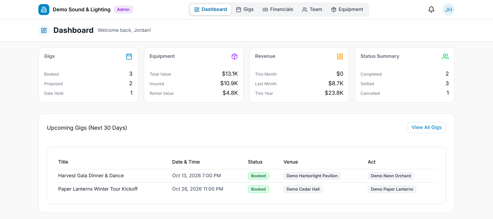
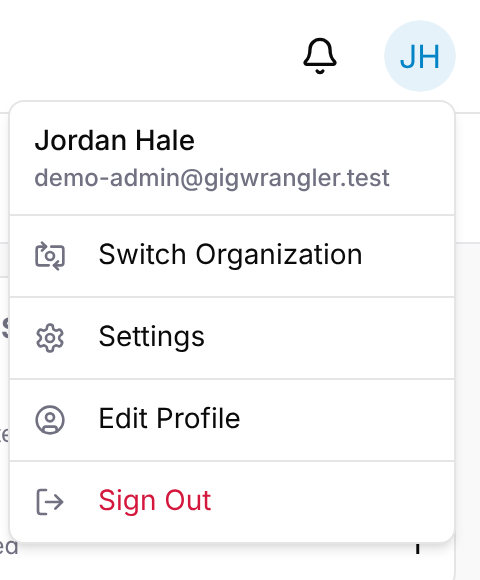

When you select an organization, Admins, Managers and Staff land on its
**Dashboard**; Viewers land on **Gigs**. If you belong to only one organization,
it's selected for you. The dashboard opens with "Welcome back" and an
at-a-glance summary:

- **Gigs** — counts by status (Booked, Proposed, Date Hold).
- **Equipment** — Total Value, Insured and Rental Value.
- **Revenue** — This Month, Last Month, This Year.
- **Status Summary** — Completed, Settled, Cancelled.
- **Upcoming Gigs (Next 30 Days)** — with venue and act.
- **Recent Activity**.

## Navigation

The top bar has the section menu, **Dashboard · Gigs · Financials · Team ·
Equipment**, with the current section highlighted. In a narrow window the menu
shows icons only; hover over one to see its name. What you see depends on your
role:

| | Admin, Manager | Staff | Viewer |
| --- | --- | --- | --- |
| **Dashboard** | ✓ | ✓ | — |
| **Gigs**, **Team**, **Equipment** | ✓ | ✓ | ✓ |
| **Financials** | ✓ | — | — |

Under the top bar, every page starts with its title. On a page you open from
somewhere else, such as Financials opened from a gig, the **Back** arrow sits
just left of the title. If a page has tabs, they're right below the title.

The avatar menu (top-right) has **Switch Organization**, **Settings**,
**Edit Profile**, and **Sign Out**. Platform moderators also see
**Access Requests** there. The bell next to it shows **Notifications**, such
as decisions on [access requests](/getting-started/organizations/).

<!-- TODO
  - 📸 Notification bell dropdown.
-->
