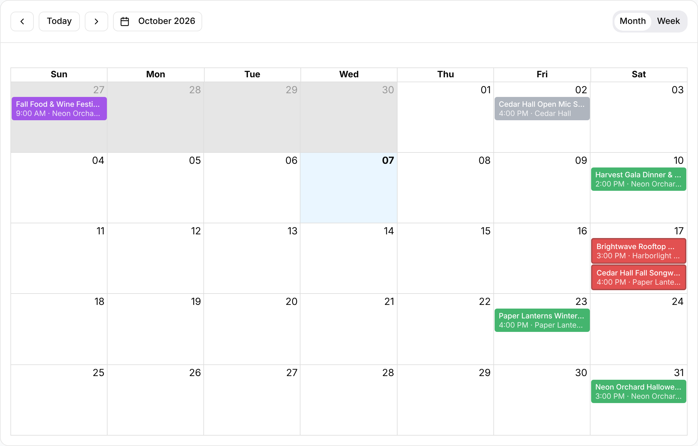

The calendar shows the same gigs as the [gig list](/gigs/the-gig-list/) laid out by
date. Everyone in the organization can use it. Open **Gigs** in the top nav, then
select **Calendar** in the **List** / **Calendar** toggle at the top right. Select
**List** to switch back.

## Month and week

Use the **Month** and **Week** tabs at the top right of the calendar to switch views.
Select a day's date number in the month grid to jump to that week. Week view
lays gigs out by the hour, so it suits a busy stretch.

To move around:

- Select the arrow buttons for the previous or next month (or week).
- Select **Today** to return to the current date.
- Select the date button (for example "October 2026" or "Week of Oct 5, 2026") and
  pick any day to jump there.

## Reading a gig on the calendar

Each gig is a colored bar showing its title. Below the title, the bar lists the
start time (month view, for gigs with a set time), the act and the venue, separated
by dots, when the gig has them. Gigs with no times show as all-day bars, and
multi-day gigs stretch across their days.

The bar's color is the gig's status:

| Color | Status |
| --- | --- |
| Gray | **Date Hold** |
| Blue | **Proposed** |
| Green | **Booked** |
| Purple | **Completed** |
| Indigo | **Settled** |
| Light gray | **Cancelled** |
| Red with a dark outline | The gig has a [conflict](/gigs/conflict-detection/), whatever its status. |

Select a gig to open it. On the gig page, the arrow to the left of the title goes
**Back to Calendar**.

## Filtering the calendar

The calendar uses the date and status filters from the list: **All Dates** and
**All Statuses**. They're set on the list, remembered in this browser, and apply
here too. The **Upcoming** and **Past** tabs and the row filters aren't part of the
calendar.

:::tip
If the calendar looks empty, a leftover filter is the usual cause. A **+7d** filter
hides every gig in the past. Switch to **List** and choose **All Dates** and **All**
to clear them.
:::

## Conflicts

When any gig has a double-booked person, venue or kit, a banner above the calendar
lists each conflict, with a **View** button that opens the gig. The affected gigs
turn red on the calendar. See [Conflict detection](/gigs/conflict-detection/).

## Other calendars

The calendar view only shows gigs in GigWrangler. To see them in Google Calendar as
well, set up [Google Calendar](/settings/google-calendar/) sync. On a phone, the
calendar isn't available; use the gig list.

## Related

- [The gig list](/gigs/the-gig-list/)
- [Conflict detection](/gigs/conflict-detection/)
- [Google Calendar](/settings/google-calendar/)
