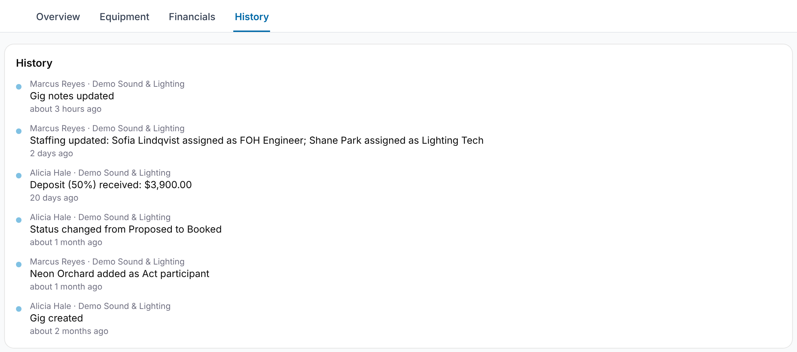

Every gig keeps a **change history**. Open a gig and select the **History** tab.
The newest change is at the top, so **Gig created** is at the bottom.

Each entry shows:

- **who** made the change and which organization they were acting for,
- **what** changed, in plain language (for example, *"Renamed from 'Summer
  Festival' to 'Summer Festival — Main Stage'"* or *"Rescheduled from 20 Sep 2026
  14:00 to 21 Sep 2026 14:00"*),
- **when**, as a relative time ("3 days ago").

The name and organization are recorded **at the moment of the change**, so later
renames don't rewrite past entries.

## What's tracked

- **The gig itself:** created, renamed, rescheduled, status changed, notes updated.
- **Participants:** an organization added or removed, with its role.
- **Schedule:** entries added.
- **Staffing:** slots added or removed, people assigned or unassigned.
- **Financials:** rows added, updated, marked paid or removed.

## Who sees what

Changes to the gig, its participants and its schedule are visible to everyone on
the gig, from every participating organization. Staffing changes are visible only
to members of the organization that made them, and financial changes only to that
organization's Admins and Managers.

Assets and kits have their own history in the same style.
