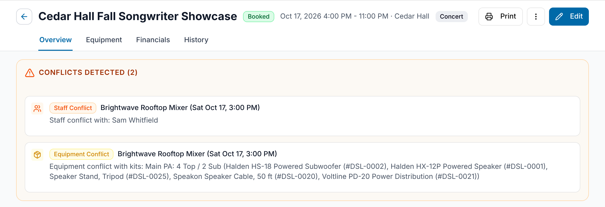

GigWrangler compares each gig with your other gigs and flags overlaps in staff,
venues and acts, and equipment. You see the warnings on the gig list, the calendar,
a gig's page and the gig's Equipment tab. Nothing is blocked: a conflict is a heads-up,
and you can still save and keep working.

## What counts as a conflict

Two gigs conflict when their dates overlap and they share any of these:

- **Staff:** the same person is assigned to both gigs.
- **Venue or act:** the same organization is a participant with the **Venue** role, or the **Act** role, on both gigs.
- **Equipment:** both gigs use the same piece of equipment. GigWrangler compares the individual assets inside each kit, so two different kits that contain the same asset still conflict. For example, the "Full Band Sound Package" contains the "Mic Case", so assigning the package to one gig and the Mic Case to an overlapping gig is flagged.

Gigs with no start time count as the whole day in the gig's time zone. **Cancelled** gigs are ignored.

## Where warnings appear

- **The gig list and calendar.** A banner above the list reads "N Conflicts Detected", with one line per conflict and a **View** button that opens that gig. **Back** on the gig page returns you to the list or the calendar, whichever you came from. In the calendar, gigs with a conflict are drawn in red. See [The gig list](/gigs/the-gig-list/) and [Calendar view](/gigs/calendar-view/).
- **A gig's page.** A "Conflicts Detected" card at the top lists the other gigs that overlap this one, with the names of the people, the venue or act, or the kits and assets involved.
- **The Equipment tab in edit mode.** The equipment check also lists gigs that fall within four hours of this one, without overlapping. Warnings update after each change to the gig's kits.

The gig list and calendar compare only the gigs in your list. The gig page and
Equipment tab check this gig against other gigs you have access to.

## Fixing a conflict

Conflicts don't stop you saving. To resolve one, open the other gig with **View**, then
change a date, reassign the person, or swap the kit. The warning disappears when the
gigs no longer overlap or share anything. If it is intended, for example a venue with
two rooms, leave it.

## Overlaps inside one gig

Two other warnings don't involve a second gig:

- In the schedule editor, an orange warning icon appears on an item that overlaps another item for the same act: "Overlaps another item for this act".
- On the Equipment tab, "Overlapping equipment" lists kits assigned to this gig that contain the same physical equipment.

## Related

- [The gig list](/gigs/the-gig-list/)
- [Calendar view](/gigs/calendar-view/)
- [Staffing and participants](/gigs/staffing-and-participants/)
