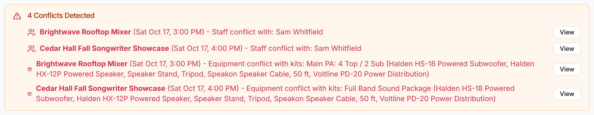

GigWrangler compares each gig with your other gigs and flags overlaps in staff,
venues and acts, and equipment. You see the warnings on the gig list, the calendar,
a gig's page and the gig's Equipment tab. Nothing is blocked: a conflict is a heads-up,
and you can still save and keep working.

## What counts as a conflict

Two gigs conflict when their times overlap, including gigs where one ends just as the next starts, and they share any of these:

- **Staff:** the same person is assigned to both gigs.
- **Venue or act:** the same organization is a participant with the **Venue** role, or the **Act** role, on both gigs.
- **Equipment:** the gigs need more of an item than you have free. GigWrangler counts how many of each item the kits on each gig ask for, whether specific units or "any" lines such as "4 × any Halden HX-12P Powered Speaker", and adds up the gigs that are on at the same moment. If that's more than you have free, it's flagged. **Free** means units that are Active and not retired, not counting any packed inside a container kit. Only your own organization's kits count.
- **The same unit:** a specific unit booked on two gigs is flagged too, even when it comes in different kits. For example, the "Full Band Sound Package" contains the "Main PA" kit, so assigning the package to one gig and the Main PA to an overlapping gig flags the PA's power distro, DSL-0211.

Gigs with no start time count as the whole day in the gig's time zone. **Cancelled** gigs are ignored.

## Where warnings appear

- **The gig list and calendar.** A banner above the list reads "N Conflicts Detected", with one line per conflict and a **View** button that opens that gig. An equipment line reads like "Not enough equipment: Halden HX-12P Powered Speaker (8 needed, 4 available)". On the gig page, **Back to Gigs** or **Back to Calendar** returns you to where you came from. In the calendar, gigs with a conflict are drawn in red. See [The gig list](/gigs/the-gig-list/) and [Calendar view](/gigs/calendar-view/).
- **A gig's page.** A "Conflicts Detected" card at the top lists the other gigs that overlap this one, with the names of the people, the venue or act, or the equipment involved. A shortage reads like "Halden HX-12P Powered Speaker: 8 needed on Oct 17, 2026, 4 available. 4 short.", with how many each gig asks for and from which kit. **View Gig** opens the other gig.

  

- **The Equipment tab in edit mode.** The same warnings appear above the kits, and update after each change to the gig's kits. They also list gigs within four hours of this one that share a specific unit. Only gigs that overlap count toward "Not enough equipment".

## Equipment needed

A gig's **Equipment** tab shows **Equipment needed on {day}**: one row for each item the gig's kits ask for, compared with the gigs that overlap it. It appears once the gig has a start and an end time, and kits from your organization. The columns are:

- **This gig** and **Overlapping:** how many this gig needs, and the most the overlapping gigs need at any one moment.
- **Needed:** the two together.
- **Owned**, **In maintenance** and **Free:** what you have. Free leaves out units in maintenance, retired ones, and any packed in a container kit.
- A status: **Enough**, **none spare** (needed equals free), or **{n} short** in red.

Items that are short come first. For a gig over several days, the table is titled with its first day and covers the whole gig.

The gig list and calendar compare only the gigs in your list. The gig page and
Equipment tab check this gig against other gigs you have access to.

## Fixing a conflict

Conflicts don't stop you saving. To resolve one, open the other gig with **View**, then
change a date, reassign the person, or swap the kit or its lines. The warning disappears when the
gigs no longer overlap or share anything. If it is intended, for example a venue with
two rooms, leave it.

## Overlaps inside one gig

Two other warnings don't involve a second gig:

- In the schedule editor, an orange warning icon appears on an item that overlaps another item for the same act: "Overlaps another item for this act".
- On the Equipment tab, "Overlapping equipment" lists kits assigned to this gig that contain the same physical equipment.

## Related

- [The gig list](/gigs/the-gig-list/)
- [Calendar view](/gigs/calendar-view/)
- [Staffing and participants](/gigs/staffing-and-participants/)
