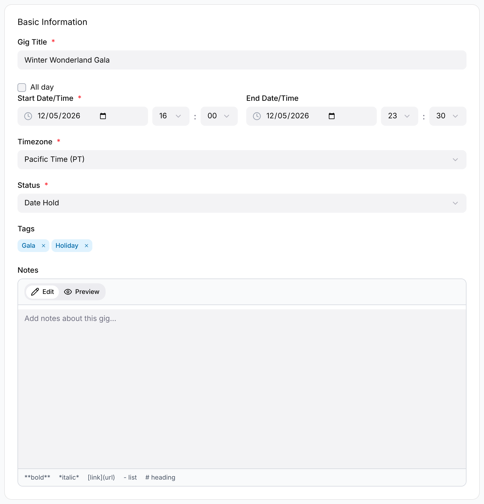

Admins and Managers create gigs. From **Gigs**, choose **New Gig** (or **Create
First Gig** on an empty list).

The **New Gig** form is deliberately short:

- **Gig Title** (required)
- **All day**, or **Start Date/Time** (required) and **End Date/Time**; the end must
  be after the start
- **Timezone** (required)
- **Status** — defaults to Date Hold
- **Tags** — type a tag and press <kbd>Enter</kbd> or <kbd>Tab</kbd> to add it; common
  tags are suggested as you type
- **Notes** — supports Markdown

Choose **Create Gig**. The gig opens in edit mode, where you add everything else —
venue, participants, schedule, staffing, equipment and financials (see the
[Gigs overview](/gigs/overview/)). **Cancel**, or **Back to Gigs** above the
title, leaves without saving.

Your organization is added to the gig as a participant automatically.

:::note
The gig's **venue** isn't set on this form. Add a participating organization with
the **Venue** role, and it shows as the gig's venue in the page header and the
**Venue** card.
:::
