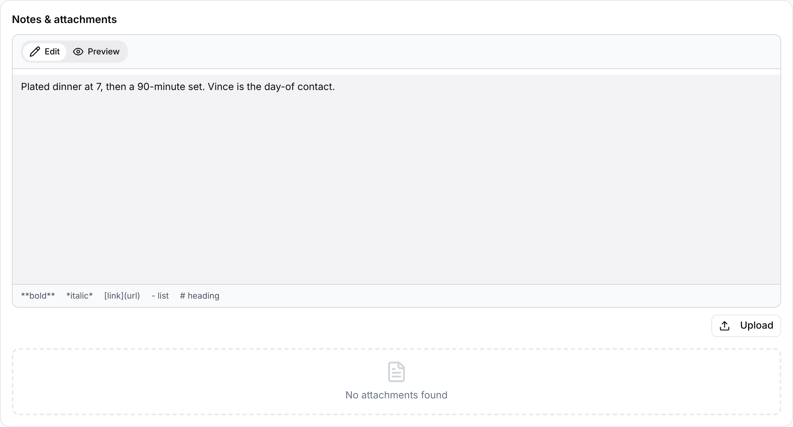

Every gig has a **Notes & attachments** section for free-text notes and files such
as stage plots, riders and run sheets. Find it on the gig's **Overview** tab. Admins
and Managers can add and change notes and files. Staff and Viewers can read the notes
and open the files.

## Reading notes and files

Open a gig and look at **Notes & attachments** under the schedule and venue. If nobody has written any notes,
you see "No notes". Below the notes, each attached file shows its name and upload
date. Select **Open** (eye) to view it in a new browser tab.

Files belong to the organization that uploaded them. Another organization on the
same gig doesn't see your files, and you don't see theirs.

The **Gig sheet** from **Print** includes the notes and lists the attachment names. See
the [gig overview](/gigs/overview/#the-gig-page) for the Print menu.

## Writing notes

1. Open the gig and select **Edit**.
2. In **Notes & attachments**, enter your notes in the **Edit** tab.
3. Select the **Preview** tab to check the formatting.

The editor uses Markdown. A reminder under the box shows the basics: `**bold**`,
`*italic*`, `[link](url)`, `- list` and `# heading`. Links in the preview open in a
new tab. Changes save as you type, like the rest of the gig page; see
[Editing a gig](/gigs/overview/#editing-a-gig).

Outside edit mode, the gig page and the printed **Gig sheet** show the notes
formatted, the same as the **Preview** tab.

## Attaching files

1. Open the gig and select **Edit**.
2. In **Notes & attachments**, select **Upload**.
3. Choose one or more files.

The files appear in the list and "Files uploaded successfully" confirms it. You can
attach any type of file.

To take a file off the gig, select **Remove** (X) on its row and confirm. The file is
removed from this gig's list.

Receipts and invoices for money in and out are attached to the financial record, not
to the gig's notes. See [Receipts and invoices](/financials/receipts-and-invoices/).

## Related

- [Gigs overview](/gigs/overview/)
- [Receipts and invoices](/financials/receipts-and-invoices/)
