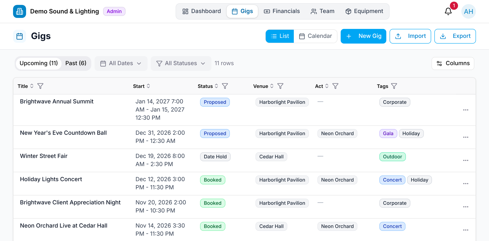
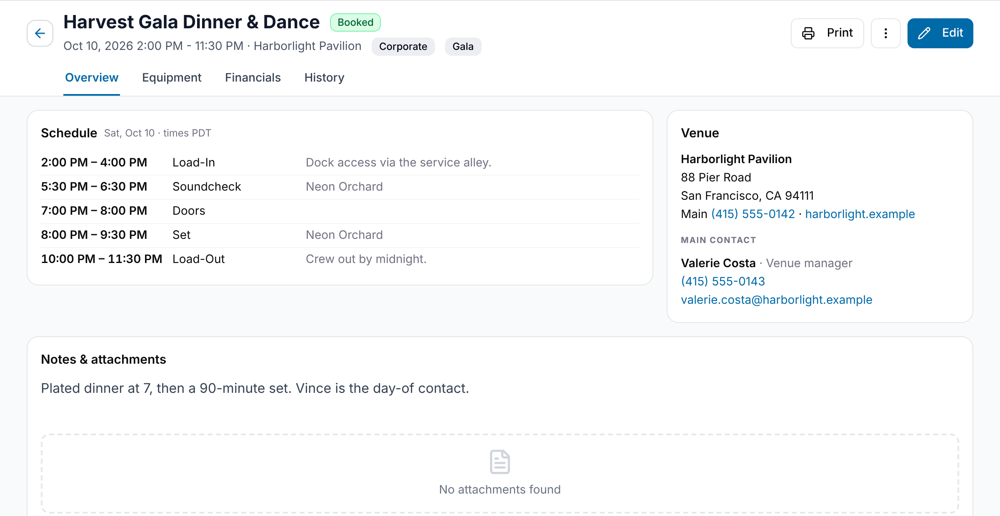

A **gig** is a single job. It carries its dates and status plus everything hung
off it: participants, schedule, staffing, financials, equipment, and attachments.

## The gig list

**Gigs** in the top nav opens the list. Switch between **List** and **Calendar**
with the toggle at the top right. See [The gig list](/gigs/the-gig-list/) and
[Calendar view](/gigs/calendar-view/).

The list is split into **Upcoming** and **Past** tabs, each with a live count. A gig
stays in Upcoming until its last day is over in the gig's time zone. Next to the
tabs, the date filter (**+7d**, **+14d**, **+30d**, **All** ahead; **-7d**, **-14d**,
**-30d**, **All** back) and the status filter narrow the list; both are remembered in
this browser between visits.

**Export** downloads the list as a CSV, exactly as shown: the filters, any column
search, the sort order and the columns you've chosen with **Columns** all carry
over. Admins and Managers also see **New Gig** and **Import**.

To open a gig, select its title, or open the row's **⋯** menu and choose **View**.
Admins and Managers also get **Edit** (opens the gig in edit mode) and **Duplicate**.
Only Admins can delete a gig.
<!-- TODO: #175 — Managers currently see Delete too, and get an error. -->

## The gig page

The page header shows the gig's title, status, dates, venue and tags. The arrow to
the left of the title goes **Back to Gigs** (or **Back to Calendar** if you opened
the gig from the calendar). Below the header are up to four tabs:

| Tab | What it shows |
| --- | --- |
| **Overview** | [Schedule](/gigs/schedule/), Venue, [Notes & attachments](/gigs/documents-and-notes/), [Participants](/gigs/participating-organizations/), and your organization's [Staffing](/gigs/staffing-and-participants/). Any [conflicts](/gigs/conflict-detection/) with other gigs show at the top. |
| **Equipment** | The kits assigned to the gig, the equipment it needs against what's free ([Equipment needed](/gigs/conflict-detection/#equipment-needed)), and its packing list. |
| **Financials** | Money in and money out for the gig — Admins and Managers only. See [Financials](/financials/overview/). |
| **History** | The gig's [change history](/gigs/change-history/). |

**Print** offers a **Gig sheet**, a **Packing list** and, for Admins and Managers,
a **Gig sheet with financials**. The **⋮** menu next to **Edit** has **Duplicate
Gig** and, for Admins, **Delete Gig**.

## Editing a gig

Admins and Managers choose **Edit**. The whole page switches to edit mode: the
title, status and tags become editable in the header, and every tab's sections
become editable in place. On Overview those are **When & schedule**,
**Participants**, **Staff Assignments** and **Notes & attachments**; on Equipment,
the kit assignments.

There's no Save button: changes save as you make them, and the header shows the
save state. Choose **Done** to leave edit mode; it waits for any save still in
progress, so nothing you just typed is lost.

Staff and Viewers see the gig read-only, without the Financials tab or staff pay.

## Status

A gig is **Date Hold**, **Proposed**, **Booked**, **Completed**, **Settled** or
**Cancelled**. New gigs start as Date Hold. You can set any status at any time;
GigWrangler doesn't enforce an order.
