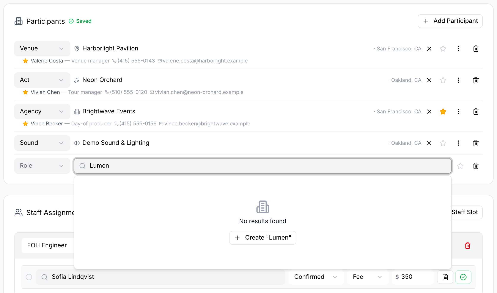
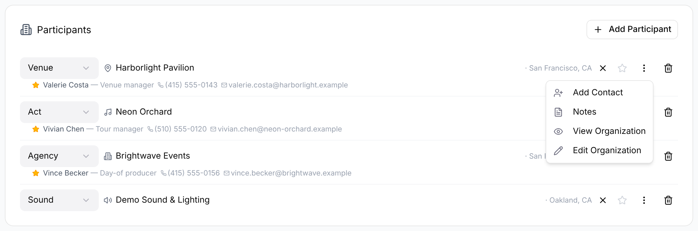

Participants are the organizations working on a gig: the venue, the act, the client, the agency and any other vendors. Admins and Managers manage them in the **Participants** card in edit mode on the gig's **Overview** tab. Everyone else sees the same list, read-only. To staff your own crew, see [Staffing](/gigs/staffing-and-participants/).

Your organization is on every gig automatically, and you can't remove it or change its role.

## Adding an organization

1. Open the gig and select **Edit**.
2. In **Participants**, select **Add Participant**. A new row appears.
3. Choose a role from the first list: **Production**, **Sound**, **Lighting**, **Staging**, **Rentals**, **Venue**, **Act** or **Agency**.
4. Start typing in **Search organizations...** and choose a match.
5. If the organization isn't listed, select **Create "&lt;name&gt;"** and fill in the dialog. The new organization is added to the row.

The row saves as you go. To swap the organization on a row, select the X next to its name to clear it, then search again.

:::note
The gig's venue comes from its **Venue** participant. It appears in the gig's header and in the **Venue** card, which also shows the venue's address and main contact. A gig can have more than one **Act**; the [schedule](/gigs/schedule/) lets you assign items to each.
:::

## Marking the client

Select the star on a participant's row. Its tooltip reads **Mark as client**, and once marked, **Client — click to unmark**. The star turns gold, and in read-only view the organization shows a gold star beside its name. You can mark more than one participant.

## Day-of contacts

Under each participant, GigWrangler lists the contacts for this gig. A contact here belongs to the gig, not to the organization's team, so you can list a venue manager without them having an account or being a member of the venue. Each contact shows their name, title, phone and email.

To add one:

1. Select the **More actions** (three dots) on the participant's row, then **Add Contact**.
2. Enter **First Name** and **Last Name**, and optionally **Email**, **Phone** and **Title**. While you type, matching people already in GigWrangler appear. Choose one to use them instead of creating a duplicate.
3. Leave **Set as primary contact for this gig** selected if this is the main contact. A new primary replaces the current one.
4. Select **Add New Person**, or choose a match from the list.

On an existing contact, select the star to set or unset them as primary. Hover over the row and select **Remove contact** (trash), then **Remove** to confirm. This takes them off this gig only.

## More actions

The **More actions** menu on a participant also has:

- **Notes**: notes about this participant's part in the gig (for example, "Provides stage power").
- **View Organization**: the organization's details and your notes. Admins also see **Edit Organization** here.

To take an organization off the gig, select **Remove participant** (trash).

## What everyone sees

In read-only view, the **Participants** card lists each organization's role, name, primary contact, phone, email and address. Select **Columns** to hide or show the optional ones. Your own organization is marked "(you)", and the eye icon opens the organization's details.

The participant list, schedule, venue and notes are shared with every organization on the gig. Each organization's staffing is private to that organization, so a venue or agency doesn't see who you've booked or what you pay.

## Related

- [Staffing](/gigs/staffing-and-participants/)
- [Schedule / run of day](/gigs/schedule/)
- [Gigs overview](/gigs/overview/)
