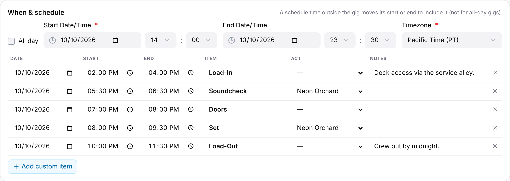

The schedule is the gig's run of day: load-in, soundcheck, doors, sets and load-out, each with a time. Admins and Managers build it in edit mode on the gig's **Overview** tab. Everyone who can open the gig sees it, read-only, in the **Schedule** card at the top of that tab.

## Building the schedule

1. Open the gig and select **Edit**.
2. Find the **When & schedule** card. The gig's dates and time zone are at the top, and the schedule table is below them.
3. Fill in **Start** for each item you need. Add **End**, **Act** and **Notes** if they help.

A new gig's schedule starts with seven empty rows: **Load-In**, **Act Arrival**, **Soundcheck**, **Doors**, **Set**, **Load-Out** and **Return**. A row only saves once it has a start time and an item name, so rows you leave without a time are simply not kept.

Each row has these columns:

- **Date**: the day of the item. Use it for multi-day gigs. New rows copy the date of the row above.
- **Start** and **End**: wall-clock times in the gig's time zone. If **End** is at or before **Start**, GigWrangler treats it as the next day, which suits a late load-out.
- **Item**: type any name, or start typing to pick one of the suggestions above.
- **Act**: choose which act the item belongs to. The list shows the gig's **Act** participants, so [add the act as a participating organization](/gigs/participating-organizations/) first. Leave it at **—** for items that aren't tied to one act.
- **Notes**: free text, shown beside the item when someone views the gig.

Changes save as you make them. The header shows the save state, and **Done** waits for any save in progress.

## Adding, changing and removing items

- To add an item the suggestions don't cover, select **Add custom item** and enter a name in **Item**, such as `Cocktail hour`.
- To change an item, edit its cells in place.
- To remove an item, select the **X** at the end of its row. There's no confirmation, and the item is gone once the change saves.

Saved items are ordered by start time. The table keeps your order on screen until you leave and reopen edit mode.

## Time zone and the gig's dates

Schedule times are always shown in the gig's **Timezone**. If you change the timezone in the **When & schedule** card, each item keeps the same moment in time and the table shows it in the new zone.

If you schedule an item before the gig's start or after its end, GigWrangler moves the gig's start or end to include it. This doesn't happen for **All day** gigs.

## Overlap warnings

When two items for the same act overlap, both rows turn orange and show a warning icon, "Overlaps another item for this act". This only checks items that have an **Act**, a start and an end. It doesn't stop you saving. For overlaps between gigs, see [Conflict detection](/gigs/conflict-detection/).

## Viewing the schedule

In the **Schedule** card each item shows its start (and end) time, its name, and then the act and notes. Items are grouped by day when the gig runs over more than one, and the card's heading shows the days and the time zone. A gig with no items shows "No schedule yet".

On a phone, the gig detail has a collapsible **Schedule** section with the item count. It lists each time, item name and act.

## Related

- [Gigs overview](/gigs/overview/)
- [Participating organizations](/gigs/participating-organizations/)
- [Conflict detection](/gigs/conflict-detection/)
