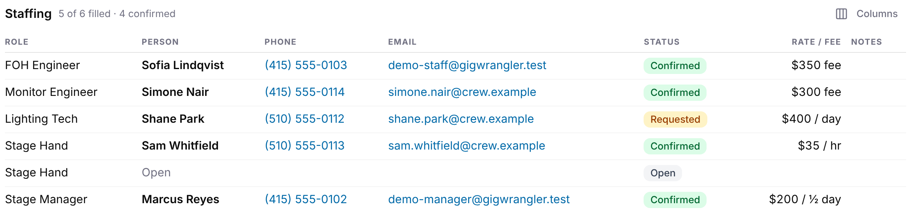

Staffing is your own organization's crew for a gig: which roles you need, how many of each, who fills them, and what you pay. Admins and Managers set it up in the **Staff Assignments** card in edit mode on the gig's **Overview** tab. Other organizations on the gig can't see your staffing.

## Adding a staff slot

A slot is one role and the number of people you need in it.

1. Open the gig and select **Edit**.
2. In **Staff Assignments**, select **Add Staff Slot**.
3. Choose a role from **Select role**, such as **FOH Engineer** or **Stage Manager**.
4. Next to **Required:**, enter how many people you need. Each place appears as its own row below.
5. To add a note for the whole slot, select **Notes**, enter it and select **Save Notes**.

To delete a slot, select **Delete staff slot** (trash) at the right of its header, then **Delete** to confirm. The confirmation names anyone assigned to the slot; they come off the gig with it.

The role list is the same for every organization. Changes save as you make them.

## Assigning people

Each row in a slot is one person.

1. In the row, select the **Search for user...** field and type a name. The search covers people in your organization and the other organizations on the gig.
2. Choose the person. If they aren't there, select **Add new person** to quick-add them without a login. See [Adding people without a login](/team/people-without-logins/).
3. Set the **status**:
   - **Open**: no one has been asked yet.
   - **Requested**: you've asked them.
   - **Confirmed**: they're booked.
   - **Declined**: they said no. A declined person no longer fills a place, so an open row appears for a replacement.
4. Choose **Rate** or **Fee**, then enter the amount. For a rate, choose its unit next to the amount: **/ hr**, **/ day** or **/ ½ day**. A new rate starts at **/ hr**. A fee is a flat amount, so it has no unit.
5. To keep a note on the person, select the notes button (document icon) at the end of the row.

A row with no person selected isn't saved. If you lower **Required:**, GigWrangler removes open rows first and keeps the people you've assigned.

## Finalizing completed work

When the work is done, finalize each assignment so it counts as a cost.

- For a **Confirmed** person, select **Finalize Assignment** (the green check). For a **Rate**, a **Finalize Rate-based Labor** dialog asks how many of the rate's unit were worked: **Hours completed**, **Days completed** or **Half days completed**. Enter the number and select **Finalize**. The amount is the rate times that number.
- To finalize every confirmed fee in one step, select **Finalize All**. It skips rates, because it can't know the units.
- To reverse one, select **Undo Finalize**.

Finalizing adds a money-out entry for the gig (category Contract labor, description "Labor: &lt;role&gt;") to the **Financials** tab. Undoing it removes the entry. A finalized row is locked until you undo it.

## Staff cost

The footer shows **Total Staff Cost** in three parts:

- **Finalized**: finalized assignments (rate times units, or the fee).
- **Projected**: **Confirmed** and **Requested** assignments not yet finalized. A fee counts in full. A rate is estimated from the gig (see below).
- **Total**: the two added together.

Under the totals, each booked rate shows how its estimate was reached, such as "Stage Hand · Sam Whitfield: est. 9.5 hr × $35.00 / hr = $332.50". GigWrangler estimates:

- **/ hr:** the hours from the gig's start to its end, to the nearest quarter hour. If the gig has no end time, or no times at all, it counts 1 hour and says so: "1 hr (no end time)" or "1 hr (no times)".
- **/ day:** the gig's days, in the gig's time zone. A gig that ends before 6 AM doesn't count the extra day.
- **/ ½ day:** one half day per gig day.

The estimate is only a projection. When you finalize, you enter the units actually worked, and the cost becomes the rate times that number.

## Viewing staffing

Everyone in your organization who can open the gig sees a read-only **Staffing** card, headed with a summary such as "3 of 4 filled · 2 confirmed". Each row shows the role, the person (or **Open**), their phone and email, a status badge and any notes. Use **Columns** to hide the ones you don't need; the choice is remembered in this browser.

The **Rate / Fee** column shows a rate with its unit, such as "$400 / day", and a fee as "$350 fee". A **Staff cost** line under the table gives the finalized, projected and total amounts. On the printed financials page, **Staff costs** shows how each rate's amount was reached, such as "3 days × $400 / day".
<!-- TODO: #219 — the print's Staff costs rows still count an unfinalized rate as one unit. --> **Rate / Fee** and the staff cost line are for Admins and Managers only. Staff and Viewers don't see pay.

<!-- TODO: #219 — retake with the Staff cost line once it shows two decimals. -->

## Related

- [Participating organizations](/gigs/participating-organizations/)
- [Adding people without a login](/team/people-without-logins/)
- [Gigs overview](/gigs/overview/)
