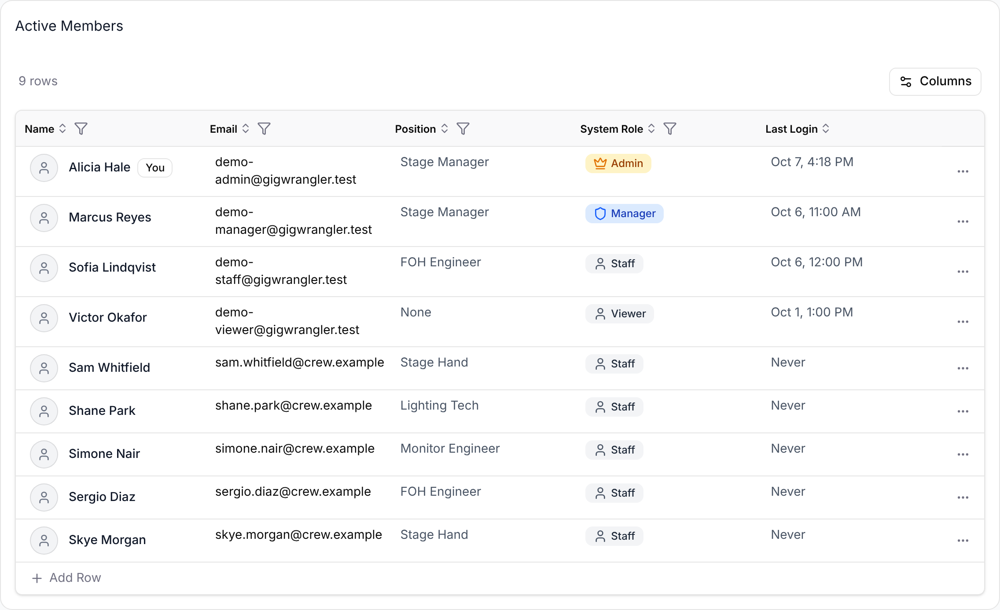

Your **role** decides what you can see and change in GigWrangler. Each person has one role in each organization, and the role is shown as a badge beside the organization name in the header. This page is the one place that lists what each role can do.

## Roles are per organization

You can be an **Admin** of one organization and a **Viewer** of another. Switching organizations (avatar menu → **Switch Organization**) switches your role with it. Nothing you can do in one organization carries over to another.

## What each role can do

| You want to… | Admin | Manager | Staff | Viewer |
|---|---|---|---|---|
| See your organization's gigs, calendar, schedule and participants | ✓ | ✓ | ✓ | ✓ |
| Use the **Dashboard** | ✓ | ✓ | ✓ | — |
| Create, edit and duplicate gigs; import gigs | ✓ | ✓ | — | — |
| Delete a gig | ✓ | — | — | — |
| Staff a gig and assign people to slots | ✓ | ✓ | — | — |
| Confirm or decline a slot you're assigned to (on your phone) | ✓ | ✓ | ✓ | ✓ |
| See staff pay rates and fees | ✓ | ✓ | — | — |
| See a gig's **Financials** tab and **Financials → Purchases** | ✓ | ✓ | — | — |
| Add and edit purchases and a gig's money in and out | ✓ | ✓ | — | — |
| See **Financials → Gig Accounting** | ✓ | — | — | — |
| Lock or unlock a filed tax year, and edit category lists | ✓ | — | — | — |
| See assets, kits and locations | ✓ | ✓ | ✓ | ✓ |
| Add, edit and delete assets and kits; assign kits to gigs | ✓ | ✓ | — | — |
| Mark gear returned, or write it off as missing, on a gig's **Not returned** list, and undo a write-off | ✓ | ✓ | — | — |
| Scan gear in and out from your phone (field inventory) | ✓ | ✓ | ✓ | ✓ |
| See the **Team** list | ✓ | ✓ | ✓ | ✓ |
| Invite or add team members, edit profiles, remove members | ✓ | ✓ | — | — |
| Change a member's role, up to Manager | ✓ | ✓ | — | — |
| Make someone an Admin, or change or remove an Admin | ✓ | — | — | — |
| Edit or delete your organization's details | ✓ | — | — | — |
| Approve or reject requests for more access | ✓ | — | — | — |
| Request a higher role | — | — | ✓ | ✓ |

A few things the table doesn't say:

- **Controls are hidden, not greyed out.** Staff and Viewers don't see **New Gig**, **Edit**, **Add Item** or **Add Team Member**. If they open a page for Admins and Managers by its address, such as **Financials** or an equipment form, GigWrangler takes them to their starting page instead.
- **Managers see Delete on a gig** but can't complete it: GigWrangler tells you that you don't have permission. Ask an Admin.
- **Managers aren't offered Admin** in the role lists, and can't change an Admin's role.
- **You can't remove yourself** from the team.
- **Staff and Viewers can't see pay.** The staffing table on a gig shows who is booked and their status, without rates or fees, on the web and on your phone.
- **Deleting an organization** is blocked while it still has data, such as gigs, equipment or purchases.

## What other organizations on your gig can see

A gig can have several participating organizations, such as a venue, an act and two vendors. Everyone in a participating organization, whatever their role, can open the gig and see the parts that are shared:

- Title, dates, time zone, status and tags
- Participants, venue and act, and the contacts listed for each participant
- The schedule and the gig's notes
- The gig's change history for those shared parts

Each organization's own work on the gig stays private to it. The other organizations can't see your:

- Staffing: who is booked, their status, and what they're paid
- Equipment: kits assigned and what's checked out
- Financials: money in, money out and profit
- Staffing, equipment and financial entries in the change history

Being on the same gig doesn't give anyone access to your Team list, equipment library or purchases.

Admins and Managers of any participating organization can change the shared parts of the gig. An Admin of any participating organization can delete it. Add participants with care.

## Claimed and unclaimed organizations

An organization is **claimed** once it has an Admin. Until then it's **unclaimed**: for example, a venue that someone added to a gig but that nobody at the venue has taken over yet.

- **Claimed:** only its own Admins can edit or delete its details.
- **Unclaimed:** an Admin of any organization can edit its details, and a platform moderator decides who becomes its first Admin.

See [Getting into an organization](/getting-started/organizations/) for how to create, claim or request access to one.

## Platform moderators

A small number of accounts are **platform moderators**. They review requests for access to unclaimed organizations, and they maintain the starter category lists new organizations begin with. A moderator has no say once an organization has an Admin, and gets no extra access to your gigs or data.

## Related

- [Getting into an organization](/getting-started/organizations/)
- [A gig's money](/financials/gig-expenses/)
- [Gigs overview](/gigs/overview/)
