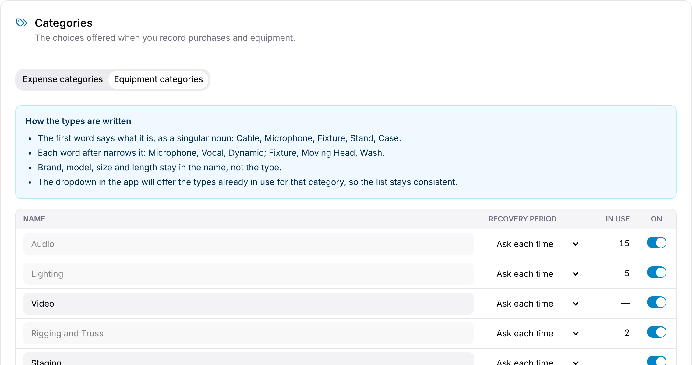

Your organization has two category lists, edited under **Settings → Categories**:

- **Expense categories:** what you spent money on, for tax time. Each one is filed on a line of IRS Schedule C, such as 22 Supplies or 27b Other expenses.
- **Equipment categories:** the broad kinds of gear you own, such as Audio, Lighting and Power.

The purchase screen and the equipment pages offer only the categories on these lists, so everyone uses the same names.

## Who can change them

| | Admin | Manager | Staff, Viewer |
|---|---|---|---|
| See the lists in Settings | ✓ | ✓ | — |
| Add, rename or turn off a category | ✓ | — | — |

## Your starting lists

The first time your organization needs a list, GigWrangler gives it a starter set suited to a sound, lighting or production company. Change it to suit you: it's yours from then on.

## Changing a list

Open the **Expense categories** or **Equipment categories** tab. Each list is a table
with the category's **Name**, its **Schedule C line** (expense categories) or
**Recovery period** (equipment categories), **In use** and **On**.

- **Add:** type the name in **New category** at the bottom of the list. For an
  expense category, also pick its Schedule C line; for an equipment category,
  optionally its recovery period. Then select **Add**.
- **Change the Schedule C line or recovery period:** pick a new one in the row. It
  saves straight away.
- **Turn off:** switch **On** off to hide the category from the pickers. Purchases
  and equipment that already use it keep it.
- **Rename:** edit the name and press <kbd>Enter</kbd>. A category that's already in
  use can't be renamed here, because each purchase and piece of equipment stores the
  name. **In use** shows how many records use each one.

## Recovery periods for equipment

Equipment you depreciate for tax has a recovery period: **5-year** (computers,
phones, office machines), **7-year** (most production gear: audio, lighting, video,
rigging, cases, tools) or **15-year** (building out a leased shop or studio). See
[Tax treatment and equipment](/financials/tax-treatment/).

An equipment category's **Recovery period** is the default for depreciated
equipment in that category. Choose **Ask each time** if the category mixes kinds,
and GigWrangler asks for a period when you record depreciated equipment in it.

## How the types are written

Inside a category, each piece of equipment has a **Type** that says what it is. The
**Equipment categories** tab shows these rules above the list:

- The first word says what it is, as a singular noun: Cable, Microphone, Fixture, Stand, Case.
- Each word after narrows it: Microphone, Vocal, Dynamic; Fixture, Moving Head, Wash.
- Brand, model, size and length stay in the name, not the type.
- When you enter a type, GigWrangler suggests the types already used in that category, so the list stays consistent.
