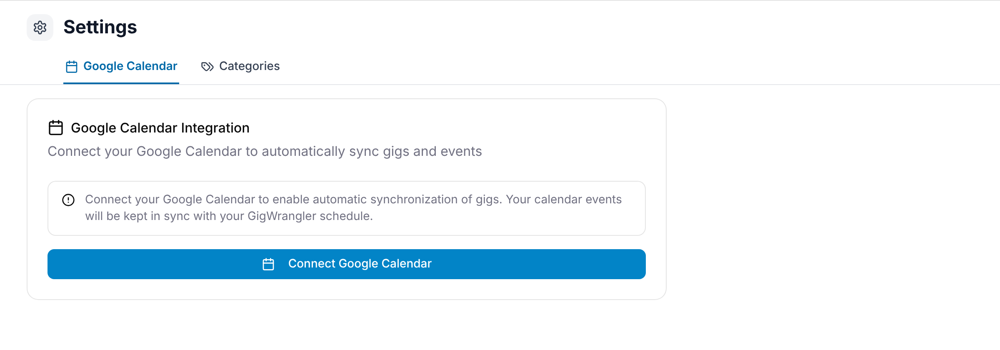

GigWrangler can copy your organization's gigs into a Google calendar, so they show up
next to everything else you have on. The sync is one way, from GigWrangler to Google,
and it's set up per person: each member connects their own Google account and picks
their own calendar. Open the avatar menu (top right) → **Settings** → **Google
Calendar**. Every role has this tab.

## Connecting your Google account

1. Select **Connect Google Calendar**.
2. Sign in to Google and allow GigWrangler to use your calendars.
3. Back in GigWrangler, the card shows "Connected to Google Calendar".

To stop syncing and remove the connection, select **Disconnect**.

If Google later revokes the connection, or it expires, GigWrangler says so and shows
**Reconnect Now**. Select it and sign in again.

## Choosing a calendar

Under **Enable Synchronization**, select **Disabled** so it reads **Enabled**. Then
pick a calendar under **Calendar Selection**. Your main Google calendar is marked
**Primary**.

The list only shows calendars GigWrangler can write to: ones you own, or ones shared
with you with "Make changes to events" access. To sync into a shared team calendar
you don't own, either:

- ask its owner to share it with you with "Make changes to events" access, or
- connect with the owner's Google account instead.

If none of your calendars can be written to, GigWrangler says so. If a calendar you
already chose loses write access, GigWrangler shows a warning and won't sync to it
until you fix the access or pick another calendar.

## Choosing what syncs and when

Once a calendar is chosen, more settings appear.

- **Sync Frequency**:
  - **Real-time (on every change)**: a gig's event is updated whenever the gig
    changes.
  - **Manual (use Sync All Gigs)**: nothing syncs until you select **Sync All Gigs**.
- **Sync Filters**: which gigs to copy, by status.
  - **Confirmed gigs**: Booked, Completed and Settled.
  - **Tentative gigs**: Date Hold and Proposed.
  - **Cancelled gigs**: Cancelled. Off unless you turn it on.

Each change saves straight away.

## Syncing your existing gigs

Under **Sync Now**, select **Sync All Gigs** to copy every gig your organization is
part of that matches your filters. The button shows its progress as it goes. Use it
after you first connect, or after you change your filters. It's unavailable until
you've chosen a calendar you can write to.

The page also shows how the sync has gone so far: **Total Events**, and how many
were **Synced**, **Removed** or **Failed**.

## What a synced gig looks like

Each gig becomes an all-day event on the gig's dates, in the gig's own time zone, so a
gig never lands on the wrong day. The event's description carries the gig's times,
its venue and its notes, plus a link back to the gig in GigWrangler.

:::caution
Edit gigs in GigWrangler, not in Google Calendar. Changes you make to the event in
Google aren't copied back, and the next sync overwrites them.
:::

<!-- TODO 📸 held: settings/google-calendar-connected — the connected Google Calendar settings. Needs a real Google account connected in dev; not taken. -->

## Related

- [The calendar view](/gigs/calendar-view/)
- [Settings & integrations](/settings/overview/)
