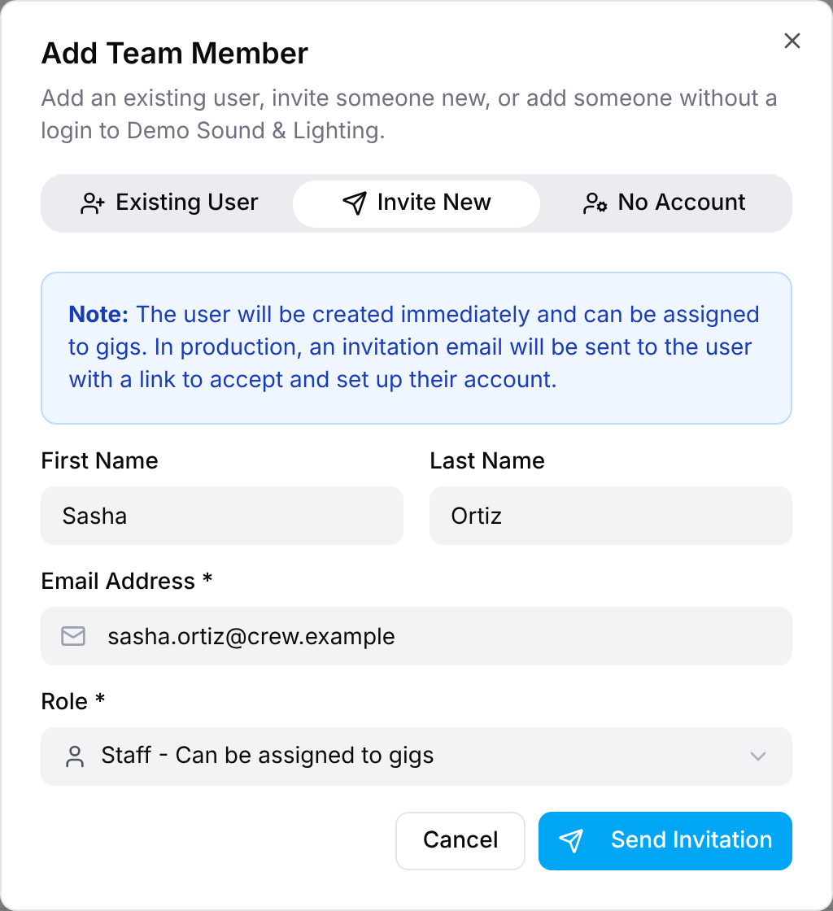
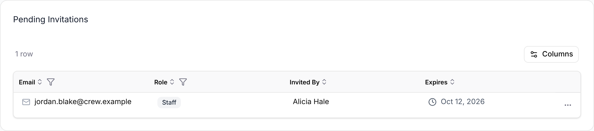

Admins and Managers can invite people to the organization by email, and can add
people who already have a GigWrangler account. Both start from **Team → Add Team
Member**. If the person doesn't need to sign in at all, see
**Adding people without a login** instead.

## Inviting someone new

1. Open **Team** and select **Add Team Member**.
2. Select the **Invite New** tab.
3. Enter an **Email Address**. **First Name** and **Last Name** are optional.
4. Choose a **Role**: **Admin**, **Manager**, **Staff** or **Viewer**.
5. Select **Send Invitation**.

GigWrangler sends an email to that address with a link to join. You see "Invitation
sent!" and the dialog closes. The person appears right away in **Active Members**
with **Pending** under **Last Login**, so you can assign them to gigs before they
accept. Only Admins can invite an Admin.

If the email address already belongs to an active GigWrangler user, the invitation
is refused with a message. Use the **Existing User** tab instead.

## What the invitee does

The invitee follows the link in the email. If they're new to GigWrangler, they
complete their profile first (see
[Getting into an organization](/getting-started/organizations/)). They then see
"Invitation Accepted!" and a **Go to Dashboard** button.

## Adding someone who already has an account

1. Select **Add Team Member**, then the **Existing User** tab.
2. Enter at least two characters in **Search Users** (name or email).
3. Choose the person from the results. People already in your organization don't
   appear.
4. Choose a **Role**, then select **Add User**.

They're added straight away, with no email and nothing to accept.

## Managing pending invitations

Admins and Managers see a **Pending Invitations** table below **Active Members**
whenever an invitation is waiting. It shows **Email**, **Role**, **Invited By** and
**Expires**. An invitation expires 7 days after it is sent.

- **To resend:** invite the same email address again. GigWrangler shows "Invitation
  resent!", sends another email and extends the expiry by 7 days from now.
- **To cancel:** open the row's **⋯** menu → **Cancel Invitation**, then select
  **Yes, Cancel** (or **No, Keep It**).

Cancelling removes the invitation only. The person stays in **Active Members** until
you remove them with **Remove from Team**.

## Related

- [Roles & access](/reference/roles-and-access/)
- [Getting into an organization](/getting-started/organizations/)
