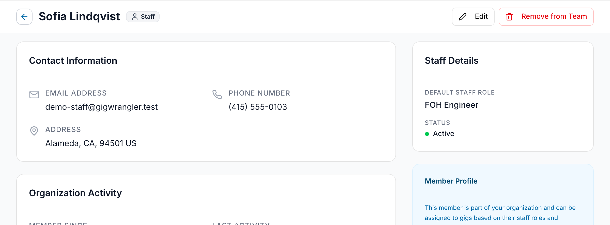
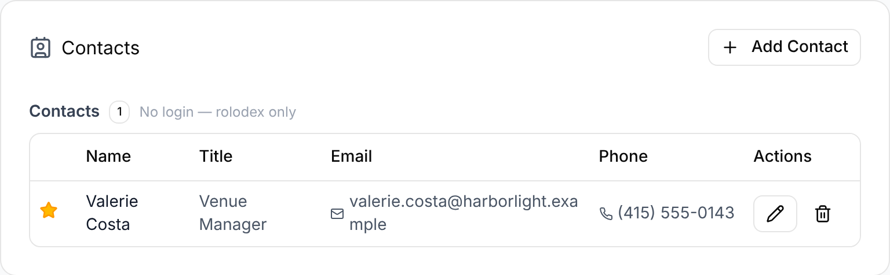

Each person on your team has a details page, and each organization has a **Contacts**
list of the people to call there. Open a member's page from **Team**; the Contacts
list is on the **Edit Organization** screen.

## A member's details page

On **Team**, select a person's name, or open the row's **⋯** menu → **View Details**.
The page opens on desktop; on a phone, GigWrangler sends you to the gig list
instead. It shows:

- **Contact Information**: **Email Address**, **Phone Number** and **Address**.
- **Organization Activity**: **Member Since** and **Last Activity** (the last sign-in,
  or "Never").
- **Staff Details**: **Default Staff Role** and **Status**.
- Their role as a badge at the top, plus **Pending Invitation** if they haven't
  accepted yet.

Admins and Managers also see **Edit**, which opens **Edit Team Member**, and
**Remove from Team** (not on their own page). **Default Staff Role** reads "No
default role assigned" when none is set.

## Editing a member

Select **Edit** on the member's page, or on **Team** open the member's **⋯** menu →
**Edit Permissions**. Then update **Edit Team Member**: **First Name**, **Last Name**,
**Default Staffing Role**, **Phone Number**, **Timezone**, **Avatar URL** and the
address. Select **Save Changes**. The email address can't be changed. Only Admins and
Managers can edit other members.

To change someone's role, use **Edit Permissions** on **Team**: it adds
**Organization Role** to the form. See [Changing a role](/team/team-and-roles/#changing-a-role).
<!-- TODO: #206 — Edit on the member's page doesn't show Organization Role yet. Once fixed, say either way works. -->

You edit your own details from the avatar menu (top right) → **Edit Profile**. See
[Onboarding](/getting-started/onboarding/#your-profile).

## The Contacts list

On **Edit Organization**, the **Contacts** card lists everyone connected to that
organization in two groups:

- **Team Members** (has a GigWrangler login)
- **Contacts** (no login — rolodex only)

Each row shows **Name**, **Title**, **Email** and **Phone**; email and phone are
links. Select the star to mark someone as the **primary contact**, or select it
again to unset it. Only one person is primary at a time.

Admins also see **Add Contact**, plus **Edit** and **Remove** on each row. **Edit
Contact** changes the name, phone and title; **Remove** asks "Remove contact?" and
only takes the person off this organization's list.

Open **Edit Organization** from **Switch Organization → Browse All Organizations**;
see [Team](/team/overview/).

## Related

- [Roles & access](/reference/roles-and-access/)
- [Getting into an organization](/getting-started/organizations/)
