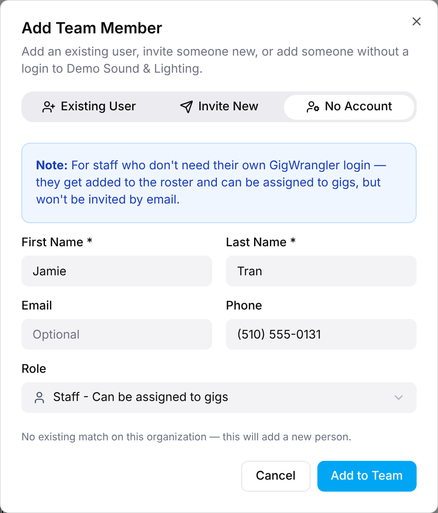

Not everyone on a crew needs a GigWrangler account. You can add a person with just a
name, and they show up on your team and in gig staffing without an email invitation.
Admins and Managers can do this from **Team**, and from the gig staffing picker.
Use an invitation instead when the person should sign in.

## Adding someone from the Team screen

1. Open **Team** and select **Add Team Member**.
2. Select the **No Account** tab.
3. Enter a **First Name** and **Last Name**. **Email** and **Phone** are optional.
4. Choose a **Role**: **Staff** (can be assigned to gigs) or **Viewer** (read-only).
5. Select **Add to Team**.

You see "Person added to the team", and the person appears in **Active Members**.
They can be assigned to gigs like anyone else. Nothing is emailed.

## Checking for duplicates

As you type a name, or an email of three or more characters, GigWrangler searches
everyone in GigWrangler, not just your organization. Matches appear under **Found
a possible match** (or **Found 2 possible matches**, and so on) with each person's
email and phone.

- To use someone who already exists, select **Use this person**. They're added to
  your team with the role you chose, and no new person is created.
- If nothing fits, ignore the list and select **Add to Team** to create a new
  person.

If the search fails, GigWrangler says "Couldn't check for existing matches" and asks
you to double-check before adding. This isn't the same as "No existing match".

:::note
Search results show people from other organizations too, so only link someone you
know is the same person.
:::

## Adding someone while staffing a gig

In the gig's staffing picker, select **Add new person**. It opens **Add Person**,
the same search-then-add form, and adds the person to your organization.

## Adding a contact from Edit Organization

Admins see an **Add Contact** button in the **Contacts** card on **Edit
Organization**. It opens **Add Person** with **First Name**, **Last Name**, **Email**,
**Phone**, **Title** and **Role** (**Staff** or **Viewer**), plus **Set as primary
contact**. Select **Add New Person**, or **Use this person** on a match. See
Member profiles & contacts.

## Related

- [Roles & access](/reference/roles-and-access/)
- [Getting into an organization](/getting-started/organizations/)
